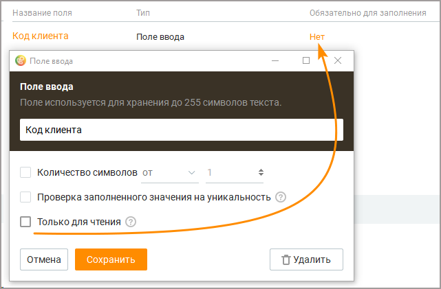
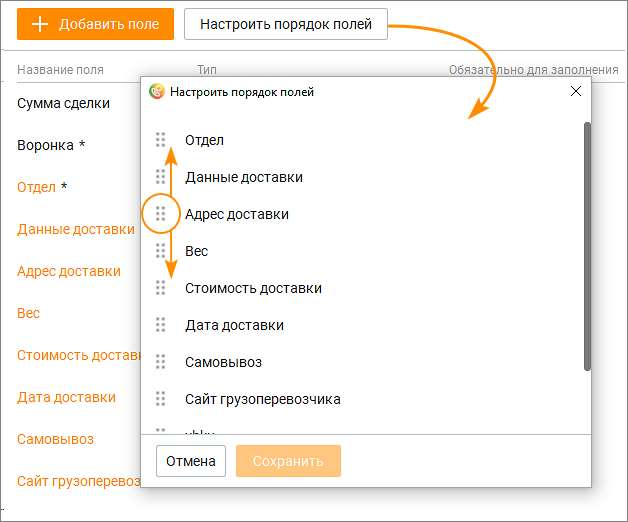

# Настройки пользовательских полей

> Трассировка: PDF §10.3 · сквозные стр. 326-331 · источники: ч.1 `kb/sources/mango-cc-manual/CC_manual_1.26.28.1.pdf` с.326-331.

После выбора типа поля следует установить его настройки. Выбор типа пользовательского поля доступен только при создании. Изменение типа пользовательского поля в уже созданном поле – не доступно.

Отмеченные * настройки поля не могут быть впоследствии изменены. В зависимости от типов полей доступны следующие настройки:

| № | Тип настройки | Описание настройки |
| --- | --- | --- |
| 1 | Название поля | Произвольное, уникальное имя. Не может повторять название стандартных полей. Длина не более 30 символов. Доступна для всех типов полей. |

| 2 | Количество символов* | Настройка ограничения на количество вводимых символов в содержимом поля. Доступна для полей: • Поле ввода • Адрес • Число • Ссылка |
| --- | --- | --- |
| 3 | Проверка заполненного значения на уникальность* | Проверка содержимого пользовательского поля на уникальность при создании или изменении. Пустое значение на уникальность не проверяется. Доступна для полей: • Поле ввода • Адрес • Число • Денежный • Ссылка |
| 4 | Только для чтения | Вне зависимости от прав и ролей пользователей, содержимое поля будет не доступно для изменения, в случае включения настройки. Доступна для полей: • Поле ввода • Адрес • Число • Денежный • Ссылка |
| 5 | Указать ограничение для суммы* | Настройка ограничения на ввод суммы чисел. Доступна для полей: • Денежный |
| 6 | Валюта* | Список содержит иконки трех валют для выбора: • Рубль • Евро • Доллар Доступна для полей: • Денежный |
| 7 | Доступно несколько вариантов для выбора* | Переключает список с единичным выбором значения, на список с множественным выбором. Доступна для полей: • Выпадающий список |
| 8 | Показывать поиск по значениям | Включает/отключает поисковое поле, с поиском по значениям выпадающего списка. Доступна для полей: |

|  |  | • Выпадающий список • Пользователь |
| --- | --- | --- |
| 9 | Действия со значениями выпадающего списка | Доступны следующие действия: • Наименование значения списка – произвольное, уникальное наименование значения выпадающего списка; • Добавление значения списка – настройка, добавляющая плюс еще одно значение выпадающего списка к существующему одному значению, созданному системой автоматически; • Изменение порядка расположения значений. Пользователю доступно изменение порядка созданных значений, повышая приоритет (перемещая выше), либо уменьшая приоритет (перемещая ниже); • Удаление значения списка – настройка, удаляющая значение выпадающего списка без возможности восстановления. Доступна для полей: • Выпадающий список |

Дополнительные настройки для пользовательских полей:

| № | Наименование | Описание настройки |
| --- | --- | --- |
|  | настройки |  |
| 1 | Обязательность заполнения | При включенном состоянии, включена проверка, которая не позволяет создавать или изменять сделки, если содержимое поля – пусто |
| 2 | Показывать в карточке | Включено или выключено отображение поля на интерфейсе карточки сделки |
| 3 | Порядок полей | Настройка позволяет менять порядок расположения полей в интерфейсе. Влияет только на порядок расположения поля, не изменяет данные или содержимое пользовательского поля. |

Просмотр/редактирование полей адресной книги Для просмотра или редактирования пользовательского поля щелкните по названию поля и, при необходимости, внесите изменения в настройки поля. Для редактирования доступны только значения, выделенные оранжевым цветом.

Если чекбокс "Только для чтения" проставлен, пользовательское поле недоступно для заполнения. В графе "Обязательно для заполнения" значение "Нет" отображается оранжевым цветом. Настроить порядок полей Клик по кнопке Настроить порядок полей открывает окно, в котором пользователь может изменить порядок отображения пользовательских полей.

Для изменения порядка полей зафиксируйте левую кнопку мыши на пиктограмме и переместите поле вверх или вниз по списку. Сохраните внесенные изменения кнопкой Сохранить.

| Кнопка Настроить порядок полей недоступна, если на продукте имеется менее двух |
| --- |
| пользовательских полей. |

Удаление пользовательских полей Для удаления поля кликните на наименование поля и в открывшемся окне нажмите кнопку Удалить. Подтвердите согласие на удаление.

| При удалении пользовательского поля удаляется поле и все содержимое поля, без |
| --- |
| возможности восстановления. |

<!-- изображение на стр. 330: байты не извлечены (PyMuPDF недоступен) -->

<!-- изображение на стр. 331: байты не извлечены (PyMuPDF недоступен) -->
