# 5.1. Сделки в работе

> Трассировка: PDF §5.1 · сквозные стр. 170-179 · источники: ч.1 `kb/sources/mango-cc-manual/CC_manual_1.26.23_compressed.pdf` с.170-179.

Вкладка предназначена для мониторинга сделок со статусом В работе.

| Переключатель По группе/По сотруднику доступен, если у пользователя в подчинении |
| --- |
| имеются группы или сотрудники. |

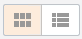

Сделки в работе отображаются в табличном либо плиточном виде Табличный вид

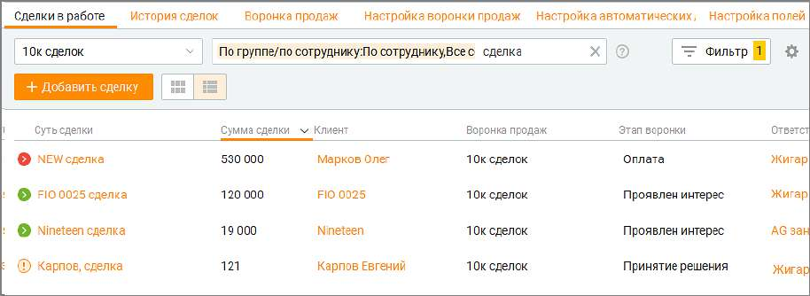

| По клику на пиктограмме |
| --- |
| задач сделки. Значок |
| по кнопке |

|  | открывается список |
| --- | --- |
| означает отсутствие у данной сделки запланированных задач. Клик |  |

клиента имеется контактный телефон.

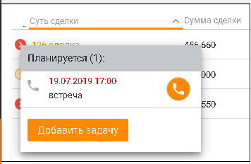

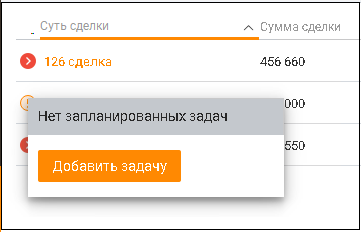

Предусмотрена фильтрация списка сделок в таблице. Чтобы открыть панель фильтрации, нажмите на кнопку Фильтры. Имеется строка поиска для быстрого поиска сделки.

| Чтобы отобрать сделки в зависимости от привязанных к ним задач, выберите нужный вариант |
| --- |
| в выпадающем списке Все сделки. Доступны следующие: Все сделки, Без задач, |
| Просрочены, С задачами на сегодня, Запланированы. |

Выбранные фильтры сохраняются после выхода пользователя из Контакт-центра и повторной авторизации.

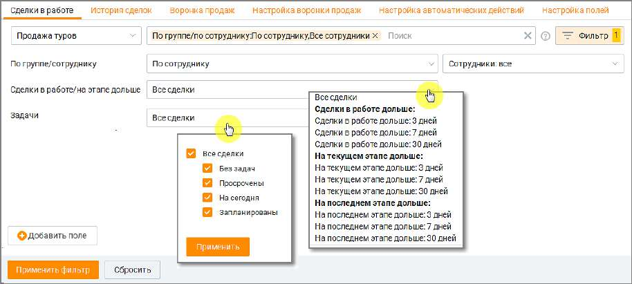

Клик по кнопке "Добавить поле" открывает окно со списком полей вкладки Настройка полей для выбора дополнительного поля фильтрации. Установка переключателя в режим "Включено" открывает возможность выбора нескольких воронок для формирования таблицы данных:

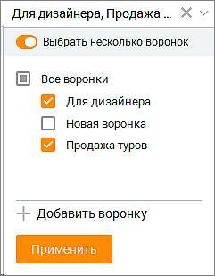

Вы можете самостоятельно выбрать, какие столбцы будут отображаться в таблице. Для этого

щелкните левой кнопкой мыши по пиктограмме и установите/снимите флаги напротив наименований столбцов. По умолчанию отображается набор столбцов, соответствующих стандартным полям сделки: • Суть сделки – название сделки; • Сумма сделки - сумма сделки; • Клиент – контакт адресной книги. Если клиент был удален, то в созданной ранее сделке отображается как Удаленный клиент; • Организация – компания, к которой относится клиент; • Воронка продаж – наименование воронки продаж; • Этап воронки – текущий этап сделки; • Ответственный – сотрудник, создавший сделку либо сотрудник, на которого назначена сделка при её создании; • Дата создания сделки – дата создания сделки в формате дд.мм.гггг; • ID - уникальный идентификатор сделки; • Дата первого обращения – дата первого обращения клиента по данной сделке; • Дата последнего обращения – дата последнего обращения клиента по данной сделке. Плиточный вид

| Если использована услуга "Увеличение лимита открытых сделок" (более 1000 шт.), |
| --- |
| плиточный вид не доступен |

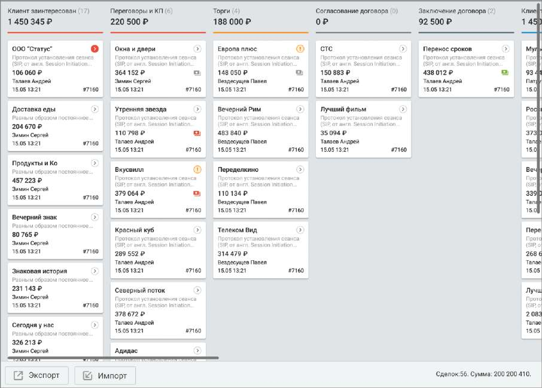

В плиточном варианте сделки расположены в соответствии с этапом воронки продаж, на котором находится сделка. По умолчанию сделки отфильтрованы по текущему сотруднику. Для перемещения сделки между этапами установите курсор на сделке, и, удерживая левую кнопку мыши в нажатом состоянии, переместите сделку на нужный этап.

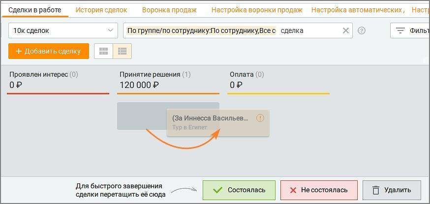

| Для выбора строк, отображаемых в карточке сделки, щелкните по пиктограмме |
| --- |
| установите/снимите флаги напротив наименований |

системные и пользовательские поля, включая следующие: • Название – название сделки; • Сумма сделки – сумма сделки;

• Организация – организация, с которой осуществляется сделка; • Клиент – контакт адресной книги. Если клиент был удален, то в созданной ранее сделке отображается как Удаленный клиент; • Ответственный -ответственный за сделку; • Дата создания – дата создания сделки; • ID сделки – уникальный номер сделки в системе; Рекомендуется выводить только самые важные данные, так как при выборе большого количества отображаемых полей карточка сделки увеличивается, а содержащаяся на ней информация воспринимается сложнее.

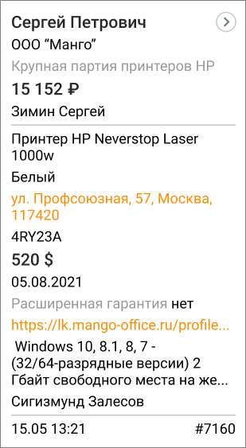

Если в сделке была сгенерирована ссылка на оплату через сервис ЮKassa, в карточках сделки плиточного вида отображаются пиктограммы статуса оплаты

– ссылка на оплату сгенерирована, ожидается оплата от клиента.

– оплата по ссылке получена;

– оплата не получена, ссылка устарела;

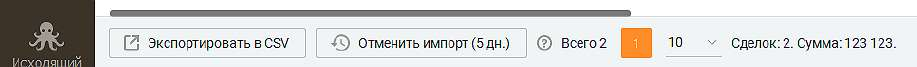

– оплата получена дважды, возможна ошибка. Для экспорта списка нажмите кнопку Экспорт. После этого на экране отображается окно выбора параметров экспорта. Пользователь имеет возможность выбрать для экспорта все данные из адресной книги для контакта. Сохраните файл экспорта, используя стандартные средства операционной системы.

| Для импорта сделок нажмите кнопку Импорт. Ознакомьтесь с информацией в открывшемся |
| --- |
| окне первого шага импорта, скачайте шаблон импортируемого файла в формате csv, заполните |
| его и загрузите в Контакт-центр. На втором шаге импорта проверьте правильность |
| сопоставления полей и, при необходимости, произведите другие настройки. По клику на |

| кнопку Начать импорт сделки будут импортированы. По завершении в папке, содержащей |
| --- |
| файл импорта, создается файл "Журнала импорта". |
| О наличии ошибок импорта пользователь уведомляется системным сообщением, содержащим |
| число невалидных сделок. Например: |

Для последней процедуры импорта и в течение 5 дней возможна отмена импорта сделок. Например, если было два импорта сделок и пользователь хочет отменить импорт, то отмена может быть сделана только по последней загрузке сделок. Чтобы отменить импорт, нажмите кнопку "Отменить импорт" в нижней части окна сделок. В открывшемся окне выберите сделки и подтвердите отмену импорта.

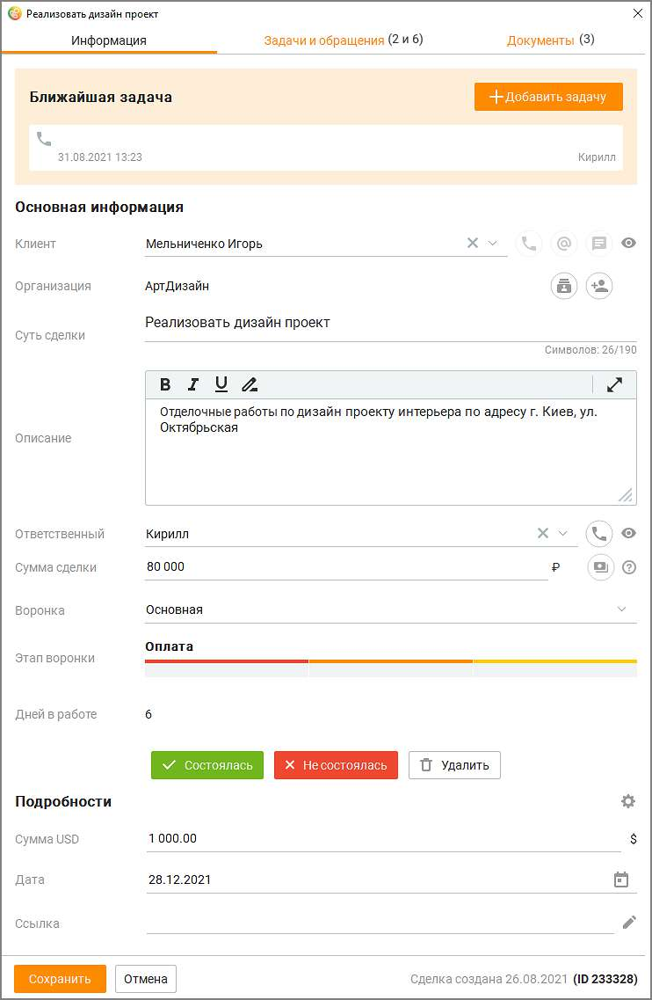

Карточка сделки Чтобы открыть карточку сделки, щелкните правой кнопкой мыши по названию сделки. Открывается окно для просмотра и редактирования сделки. Сохранение изменений производится щелчком по кнопке Сохранить. Карточка сделки откроется на вкладке Информация.

Информация

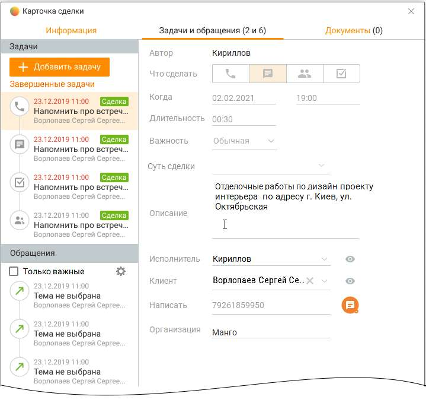

Помимо стандартных и пользовательских полей, заполняемых пользователем при создании сделки, карточка сделки содержит: Сделка создана – дата создания сделки в формате дд.мм.гггг;

ID – уникальный идентификатор сделки. При создании сделки заполняется автоматически, не изменяется. Клик по ID приводит к копированию его в буфер обмена. При наличии связи с "родительской" сделкой также отображается ее ID. Дней в работе – количество дней с даты создания сделки; Состоялась – кнопки перевода сделки в статус "Состоялась"; Не состоялась - кнопка перевода сделки в статус "Не состоялась"; Удалить – кнопка удаления сделки. При клике на область отображения Ближайшая задача открывается отображаемая в области задача. Задачи и обращения Сделка может быть связана со: • одной или несколькими задачами • одним или несколькими обращениями • одним клиентом • одной организацией • одной сделкой

| Задачи: Сделка связана с задачей только через клиента. Если в задаче, связанной со сделкой |
| --- |
| и каким-либо клиентом меняется клиент, то задача перестает быть связанной со сделкой, и |

| привязывается к новому клиенту. Если клиент меняется у сделки, задача привязывается к |
| --- |
| новому клиенту, сохраняя связь со сделкой. |
| При изменении клиента сформированное по умолчанию название сделки "имя_клиента |
| сделка" не меняется. Изме |

Клик по кнопке "Завершенные задачи" открывает список завершенных задач. Фильтрация

списка доступна по клику на пиктограмму . Обращения: Полученное или созданное обращение от клиента из адресной книги, у которого есть открытая сделка В работе автоматически привязывается к открытой сделке. Если у клиента несколько открытых сделок, его обращения автоматически привязываются к последней по дате создания сделке со статусом В работе, где инициировавший создание обращения сотрудник является Ответственным. Если сотрудник не является ответственным ни в одной из сделок по клиенту, такое обращение автоматически привязывается к сделке в статусе В работе последней по дате создания, не зависимо от того кто является Ответственным за сделку. Если чекбокс "Только важные" проставлен, в списке обращений выдаются только обращения с указанными настройками важности. Настройки важности задаются кликом по пиктограмме

.

| ПРИМЕР 1: |
| --- |
| У клиента "Василий" 3 сделки – "1","2" и "3". В сделке "1" ответственный – сотрудник А, в сделке "2" |
| ответственный – сотрудник Б, и в сделке "3" ответственный – сотрудник А. Сотрудник Б звонит |
| клиенту "Василий" из карточки клиента, то есть не из карточки сделки. |
| Созданное обращение привязывается к сделке "2", поскольку сотрудник Б является ответственным |
| за эту сделку. |
| ПРИМЕР 2: |
| У клиента "Николай" 3 сделки – "1","2" и "3". В сделке "1" ответственный – сотрудник А, в сделке "2" |
| ответственный – сотрудник Б, и в сделке "3" ответственный – сотрудник А. Сотрудник А звонит |
| клиенту "Николай" из карточки клиента, то есть не из карточки сделки. |
| Созданное обращение привязывается либо к сделке "1", либо к сделке "3", поскольку сотрудник А |
| является ответственным за обе этих сделки. Определяется какая сделка из сделок "1" и "3" была |
| создана позднее, и обращение привязывается к сделке с наиболее поздней датой создания. |
| ПРИМЕР 3: |
| У клиента "Сергей" 3 сделки – "1","2" и "3". В сделке "1" ответственный – сотрудник А, в сделке "2" |
| ответственный – сотрудник Б, и в сделке "3" ответственный – сотрудник А. Есть сотрудник В, который |
| звонит клиенту "Сергей" по какому-либо вопросу. Сотрудник В не является ответственным ни за |
| одну из сделок. Поэтому созданное обращение привяжется к той сделке из "1", "2" и "3", которая |
| имеет наиболее позднюю дату создания. |
| При создании сделки из раздела Мои обращения сделка привязывается к последнему |
| обращению клиента. |

| Каждая сделка связана только с одним клиентом. Поэтому вкладка Задачи и обращения |
| --- |
| карточки сделки содержит задачи и обращения данного клиента. |

Документы На вкладке Документы содержатся прикреплённые к карточке сделки файлы, полученные с рабочего места сотрудника. Размер загружаемого файла не должен превышать 100 МБ. Файл должен иметь название, уникальное для этой сделки.

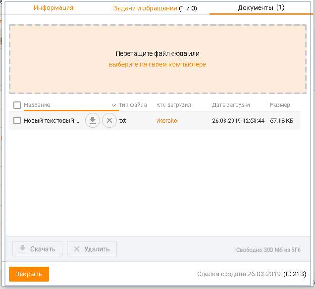

Чтобы прикрепить файл, перетащите его на поле карточки, или выберите на своем компьютере, используя стандартные средства операционной системы.

<!-- изображение на стр. 179: байты не извлечены (PyMuPDF недоступен) -->

Прикрепленные файлы можно скачать или удалить , предварительно подтвердив свое согласие на удаление.

<!-- изображение на стр. 179: байты не извлечены (PyMuPDF недоступен) -->

Также пользователю доступно пакетное скачивание/удаление файлов. Кнопки Скачать и Удалить будут доступны после выбора файлов в списке. После запроса на скачивание откроется стандартное окно проводника Windows с выбором пути для сохранения файлов.

<!-- изображение на стр. 179: байты не извлечены (PyMuPDF недоступен) -->

Если сделка не имеет статуса "в работе", её редактирование невозможно.
