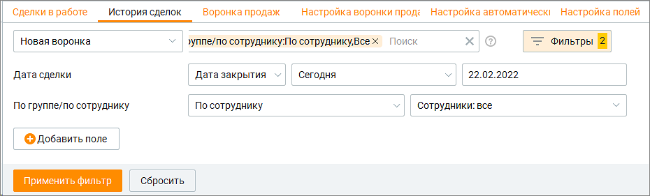
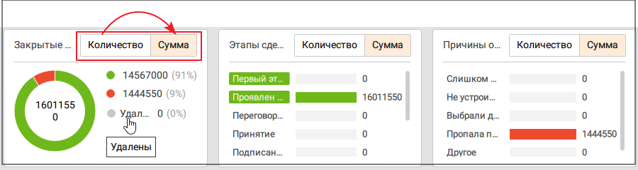
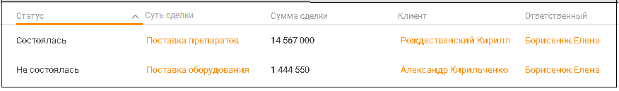
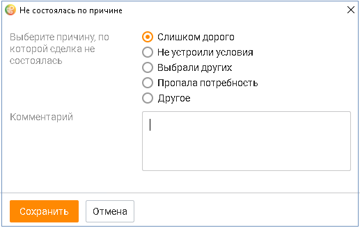

# 5.2. История сделок

> Трассировка: PDF §5.2 · сквозные стр. 179-182 · источники: ч.2 `kb/sources/mango-cc-manual/CC_manual_1.26.23-part-2.pdf` с.78-81.

Вкладка История сделок содержит сделки со статусом Состоялась, Не состоялась, Удалена. Пользователь может открывать и просматривать карточки сделок, а также возвращать сделкам статус В работе. Вкладка состоит из блока фильтров, блока визуализаций и табличной части. Вкладка содержит подробную детализацию по количеству сделок, их стоимости и статусам с учетом выбранных фильтров. По умолчанию доступна фильтрация: • по воронке – выбор из всех доступных пользователю воронок; • по дате сделки – дата создания сделки, дата закрытия сделки; • по времени – сегодня, вчера, текущая неделя, прошлая неделя, текущий месяц, текущий год, произвольный период;

• по участникам – по сотруднику, по группе (с возможностью выбора конкретных сотрудников или групп); • клиенту – доступные варианты: заполнен, неважно. При выборе "Заполнен" рядом отображается поисковая строка по клиентам с возможностью выбора неточного совпадения; • по организации – выбор из списка доступных пользователю организаций. Доступен поиск по точному или неточному совпадению наименования организации. • по сумме сделки – выбор в диапазоне сумм. Клик по кнопке "Добавить поле" открывает окно со списком полей вкладки Настройка полей для выбора дополнительного поля фильтрации. Выбранные фильтры сохраняются после выхода пользователя из Контакт-центра и повторной авторизации.

Длительность произвольного периода не может превышать 31 день.

рис.1. Блок фильтров Блок визуализаций отображает информацию по: • количеству сделок • сумме сделок

рис.2. Блок визуализаций

Клик по пиктограмме сворачивает графики, оставляя открытой таблицу. Таблица формируется по срезу Группа/Сотрудники и заданному пользователем периоду.

рис.3. Табличная часть Предусмотрены следующие столбцы:

• Статус сделки • Суть сделки • Сумма сделки • Клиент • Организация • Воронка продаж • Этап воронки • Ответственный • Дата создания сделки • Дата закрытия сделки • Дата первого обращения • Дата последнего обращения • Всего задач • Обращений • Не состоялась по причине • Комментарий • ID сделки • а также все пользовательские поля

|  | левой кнопкой мыши |
| --- | --- |
| и установить/снять флаги напротив наименований столбов. По умолчанию |  |

| по пиктограмме |
| --- |
| отображается весь набор столбцов. |

Перевод сделки в статус Состоялась Чтобы перевести сделку в статус Состоялась, необходимо щелкнуть по наименованию сделки, открыть карточку сделки и нажать на кнопку Состоялась. Карточка сделки промаркирована зеленым цветом.

Нажатие на кнопку Переоткрыть сделку возвращает сделке статус В работе. Перевод сделки в статус Не состоялась Чтобы перевести сделку в статус Не состоялась, необходимо открыть карточку сделки и нажать на кнопку Не состоялась. Далее следует выбрать причину, по которой сделка не состоялась, и сохранить внесенные изменения.

Сделка со статусом Не состоялась недоступна для редактирования. Карточка сделки промаркирована красным цветом.

Нажатие на кнопку Переоткрыть сделку возвращает сделке статус В работе. Также изменить статус сделки можно в плиточном виде окна Сделки в работе.
