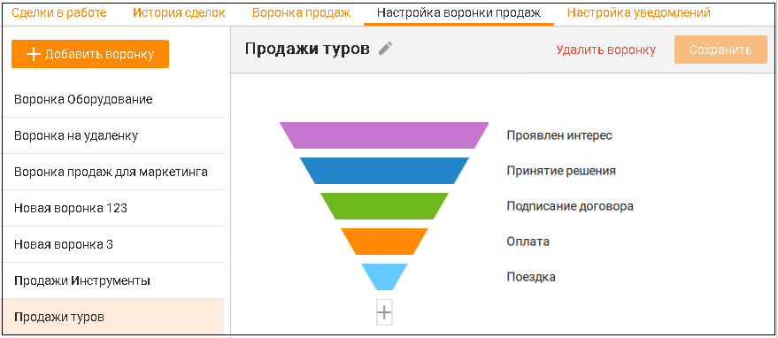
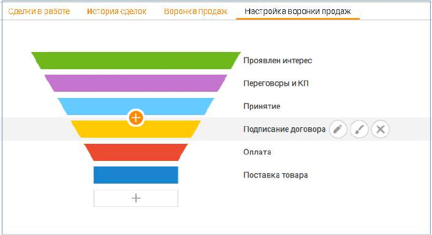
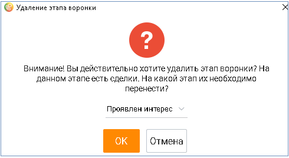

# 5.4. Настройка воронки продаж

> Трассировка: PDF §5.4 · сквозные стр. 185-187 · источники: ч.1 `kb/sources/mango-cc-manual/CC_manual_1.26.23_compressed.pdf` с.185-187.

| Воронки продаж настраиваются пользователями с правом доступа Руководитель |  |  |
| --- | --- | --- |
|  | компании или Администратор. Остальные пользователи имеют доступ только к уже |  |
| настроенным воронкам. |  |  |

Пользователь может настроить несколько воронок продаж, для каждого из своих проектов. Каждая воронка включает в себя сделки по одному проекту. Сделка может быть частью только одной воронки. На вкладке имеется предустановленная воронка продаж. Пользователь может добавлять, редактировать и удалять этапы воронки. Чтобы добавить новую воронку продаж, щелкните по кнопке + Добавить воронку. Для каждой воронки следующие действия:

• Задать имя воронке – пиктограмма • Удалить воронку • Сохранить внесенные изменения • Производить действия с этапами воронки.

Действия с этапами воронки Каждая сделка воронки имеет определенный этап. Одному этапу может соответствовать сколь угодно сделок, при этом одна сделка может соответствовать только одному этапу. При создании сделки назначается первый этап из возможных. Любую сделку в статусе В работе можно перемещать между этапами. 1. Чтобы добавить новый этап воронки продаж, щелкните по значку +. Этап можно добавлять в любой части воронки. Для одной воронки допускается не более 10 этапов. 2. Чтобы отредактировать этап воронки продаж, наведите курсор на нужную строку и выберите один из двух вариантов:

– редактировать название этапа воронки

– редактировать цвет воронки

3. Чтобы удалить этап, наведите курсор на нужную строку и щелкните по значку .

Если в удаляемом этапе имеются сделки со статусом В работе, выберите другой этап в выпадающем окне и переместите сделки. Подтвердите свое согласие на удаление. Сделки, которые не находятся в работе (со статусами Состоялась, Не состоялась, Удалена), перемещаются на другой этап автоматически.

Оставшийся последним этап воронки удалить невозможно. Чтобы удалить воронку кликните по кнопке Удалить воронку. Для удаления не доступны воронки и этапы, выбранные в настройках интеграции с ЮKassa.
