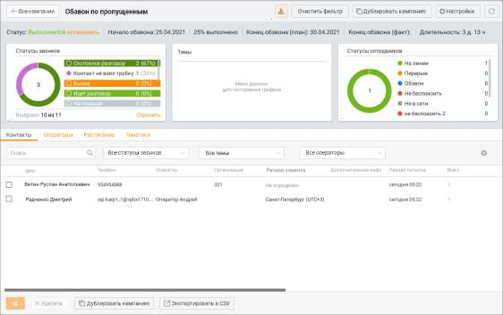
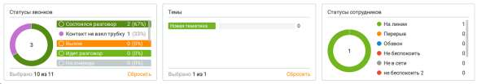
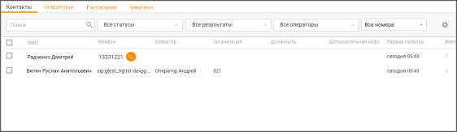
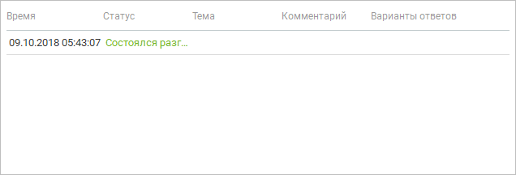
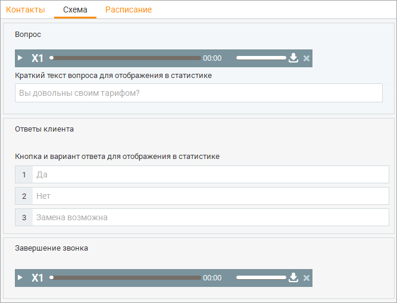
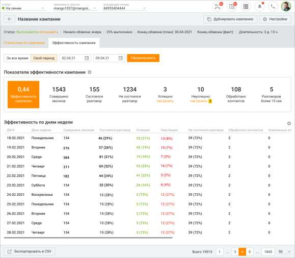

# 11.5. Карточка кампании

> Трассировка: PDF §11.5 · сквозные стр. 366-374 · источники: ч.1 `kb/sources/mango-cc-manual/CC_manual_1.26.28.1.pdf` с.366-374.

Откройте Карточку кампании, кликнув по наименованию кампании в списке кампаний Исходящего обзвона.

Карточка кампании содержит две вкладки: • Статистика по кампании • Эффективность кампании 11.5.1. Статистика по кампании Вкладка Статистика по кампании состоит из двух блоков:

• инфографика (открывается кликом по пиктограмме ); • данные текущей кампании, разделенные на вкладки.

Клик по кнопке F5 обновляет данные в отчетах. Клик по кнопке Очистить фильтр удаляет заданные параметры фильтрации.

| В рамках компаний исходящего обзвона в Контакт-центре MANGO OFFICE |  |  |
| --- | --- | --- |
|  | предусмотрена возможность скрытия номеров клиентов от сотрудников. Данная |  |
|  | возможность является опциональной и подключается только через персонального |  |
| менеджера. |  |  |

В заголовке отображается статус кампании с возможностью управления им. Описание статусов приведено в разделе Список кампаний, блок "Как изменить статус кампании". Напомним, что статусом кампании можно управлять как из карточки кампании, так и из общего списка кампаний. Для возвращения к списку кампаний нажмите ссылку "Все кампании".

Для вызова дополнительных настроек нажмите Настройки. Описание настроек приведено в разделе Карточка кампании, шаг Дополнительные настройки. В зависимости от статуса допускается изменение следующих настроек:

• Статус "Завершена", "Обрабатывается", "Останавливается" – любые изменения недоступны; • Статус "Остановлена" – доступны для изменения поля: Название, Даты начала/окончания обзвона, Список операторов, Список контактов, Перебор номеров. • Статус "Выполняется" – доступны для изменения поля: Дата окончания обзвона, Список контактов, Список операторов; • Статус "Запланирована" – доступны для изменения поля: Название, Дата начала обзвона, Дата окончания обзвона.

| Удаление контактов, импортированных из файла, доступно только в компании со статусом |
| --- |
| "Остановлена". |

Инфографика Данные об исходящем обзвоне выбранной кампании приведены в виде инфографики, включающей три диаграммы. Обновление информации осуществляется автоматически каждые 10 секунд либо при нажатии кнопки F5.

| Клик по области графика (тексту либо изображению) приводит к фильтрации списка в таблице |
| --- |
| соответственно выбранному значению. Повторный клик по этой области приводит к отмене |
| фильтрации. Клик по кнопке Сбросить очищает фильтр графика. |
| Графики зависимы друг от друга, т.е. выбор показателя на одном графике перестраивает |
| значения на других графиках. |

| Данное правило не касается графика "Статусы сотрудников", поскольку он отражает |
| --- |
| текущий статус оператора. |

Статусы звонков Данная диаграмма отображает количество контактов, распределенных по статусам. Предусмотрены следующие статусы:

| Вызов – совершается вызов и/или оператору/роботу; |
| --- |
| Состоялся разговор – вызов совершен и разговор состоялся; |
| Идет разговор – прямо сейчас происходит разговор; |
| На очереди – вызов контакту пока не состоялся или только происходит дозвон; |
| Занято – вызов контакту состоялся, но при последней попытке дозвона телефонная линия |
| вызываемого абонента была занята; |
| Контакт не взял трубку – вызов контакту состоялся, но при последней попытке дозвона, |
| абонент не взял трубку; |
| Оператор не взял трубку – вызов оператору состоялся, но при последней попытке |
| дозвона оператор не взял трубку; |
| Оператор не дождался клиента – вызов оператору состоялся, но при попытке дозвона до |
| абонента оператор положил трубку. (Статус актуален только для режима "Сначала |
| оператору, потом абоненту"); |
| Отклонен оператором – вызов оператору состоялся, но оператор отклонил вызов; |
| Недоступен клиент – вызов контакту состоялся, но при последней попытке дозвона |
| телефонная линия вызываемого абонента была недоступна; |

| Недоступен оператор – вызов контакту состоялся, но при попытке дозвона телефонная |
| --- |
| линия оператора была не доступна; |
| Остановлен – дозвон контакту был остановлен пользователем из клиентского |
| приложения, либо кампания завершилась согласно расписанию; |

• АнтиРобот: клиент разговаривает - вызов контакту состоялся, но АнтиРобот распознал, что контакт занят и отклонил вызов; • АнтиРобот: голосовая почта – вызов контакту состоялся, но АнтиРобот распознал голосовую почту и отклонил вызов; • АнтиРобот: номер недоступен - вызов контакту состоялся, но АнтиРобот распознал робота и отклонил вызов. • АнтиРобот: клиент положил трубку во время анализа АнтиРоботом - вызов контакту состоялся, но клиент положил трубку после начала работы Антиробота и до его завершения.

| Статусы звонков "Антиробот" отображаются, если на Контакт-центре подключена услуга |  |  |
| --- | --- | --- |
|  | "АнтиРобот". |  |

При наведении курсора на диаграмму выводится всплывающая подсказка, отображающая название статуса, количество сотрудников в данном статусе и их имена. Темы Данная диаграмма отображает вызовы со статусом "Дозвонились", распределенные по результатам. Если результатов больше семи, то будут отображены семь наиболее часто используемых. Список содержит результаты только нижнего уровня. Таким образом, если по одному разговору была выбран родительский и дочерний результат, то в отчете отображается только дочерний результат. При наведении курсора на область диаграммы выводится всплывающая подсказка, отображающая процентное соотношение вызовов с данным результатом. Статусы сотрудников Данная диаграмма отображает количество сотрудников, участвующих в исходящем обзвоне, распределенных по статусам на данный момент времени. При наведении курсора на область диаграммы выводится всплывающая подсказка, отображающая процентное соотношение задействованных в кампании сотрудников в данном статусе.

| Для кампаний с режимом обзвона "Уведомление" и "Сбор обратной связи" отображается |  |  |
| --- | --- | --- |
|  | только диаграмма "Результаты". Для кампаний с режимом "Специальное предложение" |  |
| отображается дополнительная круговая диаграмма с результатами ответов на вопрос. |  |  |

Данные текущей кампании Данные кампании с режимом обзвона С участием сотрудника характеризуются несколькими вкладками. Контакты Вкладка "Контакты" содержит список отобранных контактов и отображает результаты обзвона.

| Для пользователей Личного кабинета с ролью "Руководитель компании", а также ролей, |  |  |
| --- | --- | --- |
|  | созданных на ее основе, предусмотрена возможность ограничения доступа остальных |  |
|  | пользователей к просмотру записей своих разговоров. Для настройки ограничений следует |  |
| воспользоваться виджетом "Настройки личной защиты" рабочего стола. |  |  |

Для оперативного поиска разговоров предусмотрены следующие фильтры: • по статусу разговора; • по результатам вызова;

• по оператору; • по номерам – фильтр доступен, если при настройке кампании ИО проставлен чекбокс Перебор номеров.

Для оперативного поиска контактов введите в поле поиска имя, отчество или фамилию контакта. При вводе искомого текста работает автоподбор.

| Вы можете самостоятельно выбрать, какие столбцы будут отображаться на панели. Для этого |  |
| --- | --- |
| щелкните левой кнопкой мыши по пиктограмме | и установите/снимите флаги напротив |
| наименований столбцов. |  |

Для добавления контактов нажмите на и выберите способ добавления контактов: • из адресной книги • из файлов. Процесс добавления контактов аналогичен рассмотренному в разделе Добавление кампании/С участием сотрудника, шаг Выбор контактов. Добавление контактов допускается также в случае, когда кампания находится в статусе "Выполняется". Предусмотрена возможность удалить контакт(ы) из обзвона. Для этого следует: 1. присвоить кампании статус "Остановлена"; 2. установить флаги напротив ФИО контактов, предназначенных для исключения; 3. нажать кнопку Удалить. Предусмотрена возможность копирования кампании из карточки контактов. Для этого необходимо, чтобы в карточке контактов при помощи фильтров был выбран хотя бы один сотрудник. В результате кнопка "Дублировать кампанию" становится активной. После нажатия кнопки запускается процесс добавления компании с предзаполненными полями. Также предусмотрена возможность скопировать любое значение из списка задач кампании, кликнув по значению правой кнопкой мыши и выбрав "Копировать" во всплывающем контекстном меню. При щелчке по значению в колонке Всего отображается история вызовов данного контакта.

Чтобы экспортировать данные результатов обзвона, истории вызовов, нажмите кнопку Экспорт в CSV. Для экспорта доступны все поля, включая пользовательские.

Функция экспорта не доступна пользователям с ролью Сотрудник и Оператор. Выберите необходимую кодировку экспортируемых данных из списка Кодировка в группе Параметры. Затем выберите нужный разделитель между полями данных (точка с запятой, точка либо символ табуляции) из списка Разделитель в группе Параметры. После этого (при необходимости) выберите формат даты в группе Дополнительные настройки. Далее выберите подлежащие экспорту поля данных. При необходимости выбирайте поля в соответствии с очередностью, нужной для целевого приложения. Для выбора поля данных дважды щелкните по нужному полю в списке Доступные поля либо воспользуйтесь соответствующими кнопками. После этого поле перемещается в список Выбранные поля. Чтобы отменить выбор поля, дважды щелкните по нему еще раз. После этого оно возвращается в список Доступные поля. Когда вы завершите выбор подлежащих экспорту полей и типа экспорта, нажмите кнопку Начать экспорт. В появившемся окне Экспортировать в файл выберите имя и путь сохранения файла и нажмите кнопку Сохранить. После этого Контакт-центр MANGO OFFICE сохраняет выбранные для экспорта данные в файл с расширением .csv. Операторы Вкладка "Операторы" содержит список операторов. Процесс выбора операторов аналогичен рассмотренному в разделе Добавление кампании/С участием сотрудника, шаг Выбор операторов. Сотрудники, добавленные в кампанию, будут обладать правами наравне с операторами. Список операторов для кампаний в статусах Запланирована, Выполняется, Остановлена доступен для редактирования. Список операторов кампании в статусе Завершена недоступен для редактирования. Расписание Вкладка "Расписание" содержит таблицу с расписанием исходящего обзвона. Процесс изменения расписания аналогичен рассмотренному в разделе в разделе Добавление кампании/С участием сотрудника, шаг Параметры обзвона. Тематики

| Вкладка "Тематики" содержит список тематик обзвона. В табличной части проставленные |
| --- |
| звонку тематики размещаются в столбце "Темы". |

Процесс добавления и редактирования списка аналогичен рассмотренному в разделе Справочник тематик обращений. При редактировании набора тематик у всех сотрудников, которые участвуют в ней в качестве исполнителя, список доступных тематик для обработки обращения обновляется. Данные кампании с режимом обзвона Без участия сотрудника характеризуются тремя вкладками: — Контакты (аналогично вкладке для кампании с режимом обзвона "С участием сотрудника"); — Расписание (аналогично вкладке для кампании с режимом обзвона "С участием сотрудника"); Схема Данная вкладка отображает настроенную схему для кампаний с режимом обзвона без участия сотрудника.

Допускается редактирование только компаний в статусе Остановлена, и только текстовых пояснений к вопросам и ответам. 11.5.2. Эффективность кампании Вкладка "Эффективность кампании" служит для оценки кампаний Исходящего обзвона. В зависимости от выбранных параметров пользователь может отслеживать различные показатели кампаний ИО и получать данные в форме структурированных отчетов. Для формирования отчета установите фильтр периода и нажмите кнопку Сформировать.

<!-- изображение на стр. 373: байты не извлечены (PyMuPDF недоступен) -->

Вы можете самостоятельно выбрать, какие показатели эффективности будут отображаться на

<!-- изображение на стр. 373: байты не извлечены (PyMuPDF недоступен) -->

панели. Для этого щелкните левой кнопкой мыши по пиктограмме и установите/снимите флаги напротив наименований показателей. В зависимости от выбранного варианта отображения, значение показателя отображается в числовом или процентном выражении. Доступны следующие показатели: 1. Эффективность кампании – количество попыток звонков в статусе "разговор состоялся" в текущей кампании ИО за период, поделенное на общее количество попыток звонков за период в текущей кампании. 2. Совершено звонков – общее количество совершенных попыток в текущей кампании за период. 3. Состоялся разговор – количество попыток за период, по которым удалось дозвониться. 4. Не состоялся разговор – количество попыток, по которым не удалось дозвониться. 5. Успешно – количество задач кампании, которые были созданы в заданный период и по которым была проставлена одна из указанных в настройках показателя тематик. Выбор возможен из набора тематик, определенных для кампании. 6. Неуспешно – количество задач кампании, которые были созданы в заданный период и по которым была проставлена одна из указанных в настройках показателя тематик. Выбор возможен из набора тематик, определенных для кампании. 7. Обработано контактов – количество контактов, по которым был успешный дозвон, либо закончилось количество попыток дозвона.

<!-- изображение на стр. 374: байты не извлечены (PyMuPDF недоступен) -->

8. Разговоров более 15 сек – количество разговоров длительностью более 15 секунд. Клик по кнопке Экспортировать в CSV приводит к открытию стандартного окна экспорта данных. Экспорт производится с учетом выбранных в фильтрах значений.
