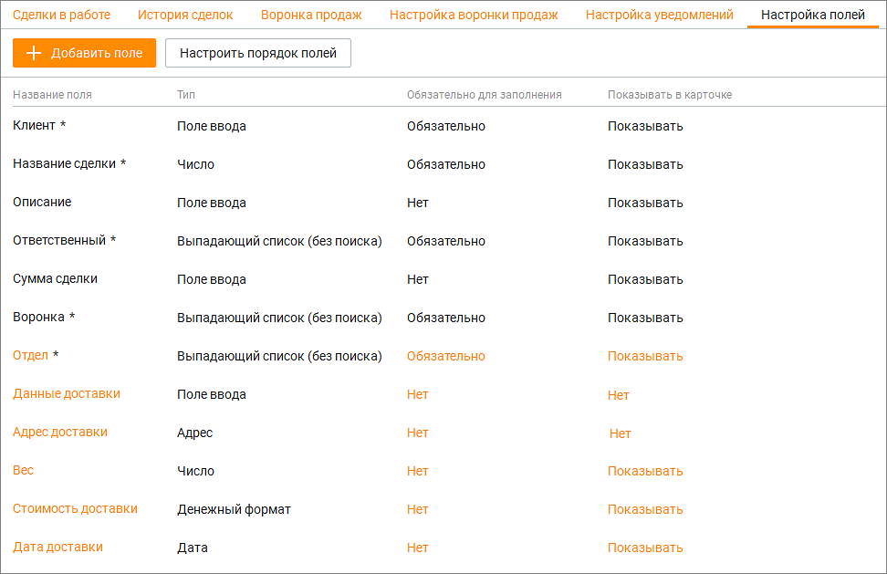

# 5.6. Настройка пользовательских полей

> Трассировка: PDF §5.6 · сквозные стр. 196-200 · источники: ч.2 `kb/sources/mango-cc-manual/CC_manual_1.26.23-part-2.pdf` с.95-99.

В модуле Сделки доступно добавление пользовательских полей. Максимальное количество пользовательских полей определяется условием дополнительно подключаемой услуги. Кнопка Добавить поле предназначена для добавления пользовательских полей в модуль Сделки. Кнопка Настроить порядок полей позволяет настроить порядок, в котором пользовательские поля будут отображаться в карточке сделки и быстрой карточке в разделе "Мои обращения".

Поля отмеченные символом *, являются обязательными к заполнению. Если это поле отображается в карточке и быстрой карточке сделки, там оно также отмечено символом * (звездочка). Добавление пользовательских полей Для добавления пользовательского поля следует кликнуть по кнопке Добавить поле. Откроется выпадающий список с вариантами типов поля. Доступны следующие типы пользовательских полей: Поле ввода – от 1 до 255 символов, текст. Если необходимо больше символов, используйте поле «Текстовая область». Выпадающий список – количество значений от 1 до 300. Возможно два варианта списка: с единственным или множественным выбором; Адрес – поиск указанного адреса в Google-картах; Число – используется только для ввода целых чисел; Денежный формат – не более 14 знаков, после запятой не более 2 знаков. То есть 999999999999.99 максимально возможное значение; Дата – ввод данных в формате: ДД.ММ.ГГГГ; Флаг – содержит одно из двух значений: Да/Нет, Истина/Ложь или Вкл/Выкл.

Ссылка – хранение ссылок на URL-адреса; Текстовая область – от 1 до 1000 символов; Пользователь – список значений, отображающий всех пользователей ВАТС.

| Созданные пользовательские поля применяются для старых и новых сделок всех статусов, |
| --- |
| во всех воронках. |

Пользовательские поля доступны для сохранения в файл импорта при импорте сделок. Настройки пользовательских полей После выбора типа поля следует установить его настройки. Выбор типа пользовательского поля доступен только при создании. Изменение типа пользовательского поля в уже созданном поле – не доступно.

Отмеченные * настройки поля не могут быть впоследствии изменены. В зависимости от типов полей доступны следующие настройки:

| № | Тип настройки | Описание настройки |
| --- | --- | --- |
| 1 | Название поля | Произвольное, уникальное имя. Не может повторять название стандартных полей. Длина не более 30 символов. Доступна для всех типов полей. |
| 2 | Количество символов* | Настройка ограничения на количество вводимых символов в содержимом поля. Доступна для полей: • Поле ввода • Адрес • Число • Ссылка |
| 3 | Проверка заполненного значения на уникальность* | Проверка содержимого пользовательского поля на уникальность при создании или изменении. Пустое значение на уникальность не проверяется. Доступна для полей: • Поле ввода • Адрес • Число • Денежный • Ссылка |
| 4 | Только для чтения | Вне зависимости от прав и ролей пользователей, содержимое поля будет не доступно для изменения, в случае включения настройки. Доступна для полей: • Поле ввода • Адрес • Число • Денежный |

|  |  | • Ссылка |
| --- | --- | --- |
| 5 | Указать ограничение для суммы* | Настройка ограничения на ввод суммы чисел. Доступна для полей: • Денежный |
| 6 | Валюта* | Список содержит иконки трех валют для выбора: • Рубль • Евро • Доллар Доступна для полей: • Денежный |
| 7 | Доступно несколько вариантов для выбора* | Переключает список с единичным выбором значения, на список с множественным выбором. Доступна для полей: • Выпадающий список |
| 8 | Показывать поиск по значениям | Включает/отключает поисковое поле, с поиском по значениям выпадающего списка. Доступна для полей: • Выпадающий список • Пользователь |
| 9 | Действия со значениями выпадающего списка | Доступны следующие действия: • Наименование значения списка – произвольное, уникальное наименование значения выпадающего списка; • Добавление значения списка – настройка, добавляющая плюс еще одно значение выпадающего списка к существующему одному значению, созданному системой автоматически; • Изменение порядка расположения значений. Пользователю доступно изменение порядка созданных значений, повышая приоритет (перемещая выше), либо уменьшая приоритет (перемещая ниже); • Удаление значения списка – настройка, удаляющая значение выпадающего списка без возможности восстановления. Доступна для полей: • Выпадающий список |

Дополнительные настройки для пользовательских полей:

| № | Наименование | Описание настройки |
| --- | --- | --- |
|  | настройки |  |
| 1 | Обязательность заполнения | При включенном состоянии, включена проверка, которая не позволяет создавать или изменять сделки, если содержимое поля – пусто |
| 2 | Показывать в карточке | Включено или выключено отображение поля на интерфейсе карточки сделки |

| 3 | Порядок полей | Настройка позволяет менять порядок расположения полей в интерфейсе. Влияет только на порядок расположения поля, не изменяет данные или содержимое пользовательского поля. |
| --- | --- | --- |

Настроить порядок пользовательских полей Клик по кнопке Настроить порядок полей открывает окно, в котором пользователь может изменить порядок отображения пользовательских полей.

Для изменения порядка полей зафиксируйте левую кнопку мыши на пиктограмме и переместите поле вверх или вниз по списку. Сохраните внесенные изменения кнопкой Сохранить. Удаление пользовательских полей Для удаления поля кликните на наименование поля и в открывшемся окне нажмите кнопку Удалить. Подтвердите согласие на удаление.

| При удалении пользовательского поля удаляется поле и все содержимое поля, без |
| --- |
| возможности восстановления. |

<!-- изображение на стр. 200: байты не извлечены (PyMuPDF недоступен) -->
