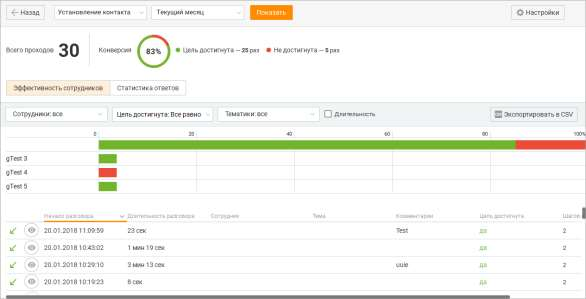
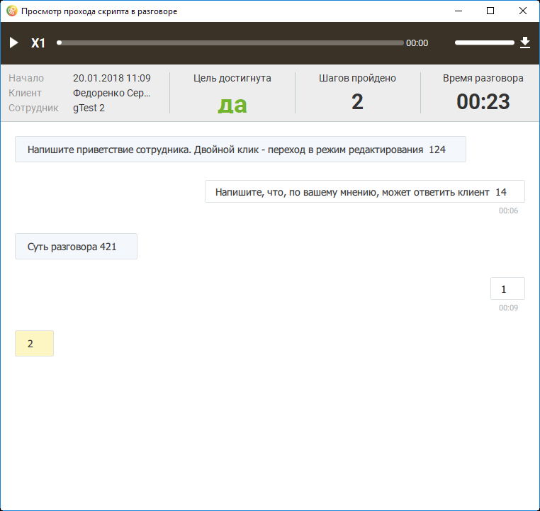
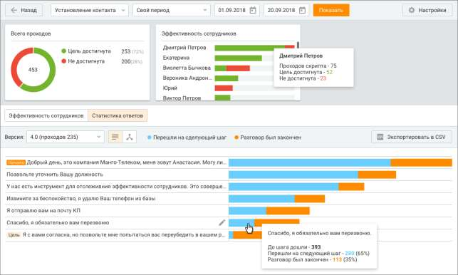
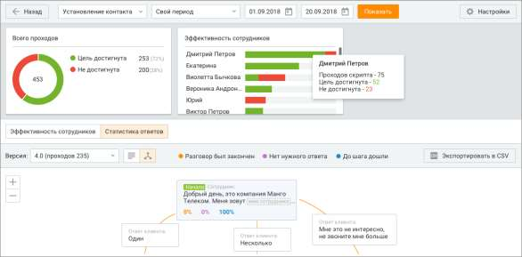

# 12.3. Статистика

> Трассировка: PDF §12.3 · сквозные стр. 387-393 · источники: ч.1 `kb/sources/mango-cc-manual/CC_manual_1.26.28.1.pdf` с.387-393.

Если по скрипту был выполнен хотя бы один проход, то есть выбор хотя бы одного варианта ответа клиента или внесение хотя бы одного комментария к ответу клиента, то при щелчке по наименованию скрипта выполняется переход к статистическим отчетам по данному скрипту. Предусмотрены следующие отчеты: • Эффективность сотрудников — персональная статистика назначенных сотрудников; • Статистика ответов — статистика прохождения каждого шага скрипта. 12.3.1. Эффективность сотрудников

Выбор скрипта и период, за который будут получены статистические данные, указываются в шапке отчета. При выборе другого скрипта и/или изменении периода нажмите кнопку Показать для формирования отчета по новым условиям. В верхней части окна отображается общее количество проходов выбранного скрипта вне зависимости от его версии в течение указанного периода. Круговой график конверсии отображает процентное отношение количества проходов скрипта, в которых хотя бы один сотрудник достиг хотя бы одной цели выбранной версии скрипта, к общему количеству проходов скрипта выбранной версии.

Основная часть отчета содержит статистические сведения в табличном виде по каждому назначенному сотруднику. При щелчке по графику отображается подробная информация по соответствующему сотруднику.

| Для пользователей Личного кабинета с ролью "Руководитель компании", а также ролей, |  |  |
| --- | --- | --- |
|  | созданных на ее основе, предусмотрена возможность ограничения доступа остальных |  |
|  | пользователей к просмотру записей своих разговоров. Для настройки ограничений следует |  |
| воспользоваться виджетом "Настройки личной защиты" рабочего стола. |  |  |

В нижней части отчета отображается таблица со всеми вызовами, в которых был совершен проход по текущему скрипту в указанный период. Элементы таблицы • Начало разговора -дата и время начала разговора; • Длительность разговора – длительность вызова; • Сотрудник – ФИО сотрудника, совершившего или принявшего вызов; • Клиент – номер телефона или ФИО клиента из адресной книги; • Тема – тематика вызова; • Комментарии – комментарий к вызову; • Цель достигнута – "да", если за проход скрипта достигнута хотя бы одна цель. Иначе – "нет". • Шагов пройдено (внесено других ответов клиента) – количество пройденных шагов скрипта и количество внесенных комментариев. Фильтр по сотрудникам

Для того, чтобы отобразить статистику по определенным сотрудникам, следует открыть выпадающий список "Сотрудники" и установить флаги напротив имен нужных сотрудников. Формирование отчета по измененному списку сотрудников выполняется автоматически. Фильтр по достижению цели Для того, чтобы отфильтровать статистику по достижению цели, следует открыть выпадающий список "Цель достигнута" и выбрать нужное значение. Формирование обновленного отчета выполняется автоматически. Фильтр по длительности разговора Для того, чтобы отфильтровать статистику по длительности разговора, включите настройку Длительность и укажите длительность разговора в полях От и До. Формирование обновленного отчета выполняется автоматически. Для просмотра выбранных ответов сотрудника и клиента во время разговора наведите курсор

на строку нужного вызова и щелкните по пиктограмме . В результате отобразится форма прохождения скрипта, содержащая все ответы.

При наличии записи разговора в верхней части формы содержится панель встроенного плеера.

В основной части формы отображается прохождение версии скрипта, которая была использована в разговоре. При прослушивании записи скрипт проматывается вместе с проигрыванием записи. Таким образом, на экране всегда отображается ответ сотрудника и следующий за ним ответ клиента и комментарий (при его наличии), которые соответствуют метке времени на записи вызова. При установке бегунка записи в какое-либо состояние скрипт прокручивается к соответствующему месту. Если запись началась через некоторое время после начала разговора и до начала записи сотрудник выбрал хотя бы один ответ клиента или оставил комментарий, то при инициировании проигрывания записи скрипт проматывается к тому блоку (ответ оператора + ответ клиента + комментарий), который соответствуют временной метке начала записи относительно начала разговора. Ответ сотрудника, который является целью, выделяется цветом. Для редактирования блока с ответом сотрудника или клиента следует навести курсор на

нужный блок и щелкнуть по пиктограмме . В результате выполняется переход к форме

| редактирования скрипта. |
| --- |
| Экспорт статистики |
| Для экспорта доступны следующие данные: |

| Начало разговора; |
| --- |
| Длительность разговора; |
| Сотрудник; |
| Клиент; |
| Тема; |
| Комментарии; |
| Цель достигнута; |
| Шагов пройдено |
| Внесено других ответов клиента. |

12.3.2. Статистика ответов Выбор скрипта и период, за который будут получены статистические данные, указываются в шапке отчета. При выборе другого скрипта и/или изменении периода нажмите кнопку Показать для формирования отчета по новым условиям. В верхней части окна отображается общее количество проходов выбранного скрипта вне зависимости от его версии в течение указанного периода. Круговой график конверсии отображает процентное отношение количества проходов скрипта, в которых хотя бы один сотрудник достиг хотя бы одной цели выбранной версии скрипта, к общему количеству проходов скрипта выбранной версии. Отчет отображает статистические данные в зависимости от версии скрипта. Выбор версии осуществляется путем выбора нужного пункта из выпадающего списка в поле "Версии". Формирование отчета при изменении версии выполняется автоматически. Основная часть отчета отображает схему скрипта выбранной версии. Представление схемы возможно как в виде дерева, так и в виде списка.

Переключение осуществляется при помощи переключателей и соответственно.

При списковом представлении отчет представлен в табличном виде. На каждом ответе сотрудника отображается два значения, каждое из которых выделено соответствующим цветом: • Перешли на следующий шаг (голубой) — количество проходов текущей версии скрипта, дошедших до данного шага: • Разговор был закончен (оранжевый) — количество проходов текущей версии скрипт, в которых данный ответ сотрудника стал последним ответом, к которому перешел сотрудник во время разговора. При щелчке по графику отображается подробная информация по соответствующему шагу. Пример отчета в виде дерева:

При представлении отчета в виде дерева на каждом ответе сотрудника отображается три значения, каждое из которых выделено соответствующим цветом: • Разговор был закончен (оранжевый) — процентное соотношение количества проходов выбранной версии скрипта, в которых текущий ответ сотрудника стал последним ответом, к которому перешел сотрудник в течение разговора, к общему количеству проходов текущей версии скрипта; • Нет подходящего ответа (фиолетовый) — процентное соотношение количества проходов выбранной версии скрипта, в которых к текущему ответу сотрудника был оставлен комментарий, т. е. выбран "Ответ клиента", к общему количеству проходов текущей версии скрипта; • До шага дошли (синий) — процентное соотношение количества проходов выбранной версии скрипта, в которых сотрудник дошел до текущего ответа сотрудника, к общему количеству проходов текущей версии скрипта. Для редактирования блока с ответом сотрудника или клиента наведите курсор на нужный блок

и щелкните по пиктограмме . В результате выполняется переход к форме редактирования скрипта. Для просмотри дерева используются те же горячие клавиши, что и для создания скрипта: ОС Windows: • сочетание клавиш "Ctrl" и "+", а также сочетание зажатой клавиши Ctrl с вращением колеса мыши в сторону увеличения аналогичны нажатию кнопки "+"; • сочетание клавиш "Ctrl" и "+", а также сочетание зажатой клавиши Ctrl с вращением колеса мыши в сторону уменьшения аналогичны нажатию кнопки "-". ОС macOS: • сочетание клавиш cmd и "+" аналогично щелчку по кнопке "+"; • сочетание клавиш cmd и "-" аналогично щелчку по кнопке "-". В статистике ответов следующие показатели вычисляются с учетом нескольких проходов цикла и быстрых переходов: • До шага дошли (хотя бы один раз дошли в текущем проходе); • Перешли на следующий шаг (при каждом прохождении этого шага оператор переходил на следующий шаг); • Разговор был закончен; • Количество проходов выбранной версии скрипта, в которых текущий ответ сотрудника стал последним ответом, к которому перешел сотрудник в течение разговора; • Количество проходов выбранной версии скрипта, в которых к текущему ответу сотрудника был оставлен комментарий, т. е. выбран Ответ клиента; • Количество проходов выбранной версии скрипта, в которых сотрудник дошел до текущего ответа сотрудника; Таким образом, если в проходе скрипта сотрудник прошел один цикл, после чего перешел на другую ветвь скрипта, то в статистике ответы в цикле будут учитываться как пройденные.

