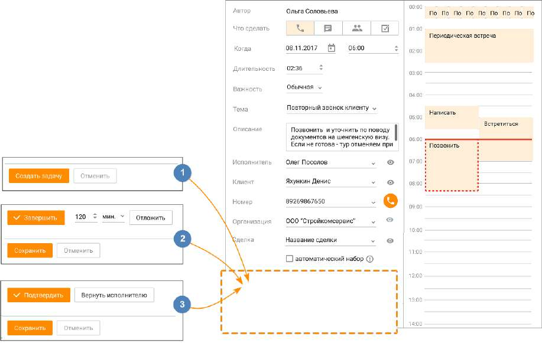

# 6.4. Создание задачи

Создание задач доступно пользователям, обладающим правом "Назначать задачи". Возможны как единичные, так и массовые постановки задач. При создании задачи постановщик может назначить исполнителя задачи в зависимости от права доступа: либо только себя, либо только кого-то из своей или подконтрольной группы, либо любого пользователя. Далее рассмотрим Карточку задачи в режимах: 1. Создания задачи; 2. Просмотра, редактирования и завершения (без подтверждения) задачи; 3. Подтверждения и завершения задачи.

БЛОК 1. Создание задачи Для создания единичной задачи откройте список задач и нажмите Добавить задачу. Откроется карточка создания задачи, где в поле Автор указан постановщик задачи. На карточке задачи заполните поля: • Что делать – целевое действие задачи. Доступны варианты: Позвонить, Написать, Встретиться, Сделать. • Когда – дата и время выполнения задачи. Выбранное время можно изменять вручную по линейке календаря; • Длительность – длительность задачи. Выбранную длительность можно изменять вручную на линейке календаря. После завершения указанного времени задача считается просроченной; • Важность – приоритетность задачи. Доступны варианты: важно, обычная, неважно; • Тема – выбор из списка имеющихся тем, либо создание новой темы (возможно создание не более 50-ти тем); • Описание – описание задачи, максимум 1024 символа. Поле не является обязательным к заполнению; • Исполнитель – исполнитель задачи. При наличии соответствующих прав в качестве исполнителя допускается выбор другого сотрудника; • Клиент – контакт адресной книги либо произвольный номер. Выбранный номер будет записан и в поле "Клиент", и в поле "Номер"; • Номер – номер телефона контакта (выбирается из доступных номеров телефона клиента) либо произвольный номер, указанный в строке Клиент. Если на продукте включена услуга "Скрытие номера клиента", номер может быть недоступен для просмотра и редактирования. (Узнать больше здесь). • Организация – поле автоматически заполняется информацией об организации из Карточки клиента и недоступно для редактирования; • Сделка – выбор сделки доступен после выбора клиента. При необходимости совершения автоматического дозвона клиенту в запланированное время, отметьте галочкой чекбокс "автоматический набор".

Завершите создание новой задачи кликом по кнопке Создать задачу. Исполнителю задачи отображается системное уведомление (приведены варианты для массовой и единичной постановки задач):

| Сотрудники могут отключить уведомления о назначении задач в разделе |  |  |
| --- | --- | --- |
|  | Настройки/Пользовательские. |  |

БЛОК 2. Просмотр, редактирование и завершение задачи (без подтверждения) Пользователь может отредактировать задачу, если он является ее автором и/или исполнителем. Если задача находится в статусе Подтверждена, ее просмотр или редактирование невозможно. В режиме редактирования задачи доступны следующие действия:

• Позвонить – кнопка отображается только для запланированных задач и только в случае наличия у контакта телефонного номера для вызовов и мобильного номера для сообщений; • Завершить задачу – кнопка Завершить. Если автор и исполнитель совпадают, задача завершается. Иначе – после нажатия кнопки задача ожидает подтверждения автора о завершении (см. Блок 3); • Отложить задачу на заданное время – кнопка Отложить.

Клик по пиктограмме открывает карточку Клиента, Исполнителя или Сделки.

Клик по пиктограмме приводит к удалению информации о Клиенте или Исполнителе.

Чтобы сохранить изменения не завершая задачи, закройте окно, нажав на пиктограмму . При нажатии кнопки Отложить внесенные изменения также будут сохранены, а срок выполнения задачи отложен на заданное количество времени. БЛОК 3. Подтверждение и завершение задачи Если автор и исполнитель задачи не совпадают, для завершения задачи необходимо получить подтверждение Автора. Автор может совершить следующие действия в Карточке задачи: Подтвердить – перевод задачи в статус Подтверждена и завершение задачи; Вернуть исполнителю – вернуть задачу на доработку исполнителю. Сохраните внесенные изменения. Задача в статусе Подтверждена недоступна для редактирования и просмотра. Массовая постановка задач Чтобы произвести постановку задачи более, чем одному контакту, отметьте контакты в разделе "Контакты". Затем на панели массовых действий кликните последовательно на кнопки Еще → Поставить задачу.

Для контактов, у которых не проставлен Ответственный, массово задачи не создаются. Для контактов, у которых имеется Ответственный, будут созданы задачи со следующими предустановленными параметрами: • исполнитель – ответственный по контакту; • клиент – соответствующий клиент; • номер – основной номер телефона клиента; • сделка – если у клиента есть хотя бы одна сделка со статусом "в работе", задача прикрепляется к ближайшей из них. Если такая сделка отсутствует, поле остается пустым. Длительность и время при массовой постановке задач:

• длительность каждой задачи при массовой постановке принимается равной 10 минут. Рассчитывается Контакт-центром в момент создания массовой постановки задач, и не доступно для редактирования пользователю. • для каждой следующей задачи время задачи увеличивается на длительность предыдущей, т. е. на 10 минут. • при массовой постановке задач учитывается время и длительность уже стоящих у пользователя задач. Остальные параметры – тип задачи, описание, автоматический набор – прописываются вручную в окне массовой постановки задачи.

| Пример 1. У пользователя нет других задач. |
| --- |
| ✓ Исходные данные: Массовая постановка задач в количестве – 3; |
| ✓ Когда: 30.12.2020. Время: 10:00; |
| ✓ Исполнитель: Ответственный по клиенту (предположим что ответственный один); |
| Распределение: |
| • 1 задача – 10:00; |
| • 2 задача – 10:10; |
| • 3 задача – 10:20; |
| Если ответственных несколько, то задачи распределяются разным ответственным с тем же |
| алгоритмом. |
| Пример 2. У пользователя есть другие задачи |
| ✓ Исходные данные: Массовая постановка задач в количестве – 7; |
| ✓ Когда: 30.12.2020. Время: 10:00; |
| ✓ Исполнитель: Ответственный по клиенту (предположим что ответственный один); |
| ✓ У ответственного по клиенту уже есть задача "Звонок". Когда: 30.12.2020. Время 10.30; |
| ✓ Длительность: 1 час. |
| Распределение: |
| • 1 задача – 10:00; |
| • 2 задача – 10:10; |
| • 3 задача – 10:20; |
| Задача "Звонок" – 10:30; |
| • 4 задача – 11:30; |
| • 5 задача – 11:40; |
| • 6 задача – 11:50; |
| • 7 задача – 12:00; |
| Если ответственных несколько, то задачи распределяются разным ответственным с тем же |
| алгоритмом с учетом задач каждого из ответственного. |

Как работает автоматический дозвон В запланированное в задаче время Контакт-центр MANGO OFFICE осуществляет попытки дозвона до указанного исполнителя. После того, как исполнитель отвечает на звонок, осуществляется одна попытка дозвона клиенту. Количество попыток дозвона до исполнителя и пауза между попытками соответствуют параметрам формы "Запланированный звонок", заданным в Настройках. Если использованы все попытки дозвона, при этом:

• система дозвонилась клиенту (клиент ответил на звонок) – задачу с настройкой "автоматический звонок" необходимо завершить принудительно, нажав на кнопку "Завершить" в карточке задачи. • система не дозванивается до исполнителя или клиента – задача помечается, как просроченная. Если попытки дозвона использованы не все, при этом: • система дозвонилась клиенту (клиент ответил на звонок) – задача остается в разделе "Запланированные". Чтобы завершить задачу, необходимо нажать на кнопку "Завершить" в карточке задачи. • система продолжает дозваниваться до исполнителя или клиента, до истечения установленного количества попыток дозвона.

| Редактирование данных или завершение задачи с автоматическим звонком возможно не |  |  |
| --- | --- | --- |
|  | позднее, чем за 5 минут до наступления времени, указанного в задаче. Поля карточки задачи |  |
|  | в этом случае недоступны для редактирования (кроме полей Описание и Сделка). Перенос |  |
|  | задачи допускается на время, до которого также остается не менее 5 минут. О невозможности |  |
| завершения задачи пользователь уведомляется системным сообщением. |  |  |

<!-- изображение на стр. 212: байты не извлечены (PyMuPDF недоступен) -->

Если две задачи с автоматическим дозвоном назначены на одно и то же время, то вначале запускается та задача, которая была создана раньше. При этом дозвон по второй задаче состоится только по завершении первого разговора, но не позднее текущего дня. Дозвон осуществляется только в том случае, если исполнитель находится в статусах "На линии", "Обзвон", "Перерыв". В правой части карточки отображается планирование задач сотрудника на указанный день. Новая задача до момента сохранения помечается пунктиром. Сплошной линией отображается текущее время. Если поставленная ранее задача растягивается на два дня, она отображается в календарях в каждом из дней. На одно время одного исполнителя допускается поставить не более десяти задач. При превышении этого числа на экране отобразится соответствующее предупреждение. Создание задачи также доступно: • из вкладки Клиенты/Контакты (адресной книги) • из карточки сделки • из Календаря задач • из окна Мои обращения В этих вкладках при создании или сохранении изменений в задаче также производится проверка на достижение максимального количества задач на одно время одного исполнителя. О достижении лимита пользователь уведомляется системным сообщением.
