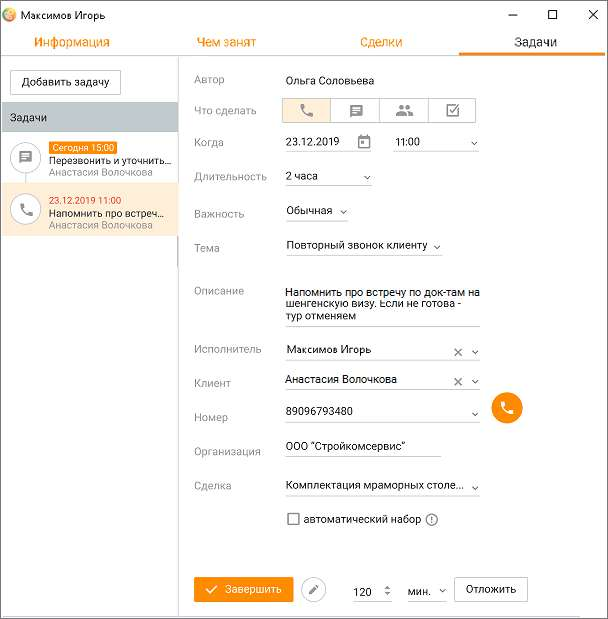

# 6.5. Просмотр задач из других модулей

> Трассировка: PDF §6.5 · сквозные стр. 212-214 · источники: ч.1 `kb/sources/mango-cc-manual/CC_manual_1.26.23_compressed.pdf` с.212-214.

Список задач, запланированных по клиенту, также доступен в карточке клиента на вкладке "Задачи и обращения", а также в карточке "Сделки". Cписок запланированных задач, назначенных на сотрудника, также доступен в карточке сотрудника на вкладке "Задачи".

