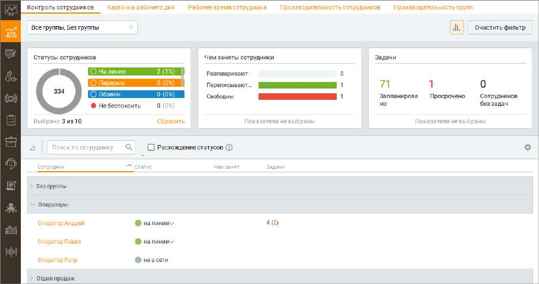
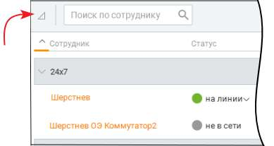
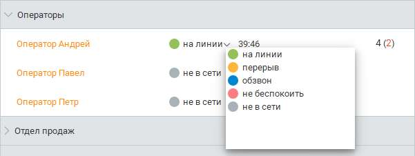

# 7.1. Контроль сотрудников

Этот отчет позволяет получить аналитические данные о работе сотрудников Контакт-центра MANGO OFFICE в режиме реального времени. В отчете учитываются все каналы коммуникации – текстовые и звонковые, которые подключены в Личном кабинете пользователя ВАТС.

Отчет доступен только для пользователей с ролями Супервизор и Администратор. Чтобы получить отчет о работе сотрудников, следует выбрать одну либо несколько групп. Формирование отчета выполняется автоматически по мере выбора групп. Клик по кнопке "Очистить фильтр" удаляет заданные параметры фильтрации.

| Если вы выбрали вариант Без группы в списке Группы, то отчет формируется по |
| --- |
| сотрудникам, не входящим ни в одну группу. |

Отчет отображается в виде трех графиков и табличной формы. Клик по пиктограмме открывает блок графиков отчета. Предусмотрены следующие графики: • Статусы сотрудников — количество сотрудников и процентное соотношение к общему количеству сотрудников в определенном статусе. В центре кольцевой диаграммы отображается сумма всех значений из данного графика. В отчете отображаются только те пользовательские статусы, которые существовали в выбранный период времени; • Чем заняты сотрудники — данный график приводит значения трех показателей: • Разговаривают — количество сотрудников у которых в обработке хотя бы один вызов/дозвон (внутренний либо внешний), вне зависимости от наличия в обработке текстовых обращений (в чате или по e-mail); • Переписываются — количество сотрудников у которых в обработке хотя бы одно текстовое обращение по любому текстовому каналу из доступных, и нет ни одного вызова/дозвона (внутреннего либо внешнего); • Свободны — количество сотрудников у нет в обработке ни одного текстового обращения и вызова/дозвона (внутреннего либо внешнего). • Задачи — данный график приводит значения трех показателей: • Запланировано — общее количество задач у сотрудников (в том числе и просроченных); • Просрочено — количество просроченных задач у сотрудников; • Сотрудников без задач — количество сотрудников, не имеющих запланированных и/или просроченных задач.

При щелчке по области графика выполняется фильтрация списка сотрудников в таблице, соответственно выбранному значению. Повторный щелчок по этой области приводит к отмене фильтрации. Допускается комбинация условий фильтра выбором нескольких значений. Клик по кнопке Сбросить очищает фильтр графика. Выбор в рамках одного графика объединяет показатели условием "ИЛИ", показатели с разных графиков объединяются логическим условием "И".

| Пример: |
| --- |
| (На линии "ИЛИ" Перерыв) "И" (Разговаривают "или" Свободны) "И" Просрочено. |

Сброс фильтров по графикам выполняется при нажатии кнопки Очистить фильтр. Табличная часть отчета содержит перечень сотрудников, удовлетворяющий условиям фильтрации. Предусмотрена оперативная фильтрация сотрудников по: • ФИО сотрудника из профиля; • Любому номеру телефона сотрудника; • E-mail сотрудника. Для фильтрации введите значение в поле "Поиск по сотруднику". При вводе искомого текста фильтрация списка сотрудников осуществляется автоматически. Для отображения только тех сотрудников, чьи текущие статусы не совпадают с запланированными в WFM, отметьте чекбокс "Расхождение статусов"

Клик по пиктограмме сворачивает/разворачивает группы сотрудников в таблице.

Таблица содержит столбцы: • Сотрудник – имя сотрудника; • Статус – актуальный статус сотрудника; • Чем занят – количество текстовых обращений в статусе «В работе», назначенных на текущего сотрудника (значок чата) и количество вызовов/дозвонов у сотрудника в настоящий момент (значок трубки); • Задачи – количество запланированных задач (в работе), назначенных на текущего сотрудника, в том числе и просроченных. В скобках указывается количество просроченных задач. При наведении курсора на строку данная строка изменяет цвет и в ней дополнительно отображается: • время нахождения в текущем статусе (время с момента последней смены статуса, под сменой статуса также необходимо понимать вход и выход из системы);

• пиктограммы «трубки», «чата» и «видео», при нажатии на которые можно совершить вызов данному сотруднику, открыть с ним чат или сделать видеозвонок соответственно. При щелчке по имени сотрудника отображается карточка сотрудника. Вид карточки зависит от роли вызывающего карточку пользователя. При щелчке по статусу отображается меню для принудительной смены статуса у сотрудника.

<!-- изображение на стр. 217: байты не извлечены (PyMuPDF недоступен) -->
