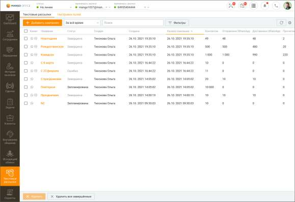
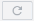
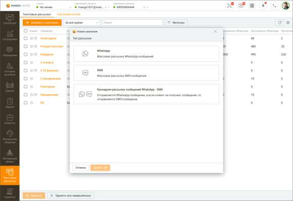
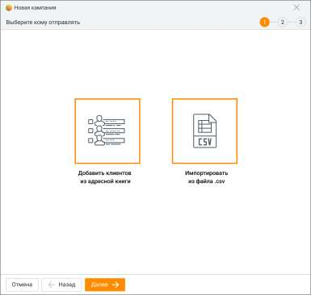
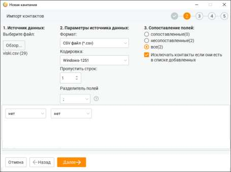
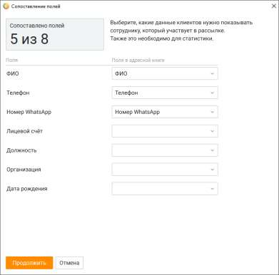
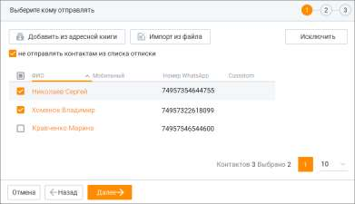
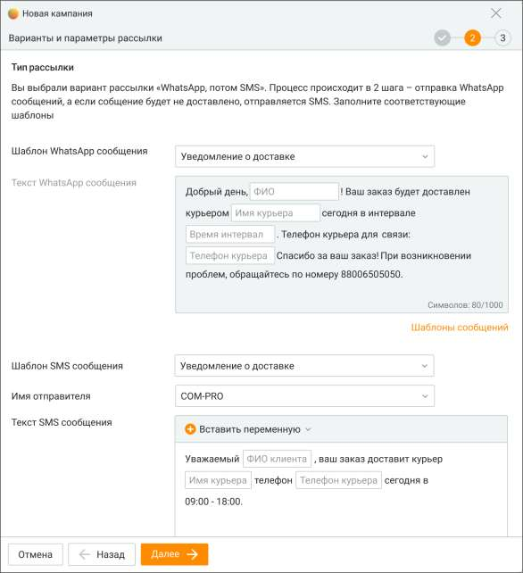
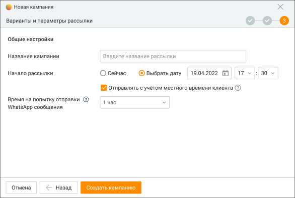

# 14.1. Текстовые рассылки

> Трассировка: PDF §14.1 · сквозные стр. 406-415 · источники: ч.1 `kb/sources/mango-cc-manual/CC_manual_1.26.28.1.pdf` с.406-415.

Вкладка "Текстовые рассылки" предназначена для создания и отслеживания статуса WhatsApp и СМС рассылок, а также просмотра и анализа статистики их доставки. На вкладке пользователь может: • добавлять, редактировать, дублировать, копировать или удалять кампанию по рассылке • просматривать или экспортировать общую статистику по кампании • просматривать детальную статистику по каждой кампании в карточке кампании • настраивать поля мастера создания кампаний в соответствии с полями шаблонов текстовых рассылок Вид вкладки со списком рассылок приведен на рисунке ниже.

Вкладка содержит блок фильтров и табличную часть. Блок фильтров позволяет производить фильтрацию списка кампаний по следующим параметрам: • дата проведения кампании – за последний месяц, за последнюю неделю, за все время, произвольный; • сотрудники – сотрудник, создавший кампанию; • статус кампании – выполняется, запланирована, остановлена (компания остановлена оператором во время ее выполнения), обрабатывается (кампания находится в процессе создания), завершена; Кампания переходит в статус "завершена" в следующих случаях: • все задачи кампании переведены для WhatsApp – в статус "доставлено" и/или "прочитано", для СМС – "отправлено". • отменена коммутатором, из-за следующих причин: a) некорректен шаблон рассылки, b) закончились деньги на счету пользователя Контакт-центра. Статус отправки WhatsApp сообщений:

| Статус | Описание статуса |
| --- | --- |
| Не отправлено • • • | Сообщение не отправлено по каналу WhatsApp Причины, по которым сообщение не отправлено: указанный получатель не зарегистрирован в WhatsApp неправильный формат номера абонента попытка отправки дубликата сообщения в течение 5 минут |

| • | сообщение не соответствует допустимому шаблону |
| --- | --- |
| В очереди | Сообщение находится в очереди на отправку |
| Отправлено | Сообщение отправлено |
| Доставлено | Сообщение доставлено |
| Прочитано | Сообщение прочитано |
| Не доставлено | Сообщение отправлено, но не получило статус "Доставлено" за период указанный в WhatsApp- сообщении (период "тайм-аут") |

Статус отправки СМС сообщений:

| Статус | Описание статуса |
| --- | --- |
| отправки |  |
| В очереди | Сообщение находится в очереди на отправку |
| Отправлено | Сообщение отправлено |
| Не отправлено | Отклонено, отменено, ошибка |

Также в блоке фильтров доступен поиск по названию кампании. Клик по кнопке F5 или

пиктограмме обновляет данные в отчетах. Клик по кнопке Очистить фильтр удаляет заданные параметры фильтрации. Табличная часть содержит сводную статистику по кампаниям. Для настройки отображения

столбцов таблицы нажмите Настройки и выберите необходимые варианты. 14.1.1. Добавление кампании Добавление новой кампании или кампании на базе существующей разбито на несколько шагов в зависимости от выбранного типа кампании. После нажатия кнопки Добавить кампанию запускается Мастер создания кампании. Выберите тип кампании.

| Создание кампании текстовой рассылки по выбранным каналам возможно только при |  |
| --- | --- |
|  | наличии подключения соответствующего канала хотя бы в одном виджете Личного кабинета |
| ВАТС. |  |

WhatsApp – массовая рассылка WhatsApp-сообщений. СМС – массовая рассылка СМС-сообщений. Для создания кампании необходимо подключить услугу "Индивидуальное имя отправителя СМС" в Личном кабинете ВАТС, последовательно пройдя в разделы горизонтального меню Общие настройки → Дополнительные настройки → Отправка SMS. Каскадная рассылка WhatsApp + СМС – отправляется WhatsApp-сообщение, а если клиент его не получает, то отправляется СМС-сообщение. Добавление кампании Процесс создания кампании текстовой рассылки состоит из трех шагов.

ШАГ-1: Выбор адресатов

На этом шаге необходимо выбрать вариант добавления адресатов в кампанию. Предусмотрено два способа добавления контактов, которые можно комбинировать. 1. Добавить клиентов из Контактов (адресной книги) – добавление контактов из адресной книги текущего продукта Контакт-центра MANGO OFFICE; 2. Импортировать из файла .csv – добавление контактов из внешнего источника (CSV файл).

| Количество контактов в одной кампании зависит от версии продукта. При превышении |  |  |
| --- | --- | --- |
|  | количества контактов соответствующая кнопка для добавления контактов будет недоступна. |  |
|  | Чтобы увеличить количество контактов, смените версию продукта либо обратитесь в |  |
| клиентский отдел MANGO OFFICE в вашем регионе. |  |  |

При добавлении контактов из адресной книги форма создания кампании скрывается и выполняется переход в модуль "Клиенты". Для поиска контактов вы можете использовать инструменты данного модуля. После выбора нужных контактов нажмите кнопку Отправить контакты.

Выбранные контакты отображаются в списке формы шага по добавлению контактов. Для удаления ненужных контактов выделите их флажками и нажмите Исключить. Из списка рассылки автоматически исключаются контакты, которые воспользовались опцией "Отписаться" в сообщениях WhatsApp, полученных в рамках маркетинговой кампании.

При импорте контактов из файла используется стандартная форма импорта данных с возможностью сопоставления полей. Поле "Телефон" является обязательным для сопоставления.

| Рекомендуется изменять CSV-файлы через приложение MS Excel. Другие приложения |
| --- |
| могут некорректно формировать файл для импорта. |

Передача списка пользовательских полей происходит в том числе при пустых значениях импортируемого файла, а также в случае, если поля не были сопоставлены при импорте. После завершения редактирования списка контактов нажмите Далее. По нажатию на кнопку Продолжить, выбранные контакты добавляются в кампанию. По нажатию на кнопку Отправить контакты ШАГА-1 может потребоваться заполнить данные в окне "Сопоставление полей". Сопоставление полей Перед началом кампании рекомендуется настроить пользовательские поля на вкладке Настройки полей. Настройки для сопоставления полей в Контактах и кампании текстовых рассылок открываются, если в данную компанию контакты добавляются впервые. Если же ранее в данную кампанию был добавлен хотя бы один контакт из адресной книги, то выбранные новые контакты добавляются в кампанию с настройками сопоставления полей, сделанными ранее для предыдущих добавленных контактов. Сопоставление полей необходимо для корректного отображения данных, поступающих сотруднику Контакт-центра в процессе рассылки, а также для сбора статистики кампаний.

В карточке кампании текстовой рассылки отобразятся только те пользовательские поля, для которых были указаны сопоставления при выборе адресатов. После нажатия на кнопку Продолжить можно добавить дополнительных адресатов рассылки или исключить контакты из списка отписки. Возможность добавления или удаления адресатов удобно использовать при дублировании одной из предыдущих рассылок.

Нажатие на кнопку Далее переводит к ШАГУ-2 добавления текстовой рассылки. ШАГ-2: Новая кампания. Настройка шаблона На ШАГЕ-2 настраивается шаблон текстовой рассылки, то есть параметры того сообщения, которое увидит конечный пользователь. На примере ниже рассмотрим ШАГ-2 для рассылки каскадного типа.

Шаблон WhatsApp-сообщения выбирается в выпадающем списке шаблонов и недоступен для изменения. О настройке шаблонов WhatsApp узнайте в разделе "Шаблоны сообщений". Шаблон СМС-сообщения можно также выбрать из существующих шаблонов, заданных в разделе "Шаблоны сообщений", или создать и отредактировать непосредственно в данном окне.

ШАГ-3: Новая кампания. Параметры рассылки

На следующем шаге создания кампании необходимо указать следующие параметры: Название кампании: необходимо задать название кампании текстовой рассылки (до 70-ти символов); Начало рассылки: варианты – сейчас, выбрать дату. Для отложенных рассылок можно задать учет часового пояса адресата; Время на попытку отправки WhatsApp-сообщения: варианты – 30 минут, 1 час (по умолчанию), 2 часа, 6 часов, 12 часов, 1 сутки. • Для кампании WatsApp+СМС – если WhatsApp-сообщение не будет отправлено за выбранное время, то будет отправлено SMS-сообщение; • Для кампании WatsApp – если WhatsApp-сообщение не будет отправлено за выбранное время, то отправка сообщения отменяется "; • Для кампании СМС-сообщения данная опция не отображается.

| При превышении количества созданных кампаний, доступных для учетной записи ЛК |
| --- |
| ВАТС, в области системных уведомлений отображается соответствующее сообщение. |

Редактирование кампании После создания в кампании текстовой рассылки доступны для редактирования следующие поля: наименование компании; тайм-аут. Удаление кампании Для удаления кампании отметьте выбранную компанию и нажмите кнопку "Удалить". Подтвердите согласие на удаление. Кампания текстовой рассылки будет удалена без возможности восстановления. Копирование кампании В Контакт-центре можно производить копирование выбранной кампании текстовой рассылки. В новую кампанию будут скопированы следующие значения параметров базовой кампании:

• наименование кампании; • имя пользователя, создавшего кампанию; • имя отправителя СМС; • отмеченные задачи для копирования. Дублирование кампании В Контакт-центре можно производить дублирование выбранной кампании текстовой рассылки. От копирования функция отличается копируемым набором параметров. В новую кампанию будут скопированы следующие значения параметров базовой кампании: • наименование кампании СМС-рассылки; • текст сообщения; • набор адресатов, отфильтрованный текущим пользователем при просмотре базовой кампании; • имя отправителя СМС.
