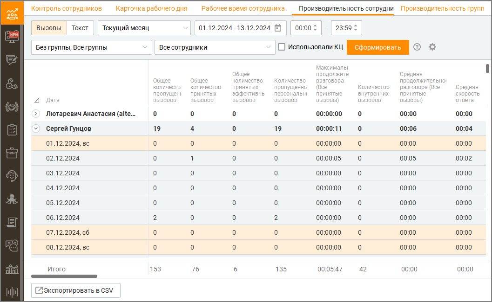

# 7.4.1. Вызовы

> Трассировка: PDF §7.4.1 · сквозные стр. 223-228 · источники: ч.1 `kb/sources/mango-cc-manual/CC_manual_1.26.23_compressed.pdf` с.223-228.

Отчет «Вызовы» предназначен для анализа входящих и исходящих телефонных звонков, с возможностью оценки эффективности обработки вызовов, работы сотрудников и изменения ключевых показателей производительности за выбранный отчетный период.

Чтобы получить отчет о показателях производительности сотрудников, вначале следует отобрать вызовы по периоду времени. Для этого выберите нужный период времени из списка Период. При выборе поля с и по, где вы можете ввести нужную дату или выбрать ее, нажав на значок календаря, период автоматически изменится на Произвольный. Вы также можете дополнительно указать время суток для полей с и по. Для этого установите соответствующие флажки и введите или укажите время. Затем вы можете выбрать группу(ы) и при необходимости сотрудника(ов), по которым необходимо получить аналитические данные. Для этого используйте раскрывающиеся списки Группы и Сотрудники.

| Если вы выбрали группу в списке Группы, то в списке Сотрудники будут доступны для |  |  |
| --- | --- | --- |
|  | выбора только сотрудники этой группы, а также вариант Все сотрудники. Если вы |  |
|  | установили флажок Без группы в списке Группы, то в списке Сотрудники будут доступны |  |
| для выбора также сотрудники, не входящие ни в одну группу. |  |  |

При необходимости вы также можете выбрать нужные столбцы отчета. Для этого нажмите на

значок . После завершения выбора критериев нажмите кнопку Сформировать. После этого создается отчет о показателях производительности сотрудников , сформированный в соответствии с критериями выбора, указанными вами выше. Отчет отображается на странице в табличном виде и включает выбранные вами столбцы. Чтобы экспортировать отчет в формате CSV, нажмите соответствующую кнопку. После этого на экране отображается окно Сохранить отчет. Сохраните файл отчета, используя стандартные средства операционной системы. Подробнее о показателях производительности сотрудников Общее количество пропущенных вызовов

Общее количество пропущенных вызовов, взятое из отчета "История вызовов" в разрезе по сотруднику, исключая внутренние вызовы (за исключением автоперезвонов и обратных звонков). Общее количество принятых эффективных вызовов Общее количество принятых вызовов длительностью более 30 секунд, взятое из отчета "История вызовов" в разрезе по сотруднику, исключая внутренние вызовы. Общее количество принятых вызовов Общее количество принятых вызовов, взятое из отчета "История вызовов" в разрезе по сотруднику, исключая внутренние вызовы. Количество принятых групповых вызовов Общее количество принятых вызовов, взятое из отчета "История вызовов" в разрезе по группе и фильтрации по сотруднику (за исключением автоперезвонов и обратных звонков). Количество пропущенных групповых вызовов Общее количество пропущенных вызовов, взятое из отчета "История вызовов" в разрезе по группе и фильтрации по сотруднику (за исключением автоперезвонов и обратных звонков). Количество принятых персональных вызовов Общее количество принятых вызовов, взятое из отчета "История вызовов" в разрезе по сотруднику (за исключением автоперезвонов и обратных звонков). Количество пропущенных персональных вызовов Общее количество пропущенных вызовов, взятое из отчета "История вызовов" в разрезе по сотруднику. Исключая внутренние вызовы. Количество совершенных вызовов Общее количество совершенных вызовов (исходящие вызовы и исходящий обзвон), взятое из отчета "История вызовов" в разрезе по сотруднику за исключением внутренних и несостоявшихся вызовов. Количество попыток дозвона Общее количество попыток дозвона, взятое из отчета "История вызовов" в разрезе по сотруднику. Источники: Исходящие вызовы (состоявшиеся и несостоявшиеся), Исходящий обзвон (состоявшиеся и несостоявшиеся), Автоперезвоны (принятые и пропущенные). Количество внутренних вызовов Общее количество внутренних вызовов, взятое из отчета "История вызовов" в разрезе по сотруднику. Средняя продолжительность разговора (Все принятые вызовы) Среднее арифметическое значение, рассчитанное на основе выборки из истории вызовов в разрезе по сотруднику с типом вызовов Принятые вызовы, исключая внутренние вызовы. Среднестатистическая продолжительность разговора (Все принятые вызовы) Медиана, рассчитанная на основе выборки из истории вызовов в разрезе по сотруднику с типом вызовов Принятые вызовы, исключая внутренние вызовы. Средняя продолжительность разговора (Групповые вызовы) Среднее арифметическое значение, рассчитанное на основе выборки из истории вызовов в разрезе по группе и фильтрации по сотруднику с типом "Принятые вызовы. Среднестатистическая продолжительность разговора (Групповые вызовы) Среднее арифметическое значение, рассчитанное на основе выборки из истории вызовов в разрезе по группе с фильтром по сотруднику и с типом вызовов Принятые вызовы. Средняя продолжительность разговора (Персональные вызовы) Среднее арифметическое значение, рассчитанное на основе выборки, получаемой путем: общее количество принятых вызовов, взятое из отчета "История вызовов" в разрезе по сотруднику с типом "Принятые вызовы", исключая внутренние вызовы, минус общее количество принятых вызовов из отчета "История вызовов" с разрезом по группе и фильтрации по сотруднику с типом "Принятые вызовы". Среднестатистическая продолжительность разговора (Персональные вызовы)

Медиана, рассчитанная на основе выборки, получаемой путем: общее количество принятых вызовов, взятое из отчета "История вызовов" в разрезе по сотруднику с типом "Принятые вызовы", исключая внутренние вызовы, минус общее количество принятых вызовов из отчета "История вызовов" с разрезом по группе и фильтрации по сотруднику с типом "Принятые вызовы". Средняя продолжительность разговора (Исходящие вызовы) Среднее арифметическое значение, рассчитанное на основе выборки из истории вызовов в разрезе по сотруднику с типом вызовов "Исходящие вызовы" и "Исходящий обзвон". Единица измерения: мм:сс. Не отображается по умолчанию в списке Текущие столбцы отчета. Среднестатистическая продолжительность разговора (Исходящие вызовы) Медиана, рассчитанная на основе выборки из "Истории вызовов" в разрезе по сотруднику с типом "Исходящие вызовы" и "Исходящий обзвон". Максимальная продолжительность разговора Максимальное значение длительности разговора по принятым вызовам, рассчитанное на основе выборки из "Истории вызовов" в разрезе по сотруднику. Исключая внутренние вызовы. Процент обслуженных групповых вызовов Процент обслуженных вызовов = Количество Принятых групповых вызовов / (Количество Принятых групповых вызовов + Количество Пропущенных групповых вызовов) (за исключением автоперезвонов и обратных звонков). Процент потерянных групповых вызовов Процент потерянных групповых вызовов = Количество Пропущенных групповых вызовов / (Количество Принятых групповых вызовов + Количество Пропущенных групповых вызовов) (за исключением автоперезвонов и обратных звонков). Количество входящих вызовов с SL 10 секунд Количество внешних вызовов, поступивших на группу и получивших там обслуживание выбранным оператором, время ожидания в очереди которых меньше заданного значения (10 секунд) за выбранный период. Количество входящих вызовов с SL 20 секунд Количество внешних вызовов, поступивших на группу и получивших там обслуживание выбранным оператором, время ожидания в очереди которых меньше заданного значения (20 секунд) за выбранный период. Количество входящих вызовов с SL 30 секунд Количество внешних вызовов, поступивших на группу и получивших там обслуживание выбранным оператором, время ожидания в очереди которых меньше заданного значения (30 секунд) за выбранный период. Уровень обслуживания SL 10 секунд Количество входящих вызовов с SL 10 секунд поделенное на Количество принятых групповых входящих вызовов по каждому выбранному сотруднику. Уровень обслуживания SL 20 секунд Количество входящих вызовов с SL 20 секунд поделенное на Количество принятых групповых входящих вызовов по каждому выбранному сотруднику. Уровень обслуживания SL 30 секунд Количество входящих вызовов с SL 30 секунд поделенное на Количество принятых групповых входящих вызовов по каждому выбранному сотруднику. Суммарное рабочее время Суммарное время в статусах На линии, Обзвон, Не беспокоить на основе выборки из отчета "Рабочее время". Суммарное время внешних разговоров Сумма на основе выборки всех внешних разговоров (включая исходящий обзвон и обратные звонки) из истории вызовов в разрезе по сотруднику. Суммарное время внутренних разговоров Сумма на основе выборки всех разговоров из истории вызовов в разрезе по сотруднику.

Уровень загруженности оператора Уровень загруженности оператора = Суммарное время внешних разговоров / Рабочее время. Суммарное время На линии Суммарное время в статусе На линии на основе выборки из отчета "Рабочее время". Суммарное время Перерыв Суммарное время в статусе Перерыв на основе выборки из отчета "Рабочее время". Суммарное время Обзвон Суммарное время в статусе Обзвон на основе выборки из отчета "Рабочее время". Суммарное время Не беспокоить Суммарное время в статусе Не беспокоить на основе выборки из отчета "Рабочее время". Суммарное время Все звонки Суммарное время в статусе Все звонки на основе выборки из отчета "Рабочее время". Суммарное время /Пользовательский статус/ Суммарное время в статусе /Пользовательский статус/ на основе выборки из отчета "Рабочее время".

Для каждого пользовательского статуса предусмотрен соответствующий показатель. Время входа в систему Значение параметра "Начало работы" из личной статистики оператора. Время выхода из системы Время (дата) последнего изменения статуса в течение суток на основе выборки из отчета "Рабочее время". Средняя скорость ответа Среднее арифметическое значение, рассчитанное на основе выборки из отчета по обслуживанию входящих вызовов с фильтрацией по сотруднику. Суммарное время совершенных вызовов Общее время совершенных вызовов из истории вызовов в разрезе по сотруднику с типом "Исходящие вызовы" и "Исходящий обзвон". Суммарное время принятых групповых вызовов Общее время принятых вызовов из истории вызовов в разрезе по группе с фильтрацией по сотруднику с типом "Входящие вызовы" и "Обратные звонки". Количество принятых обратных звонков Общее время совершенных вызовов из истории вызовов в разрезе по группе и фильтрации по сотруднику с типом "Обратные звонки". Количество пропущенных обратных звонков сотрудником Общее количество пропущенных вызовов из истории вызовов в разрезе по группе и фильтрации по сотруднику с типом "Обратные звонки". Количество пропущенных обратных звонков клиентом Общее количество пропущенных вызовов из истории вызовов в разрезе по группе и фильтрации по сотруднику с типом "Обратные звонки". Количество принятых автоперезвонов Общее количество совершенных вызовов из истории вызовов в разрезе по группе и фильтрации по сотруднику с типом "Автоперезвон – Принятые". Количество автоперезвонов, пропущенных сотрудником Общее количество совершенных вызовов из истории вызовов в разрезе по группе и фильтрации по сотруднику с типом "Автоперезвон – Пропущенные сотрудником". Количество автоперезвонов, пропущенных клиентом Общее количество совершенных вызовов из истории вызовов в разрезе по группе и фильтрации по сотруднику с типом "Автоперезвон – Пропущенные клиентом". Средняя оценка клиента Среднее арифметическое значение по полю "Оценка клиента" по всем оцененным вызовам с участием сотрудника, в разрезе по сотруднику. Показатель доступен только при подключении

в Личном кабинете ВАТС соответствующей услуги. В показателе не учитываются оценки, которые были проставлены, когда сотрудник подключался к разговору в режиме прослушивания или суфлирования. Среднее время поствызывной обработки (исходящий обзвон) Среднее арифметическое значение времени, затраченного на поствызывную обработку сотрудником по всем вызовам Исходящего обзвона. В расчет не попадают: • кампании ИО, в настройках которой не указан параметр "Поствызывная обработка"; • заказ обратного звонка; • автоперезвон. Среднее время поствызывной обработки (исходящие вызовы) Среднее арифметическое значение времени, затраченного на поствызывную обработку сотрудником исходящих вызовов. Среднее время поствызывной обработки (входящие вызовы) Среднее арифметическое значение времени, затраченного на поствызывную обработку входящих вызовов сотрудником. В расчете участвуют персональные звонки и звонки, которые были распределены на группу, в которую входит сотрудник. Суммарное время поствызывной обработки вызова Общее время, затраченное на поствызывную обработку исходящих вызовов, входящих вызовов, а также вызовов кампании ИО. Оплачиваемое время Рассчитывается как разница между временем выхода из системы и временем входа в систему. Загруженность оператора (Utilization) Рассчитывается как суммарное рабочее время сотрудника, поделенное на его оплачиваемое время. Занятость оператора (Occupancy) Рассчитывается как время обработки звонков сотрудником, поделенное на его суммарное рабочее время. Внутреннее общение в расчете показателя не учитывается. Расчет медианы В текущем и следующем разделе используется такое понятие, как медиана. В данном случае это длительность. В отличие от среднего арифметического значения, медиана рассчитывается следующим образом: • При нечетном количестве элементов набора, отсортированного по возрастанию, значением медианы является центральный элемент, например: 8 -> M = 8 1, 1, 8 -> M = 1 1, 2, 4, 4, 8 -> M = 4 • При четном количестве элементов набора, отсортированного по возрастанию, значением медианы является среднее арифметическое последнего элемента левой половины и первого элемента правой половины набора, например: 8, 12 -> M = 10 6, 8, 9, 9, 17, 17 -> M = 9 1, 6, 8, 8, 12, 12, 19, 22 -> M = 10
