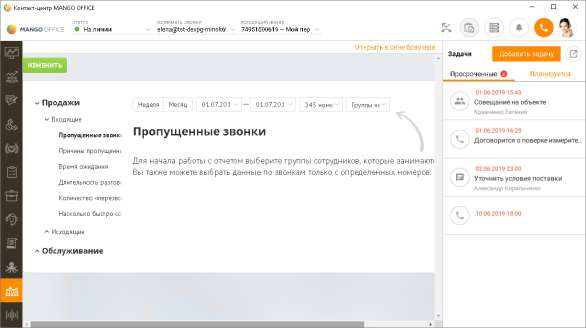
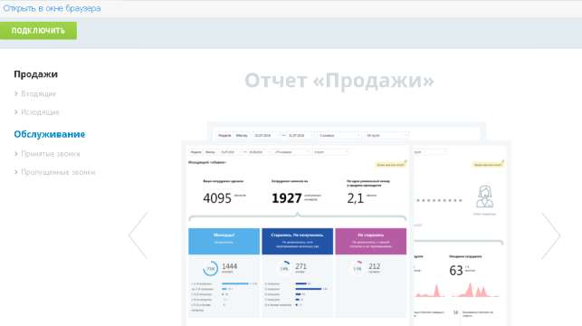
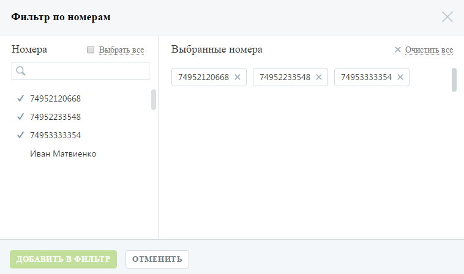
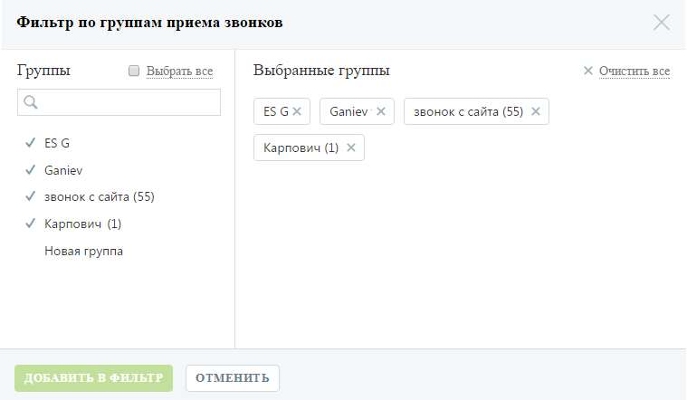

# 15. Бизнес-аналитика

> Трассировка: PDF §15 · сквозные стр. 419-422 · источники: ч.1 `kb/sources/mango-cc-manual/CC_manual_1.26.28.1.pdf` с.419-422.

Модуль Бизнес-аналитика позволяет формировать статистические отчеты, отображающие данные по работе сотрудников ВАТС, а также сведения о звонках в разных разрезах.

Инструмент включает две группы отчетов, разделенные на подгруппы в зависимости от типа вызова: Продажи o Входящие

▪ Пропущенные звонки ▪ Причины пропущенных звонков ▪ Время ожидания ▪ Длительность разговоров ▪ Количество "перезвонов" по пропущенным звонкам ▪ Насколько быстро сотрудники пытаются перезвонить o Исходящие ▪ Качественные звонки ▪ Когда лучше звонить ▪ Исходящий обзвон ▪ Длительность разговоров Обслуживание o Принятые звонки ▪ Сколько звонков принято быстро ▪ Средняя продолжительность звонка ▪ Время ожидания ответа ▪ Время обслуживания вызова ▪ Сколько сотрудников решают проблему клиента ▪ Сколько звонков требуется клиенту для решения проблемы o Пропущенные звонки ▪ Количество пропущенных звонков ▪ Причины пропущенных звонков ▪ В какое время теряются звонки ▪ Сколько клиенты готовы ждать на линии Как подключить отчеты Для получения доступа к группам отчетов нажмите Подключить и установите флаги напротив наименований групп отчетов, которые вы хотите подключить. Ознакомьтесь с условиями оплаты и нажмите Сохранить. Если ранее вы уже подключали одну из групп отчетов, на экране будет отображаться кнопка Изменить. Нажмите кнопку, установите флаг напротив наименования не подключенной группы отчетов и нажмите Сохранить. Как отключить отчеты Для отключения групп отчетов нажмите Изменить и снимите флаги, установленные напротив наименований групп отчетов, которые вы хотите отключить. Нажмите Сохранить. Как сформировать отчет Для построения любого из отчетов воспользуйтесь следующими фильтрами: 1. Выберите период отчета: неделя, месяц, произвольный; 2. Выберите линию АТС. Для этого в форме выбора линий АТС в списке в левой части окна щелкните по нужным линиям либо установите флаг Выбрать все для выбора всех номеров и нажмите Добавить в фильтр;

3. Выберите группу сотрудников. Для этого в форме выбора групп в списке в левой части окна щелкните по нужным группам и нажмите Добавить в фильтр;

Нажмите Показать для формирования отчета. Настройки фильтров "Линии" и "Группы" сохраняются для групп отчетов: • "Продажи – Входящие"; • "Продажи – Исходящие"; • "Обслуживание – Принятые звонки"; • "Обслуживание – Пропущенные звонки". Для отчетов, входящих в различные группы из перечисленных, настройки фильтров "Линии" и "Группы" сохраняются независимо.

