# 15.1. Группа отчетов "Продажи"

> Трассировка: PDF §15.1 · сквозные стр. 422-438 · источники: ч.1 `kb/sources/mango-cc-manual/CC_manual_1.26.28.1.pdf` с.422-438.

• Входящие o Пропущенные звонки o Причины пропущенных звонков o Время ожидания o Длительность разговоров o Количество "перезвонов" по пропущенным звонкам o Насколько быстро сотрудники пытаются перезвонить • Исходящие ▪ Качественные звонки ▪ Когда лучше звонить ▪ Исходящий обзвон ▪ Длительность разговоров 15.1.1. Отчеты по входящим звонкам • Входящие ▪ Пропущенные звонки ▪ Причины пропущенных звонков ▪ Время ожидания ▪ Длительность разговоров ▪ Количество "перезвонов" по пропущенным звонкам ▪ Насколько быстро сотрудники пытаются перезвонить 15.1.1.1. Пропущенные звонки Отчет «Пропущенные звонки» в графическом виде отображает информацию о входящих звонках по датам выбранного диапазона через выбранные линии с участием выбранных групп.

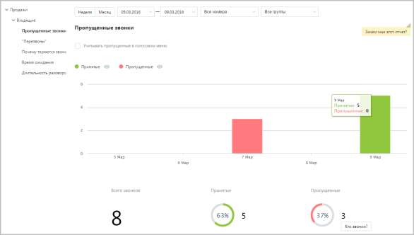

Если флаг Учитывать звонки, пропущенные в голосовом меню не установлен, то из подсчета общего числа пропущенных звонков исключаются вызовы, пропущенные в IVR меню. Для того, чтобы скрыть/отобразить принятые или пропущенные вызовы на графике, щелкните по кнопкам Принятые и Пропущенные соответственно. Данные о количестве звонков приведены в нижней части окна в виде инфографики, включающей три диаграммы. 15.1.1.2. Причины пропущенных звонков Отчет «Причины пропущенных звонков» отображает информацию о количестве и процентном соотношении внешних входящих пропущенных вызовов за определенный период в зависимости от причины, по которой они были пропущены.

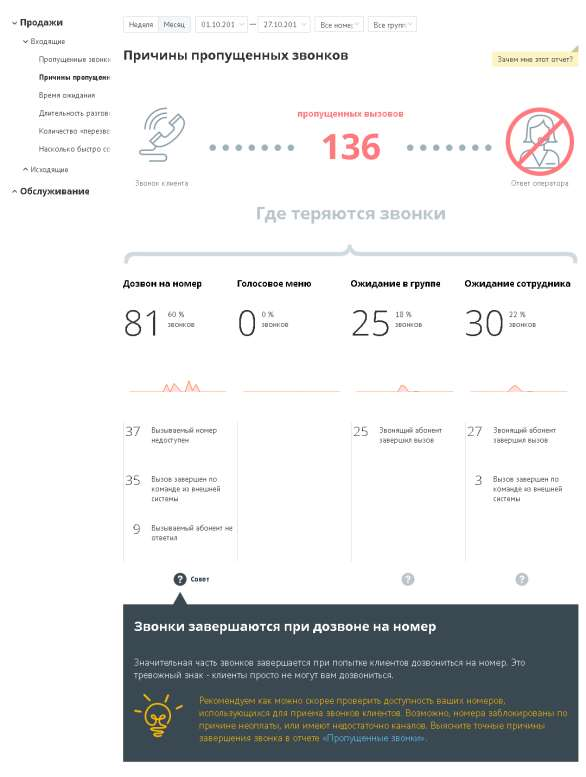

Отчет условно состоит из трех частей. В первой части приведено общее количество пропущенных вызовов в соответствии с условиями фильтрации. Во второй части отчета указывается количество и процентное соотношение пропущенных вызовов в зависимости от стадии вызова. Каждая стадия сопровождается мини-графиком, отражающим распределение пропущенных звонков по дням на протяжении выбранного периода. При наведении курсора на линию графика отображается всплывающее окно,

содержащее информацию о дате и количестве пропущенных вызовов в соответствующий день. Третья часть отражает распределение звонков, пропущенных на каждой стадии дозвона, по причинам пропуска вызова. 15.1.1.3. Время ожидания Отчет «Время ожидания» отображает информацию о времени ожидания пропущенного внешнего входящего вызова, поступившего за выбранный временной период через выбранные линии. Звонки, пропущенные в IVR и не дошедшие до групп, в отчет не включаются. В верхней части отчета приведены данные о средней продолжительности вызовов в виде инфографики. В зависимости от значения времени ожидания формируется текст совета.

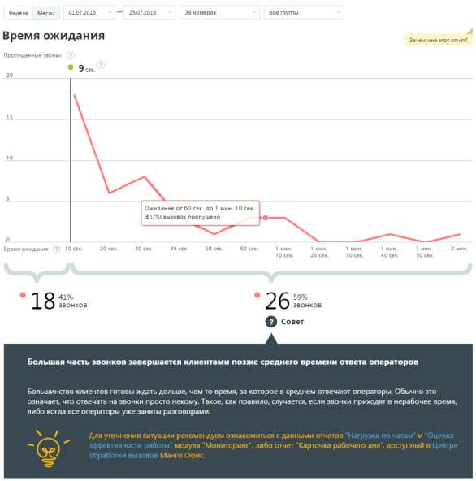

Диаграмма представлять собой визуализацию динамики изменения количества пропущенных внешних входящих звонков в зависимости от времени ожидания до завершения вызова. Ломаная строится по точкам, соответствующим суммарному числу пропущенных звонков за определенный промежуток времени. При наведении на любую точку участка ломаной отображается всплывающее окно, содержащее дополнительные данные о вызовах. Также диаграмма содержит маркер, отображающий среднее время ответа операторов на принятые внешние входящие звонки. Маркер представляет собой вертикальную линию, снабженную числовым показателем, который отражает среднее время ответа операторов на принятые внешние входящие звонки. Таким образом, в левой колонке отчета, расположенной до маркера, приводится информация о количестве вызовов, длительность ожидания по которым меньше или равна среднему времени ожидания ответа оператора. Здесь же указывается процентная доля таких звонков от всех внешних входящих пропущенных звонков за период с учетом выбранных значений фильтров. В правой колонке отчета, расположенной после маркера, приводится числовой показатель, отражающий количество вызовов, длительность ожидания по которым больше среднего времени ожидания ответа оператора. Здесь же указывается процентная доля таких звонков от всех внешних входящих пропущенных звонков за период с учетом выбранных значений фильтров. 15.1.1.4. Длительность разговора Отчет «Длительность разговора» отображает информацию о количестве входящих звонков на группу сотрудников, распределенных в зависимости от длительности разговора за определенный период. По умолчанию оптимальной длительностью разговора с клиентом считается период от 30 секунд до 5 минут. При необходимости измените этот период самостоятельно, установив другое значение в поле С оптимальной длительностью от… до после формирования отчета.

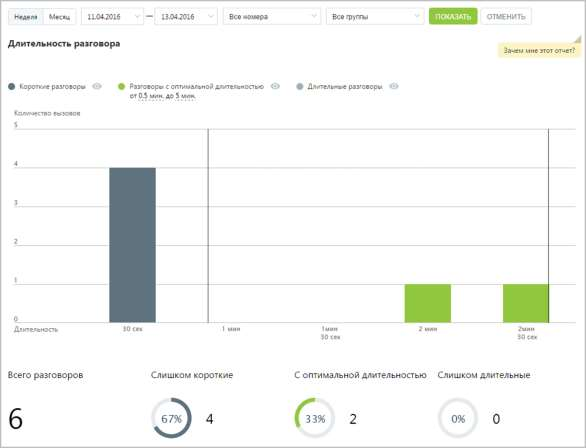

Отчет позволяет увидеть детализацию по звонкам не только для группы в целом, но и для каждого сотрудника группы в отдельности.

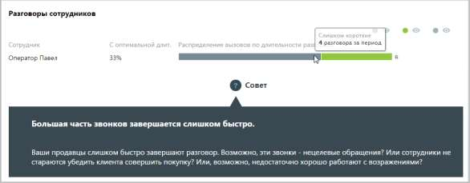

Для того, чтобы скрыть/отобразить различные категории вызовов зависимости от указанной длительности, нажмите кнопку нужного цвета.

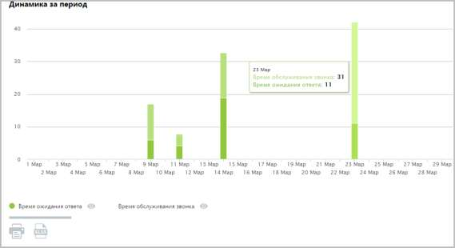

Воспользуйтесь кнопками Время ожидания ответа и Время обслуживания звонка для того, чтобы скрыть/отобразить соответствующие показатели на графике. 15.1.1.5. Количество "перезвонов" по пропущенным звонкам Отчет «Количество перезвонов по пропущенным звонкам» в графическом виде отображает информацию о перезвонах по пропущенным вызовам. Перезвоном в данном случае считается исходящий внешний звонок на номер, с которого был зафиксирован пропущенный внешний входящий вызов, в течение 24 часов с момента получения пропущенного вызова. Если флаг Учитывать звонки, пропущенные в голосовом меню не установлен, то из подсчета общего числа пропущенных звонков исключаются вызовы, пропущенные в IVR меню. При установленном флаге Учитывать определенные дни недели в отчете учитываются только указанные вами дни недели. По умолчанию данный флаг не устанавливается. Отчет условно состоит из двух частей. В первой части в виде графика и круговых диаграмм содержится детальная информация с учетом параметров фильтрации: • о количестве пропущенных звонков с уникальных номеров; • о количестве уникальных номеров из числа пропущенных, на который был выполнен перезвон; • о количестве уникальных номеров из числа пропущенных, на который перезвон не был осуществлен. Для того, чтобы скрыть/отобразить вызовы определенного типа, щелкните по соответствующим переключателям над графиком.

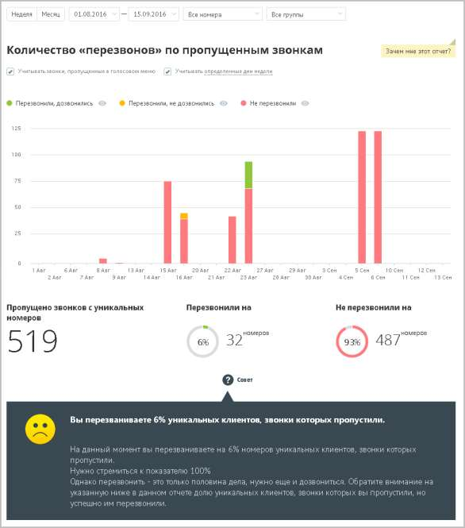

Во второй части отчета в виде круговых диаграмм приводятся данные о количестве уникальных номеров, на которые были совершены успешные и неуспешные перезвоны соответственно. 15.1.1.6. Насколько быстро сотрудники пытаются перезвонить Отчет «Насколько быстро сотрудники пытаются перезвонить» отображает информацию о количестве перезвонов на пропущенные звонки с уникальных номеров в зависимости от времени. Отчет помогает установить, укладываются ли ваши сотрудники в требуемое время, отведенное на перезвон по пропущенному звонку.

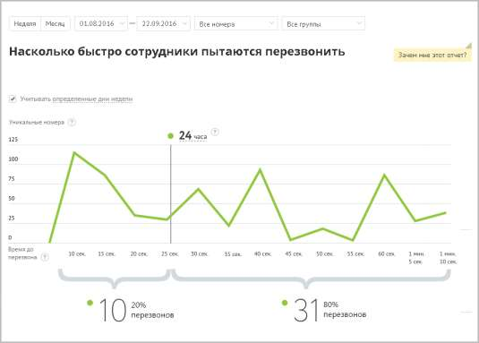

Линейная диаграмма представляет собой визуализацию динамики изменения количества первых попыток перезвонов на уникальные номера клиентов, с которых в течение выбранного промежутка времени при выбранных значениях фильтров поступали и были пропущены звонки. Чтобы установить время (в часах), в течение которого с момента пропуска звонка ваши сотрудники должны ему перезвонить, щелкните по соответствующему полю и введите нужное количество часов. При наведении на любую точку участка ломаной на экране отобразится всплывающее окно, содержащее следующие данные: • указание временного промежутка, которому соответствует участок ломаной; • количественная информация по попыткам перезвона за данный временной промежуток. Под диаграммой отображается два числовых показателя: • Перезвонили вовремя (слева) – количество уникальных номеров, с которых пропускались входящие звонки, время до первой попытки перезвона по которым с момента пропуска звонка не превышает установленного, а также процентная доля таких звонков от всех уникальных номеров; • Перезвонили позже (справа) – количество уникальных номеров, с которых пропускались входящие звонки, время до первой попытки перезвона по которым с момента пропуска звонка превышает установленное, а также процентная доля таких звонков от всех уникальных номеров. 15.1.2. Отчеты по исходящим звонкам • Исходящие o Качественные звонки

o Когда лучше звонить o Исходящий обзвон o Длительность разговоров 15.1.2.1. Качественные звонки Отчет «Качественные звонки» отображает информацию о количестве качественных исходящих звонков в соответствии с заданными параметрами фильтрации. Качественным звонком считается принятый вызов с определенной длительностью. Как правило, длительность разговора должна быть достаточной для того, чтобы продавец смог найти точку контакта с клиентом. По умолчанию качественным вызовом считается принятый вызов с длительностью не менее 30 секунд. Вы можете изменить длительность самостоятельно, установив другое значение в поле Качественные звонки – звонки длительностью свыше … мин. после формирования отчета. Если переключатель установлен в положение Звонки на уникальные номера, то отчет содержит только информацию об исходящих внешних вызовах, совершенных за выбранный календарный период через выбранные линии сотрудниками, входящими в состав выбранных групп на уникальные номера. Пример сформированного отчета приведен на рисунке ниже. Отчет содержит детальную информацию о количестве качественных вызовов в соответствии с заданными параметрами фильтрации, а именно: • графическое отображение динамики изменений количества вызовов определенных типов в течение выбранного периода; • круговые диаграммы с информацией о процентном соотношении количества вызовов определенного типа от общего количества звонков. Для того, чтобы скрыть/отобразить различные категории вызовов зависимости от указанной длительности, щелкните по пиктограмме "Просмотр" нужного цвета. Для того, чтобы узнать, кем были совершены некачественные или неудавшиеся звонки, нажмите на кнопку Кто звонил под соответствующей диаграммой. В результате выполнится переход к странице отчета «История вызовов».

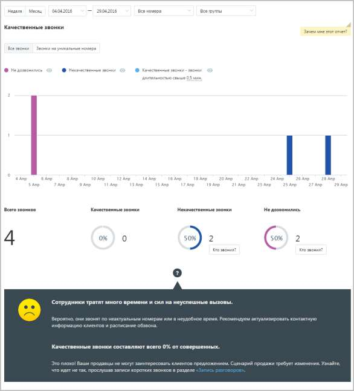

Отчет позволяет увидеть детализацию по звонкам не только для групп в целом, но и для каждого сотрудника группы, совершавшего вызовы, в отдельности.

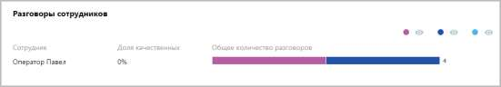

Для того, чтобы скрыть/отобразить различные категории вызовов зависимости от указанной длительности, щелкните по пиктограмме "Просмотр" нужного цвета. 15.1.2.2. Когда лучше звонить

Отчет «Когда лучше звонить» отображает информацию о количестве исходящих звонков в течение дня, распределенных в зависимости от качества обслуживания. Качественным вызовом считается принятый вызов с определенной длительностью. Отчет позволяет получить детальную информацию о количестве вызовов за день, а именно: • отображение динамики изменений количества вызовов определенных типов в течение дня; • информацию о времени, на которое приходится наибольшая доля качественных и неуспешных звонков соответственно.

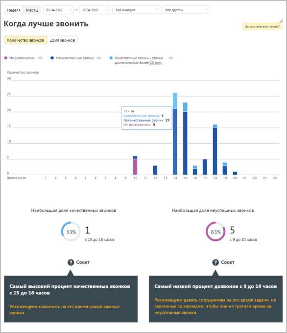

В случае, если переключатель "Количество звонков/Доля звонков» установлен в значение "Количество звонков", то на странице отчета отображается диаграмма, содержащая абсолютные значения количества звонков, совершенных в течение того или иного часа.

В случае, если переключатель установлен в значение "Доля звонков", на странице отчета отображается нормированная диаграмма, содержащая распределение долей звонков по категориям за тот или иной час. Для того, чтобы скрыть/отобразить различные категории вызовов зависимости от указанной длительности, нажмите кнопку нужного цвета. При изменении длительности звонка, считающегося качественным, отчет будет сформирован заново автоматически. 15.1.2.3. Исходящий обзвон Отчет «Исходящий обзвон» отображает информацию о количестве попыток дозвонов до клиентов операторами вашей компании. В отчете представлены как средние данные по выбранным группам, так и детализация по каждому сотруднику, в них состоящему.

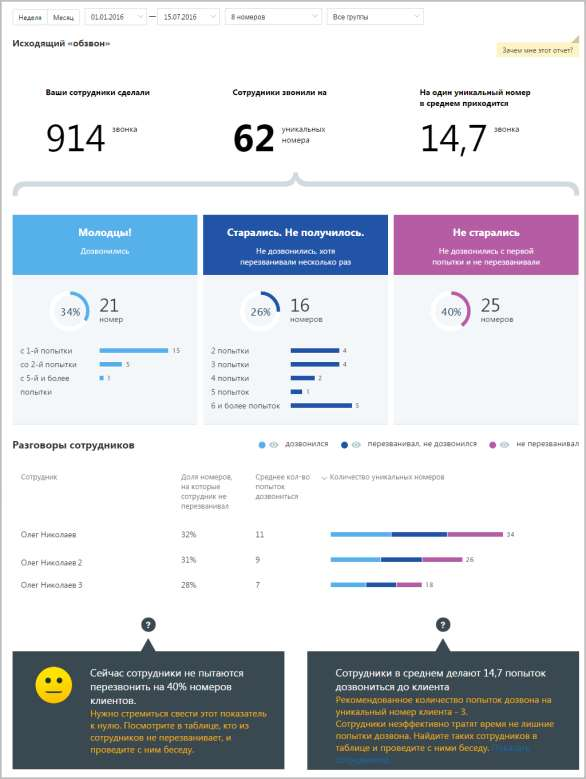

Отчет условно состоит из трех частей. В первой части приведено: • общее количество внешних исходящих вызовов; • общее количество уникальных номеров, на которые совершались внешние исходящие звонки; • среднее количество попыток дозвона на уникальный номер.

Во второй части отчета данные по звонкам распределены на три колонки, в каждой из которых указывается количество, процентное соотношение и диаграмма, отражающая распределение номеров: • Дозвонились – количество номеров из числа уникальных, на которые были совершены исходящие звонки и хотя бы одна попытка дозвона была успешной (состоялся разговор); • Старались. Не получилось – количество номеров из числа уникальных номеров, на которые было совершено строго больше одной попытки дозвониться, при этом ни одна попытка дозвона не была успешной (разговор не состоялся). • Не старались – количество номеров из числа уникальных номеров, на которые была совершена строго одна неуспешная попытка дозвониться (при этом успешных попыток не было). Третья часть отражает детализацию вызовов по сотрудникам, которые совершали исходящие вызовы. Таблица содержит следующие столбцы: • Доля номеров, на которые сотрудник не перезванивал – процентная доля уникальных номеров, на которые сотрудник совершил только одну попытку дозвона (причем неуспешную), от числа всех уникальных номеров, на которые звонил сотрудник; • Среднее кол-во попыток дозвониться – среднее количество попыток дозвона, предпринятых сотрудником для каждого уникального номера; • Количество уникальных номеров – диаграмма, отражающая количество уникальных номеров, на которые сотрудник совершал исходящие звонки, в разбиении на категории "Звонил и дозвонился", "Звонил более одного раза и не дозвонился", "Звонил ровно один раз и не дозвонился". При наведении курсора на диаграмму отображается всплывающее окно с количественной информацией по номерам для данного сотрудника в данной категории. Для того, чтобы скрыть/отобразить различные категории вызовов, щелкните по кнопке нужного цвета. 15.1.2.4. Длительность разговоров Отчет «Длительность разговора» отображает информацию о количестве исходящих вызовов, распределенных в зависимости от длительности разговора за определенный период. По умолчанию оптимальной длительностью разговора с клиентом считается период от 30 секунд до 5 минут. При необходимости измените этот период самостоятельно, установив другое значение в поле С оптимальной длительностью от… до после формирования отчета.

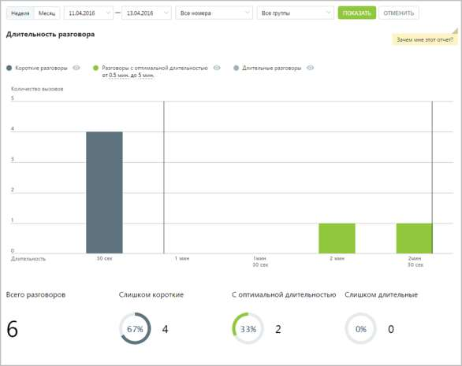

Отчет позволяет увидеть детализацию по звонкам не только для группы в целом, но и для каждого сотрудника группы в отдельности.

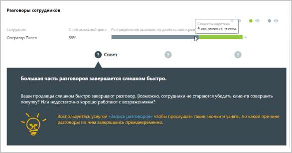

Для того, чтобы скрыть/отобразить различные категории вызовов зависимости от указанной длительности, нажмите кнопку нужного цвета.

