# 15.2. Группа отчетов "Обслуживание"

> Трассировка: PDF §15.2 · сквозные стр. 438-451 · источники: ч.1 `kb/sources/mango-cc-manual/CC_manual_1.26.28.1.pdf` с.438-451.

• Принятые звонки o Сколько звонков принято быстро o Средняя продолжительность звонка o Время ожидания ответа o Время обслуживания вызова o Сколько сотрудников решают проблему клиента o Сколько звонков требуется клиенту для решения проблемы • Пропущенные звонки o Количество пропущенных звонков o Причины пропущенных звонков o В какое время теряются звонки o Сколько клиенты готовы ждать на линии 15.2.1. Отчеты по принятым звонкам o Принятые звонки ▪ Сколько звонков принято быстро ▪ Средняя продолжительность звонка ▪ Время ожидания ответа ▪ Время обслуживания вызова ▪ Сколько сотрудников решают проблему клиента ▪ Сколько звонков требуется клиенту для решения проблемы 15.2.1.1. Сколько звонков принято быстро Отчет «Сколько звонков принято быстро» содержит информацию о количестве входящих вызовов, принятых «быстро», то есть за определенное время. По умолчанию быстро принятым вызовом считается вызов, принятый в течение 30 секунд. При необходимости измените это время самостоятельно, установив другое значение в поле «Принятые за n секунд» после формирования отчета. В верхней части отчета приведены данные о принятых звонках в виде инфографики.

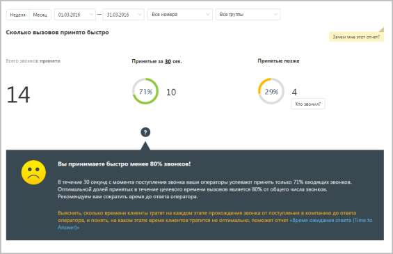

В нижней части окна отображается детальная информация по заданному периоду.

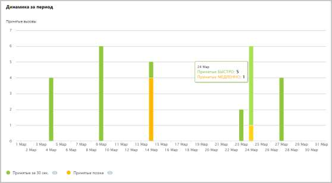

Используйте кнопки Принятые за n сек и Принятые позже для того, чтобы скрыть/отобразить соответствующие показатели на графике. 15.2.1.2. Средняя продолжительность звонка Отчет «Средняя продолжительность звонка» в графическом виде отображает информацию о средней продолжительности звонка. Показатель имеет две составляющие — среднее время ожидания ответа и среднее время обслуживания вызова.

В верхней части отчета приведены данные о средней продолжительности вызовов в виде инфографики. В зависимости от значения показателя «Время ожидания ответа» формируется текст совета.

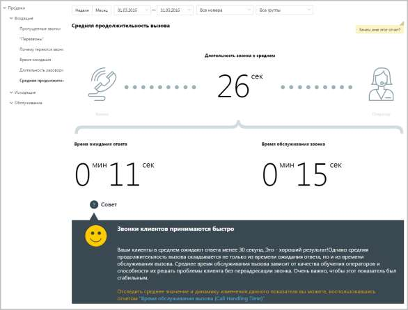

В нижней части окна отображается детальная информация по заданному периоду.

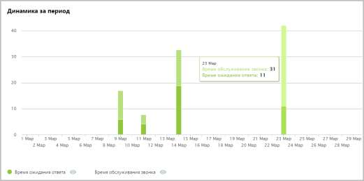

Используйте кнопки Время ожидания ответа и Время обслуживания звонка для того, чтобы скрыть/отобразить соответствующие показатели на графике. 15.2.1.3. Время ожидания ответа

Отчет «Время ожидания ответа» отображает информацию о времени ожидания обслуживания вызова на разных стадиях: голосовое меню, дозвон на группу и дозвон на оператора. По умолчанию оптимальным временем ожидания в голосовом меню считается время не более 25 секунд, ожидание в очереди на группу — от 0 до 60 секунд, ожидание ответа оператора не должно превышать 5 секунд.

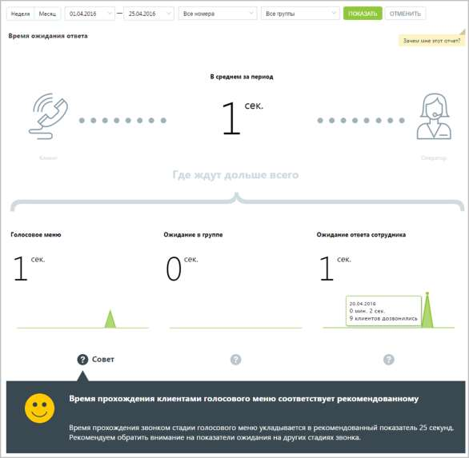

Щелкните по пиктограмме "?", чтобы посмотреть совет для каждой стадии обработки вызова. 15.2.1.4. Время обслуживания вызова Отчет «Время обслуживания вызова» содержит информацию о количестве входящих вызовов, обслуженных за определенный период. По умолчанию оптимальной длительностью обслуживания вызова считается период от 30 секунд до 2 минут. При необходимости измените этот период самостоятельно, установив другое значение в поле С оптимальной длительностью от… до после формирования отчета. В верхней части отчета приведены данные о принятых звонках в виде инфографики.

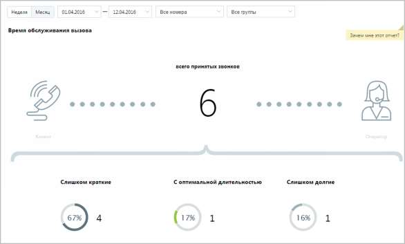

В нижней части окна отображается детальная информация о количестве вызовов, относящихся к определенному периоду.

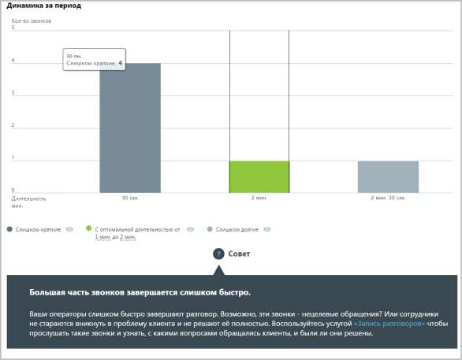

Используйте кнопки Слишком короткие, С оптимальной длительностью и Слишком долгие для того, чтобы скрыть/отобразить соответствующие показатели на графике. 15.2.1.5. Сколько сотрудников решают проблему клиента Отчет «Сколько сотрудников решают проблему клиента» отображает информацию о количестве сотрудников, участвующих в решении вопроса клиента.

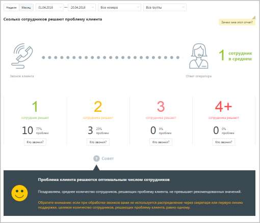

По умолчанию оптимальным количеством сотрудников, участвующих в разговоре, является количество от одного до двух. 15.2.1.6. Сколько звонков требуется клиенту для решения проблемы Отчет «Сколько звонков требуется клиенту для решения проблемы» количество повторных звонков, сделанных клиентом для решения его вопроса.

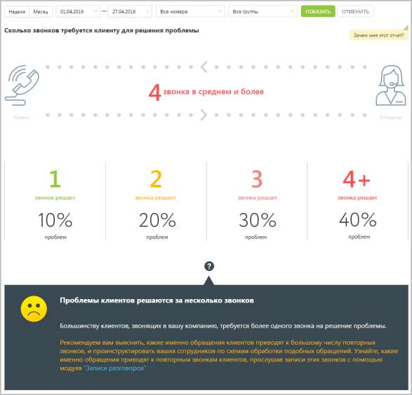

Эталонное количество звонков, за которое должна быть решена проблема клиента – один звонок. При большем количестве звонков рекомендуем прослушать записи разговоров в Истории вызовов. 15.2.2. Отчеты по пропущенным звонкам • Пропущенные звонки o Количество пропущенных звонков o Причины пропущенных звонков o В какое время теряются звонки o Сколько клиенты готовы ждать на линии 15.2.2.1. Количество пропущенных звонков

Отчет «Количество пропущенных звонков» отображает информацию о количестве и процентном соотношении принятых и пропущенных вызовов за определенный период. При выключенной настройке Учитывать звонки, пропущенные в голосовом меню вызовы, пропущенные в IVR меню, исключаются из подсчета общего числа пропущенных звонков.

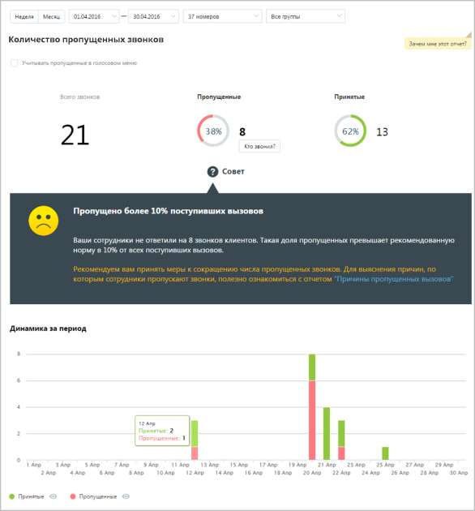

Данные о количестве и процентном соотношении звонков приведены в верхней части окна в виде инфографики, включающей три диаграммы. Для получения детальной информации о пропущенных вызовах нажмите ссылку «Кто звонил». В результате будет выполнен переход на страницу отчета «Пропущенные звонки». Динамические изменения количества звонков за указанный период приведены в виде графика в нижней части отчета. Для получения более детальной информации о количестве вызовов в течение дня наведите курсор на любой столбец графика. Используйте кнопки Принятые и Пропущенные, чтобы скрыть/отобразить принятые или пропущенные вызовы на графике.

15.2.2.2. Причины пропущенных звонков Отчет «Причины пропущенных звонков» отображает информацию о количестве и процентном соотношении пропущенных вызовов за определенный период в зависимости от причины, по которой они были пропущены.

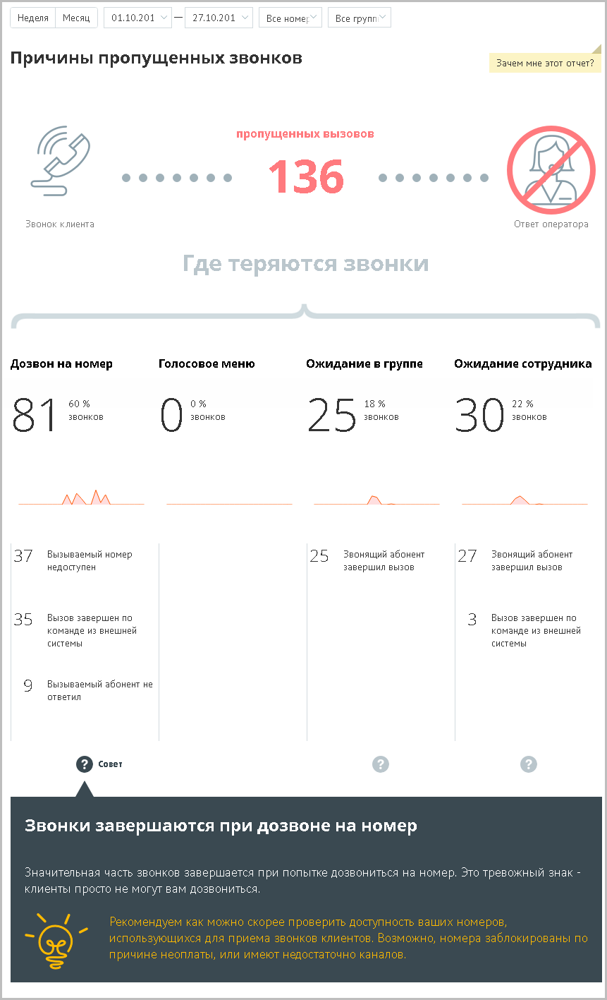

Отчет условно состоит из трех частей. В первой части приведено общее количество пропущенных вызовов в соответствии с условиями фильтрации. Во второй части отчета указывается количество и процентное соотношение пропущенных вызовов в зависимости от стадии вызова. Каждая стадия сопровождается мини-графиком, отражающим распределение пропущенных звонков по дням на протяжении выбранного периода. При наведении курсора на линию графика отображается всплывающее окно, содержащее информацию о дате и количестве пропущенных вызовов в соответствующий день. Третья часть отражает распределение звонков, пропущенных на каждой стадии дозвона, по причинам пропуска вызова. 15.2.2.3. В какое время теряются звонки Отчет «В какое время теряются звонки» в графическом виде отображает информацию о процентном соотношении количества принятых и пропущенных звонков в зависимости от времени суток. Таким образом, отчет поможет выявить часы, в течение которых пропускается больше всего вызовов, и принять меры по снижению количества пропущенных звонков в эти часы. Пример сформированного отчета приведен на рисунке ниже. Для получения более детальной информации о количестве вызовов в течение дня наведите курсор на любой столбец графика.

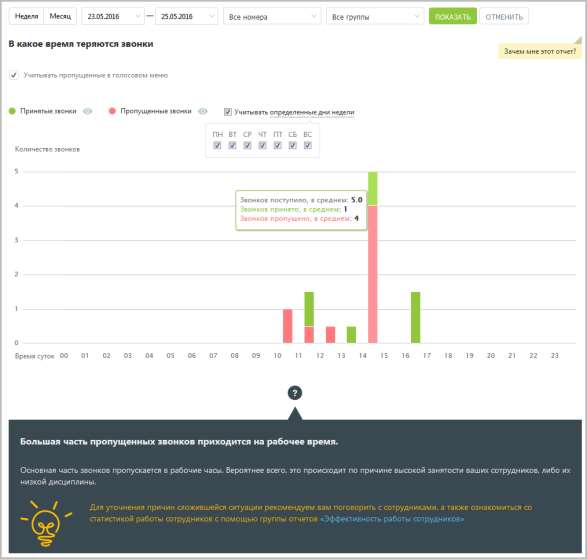

При выключенной настройке Учитывать звонки, пропущенные в голосовом меню вызовы, пропущенные в IVR меню, исключаются из подсчета общего числа пропущенных звонков. Используйте кнопки Принятые и Пропущенные, чтобы скрыть/отобразить принятые или пропущенные вызовы на графике. Для того, чтобы исключить из указанного периода определенные дни недели, данные по которым не должны фигурировать в отчете, щелкните по ссылке «Учитывать определенные дни недели» и снимите нужные флаги. 15.2.2.4. Сколько клиенты готовы ждать на линии Отчет «Сколько клиенты готовы ждать на линии» отображает информацию о количестве входящих пропущенных звонков на группу, которые в соответствии с заданными параметрами фильтрации распределены в зависимости от времени ожидания на линии. Пример сформированного отчета приведен на рисунке ниже. Отчет представляет собой диаграмму, отображающую количество внешних пропущенных звонков, прекращенных по инициативе звонящего, распределенное по промежуткам времени ожидания на линии.

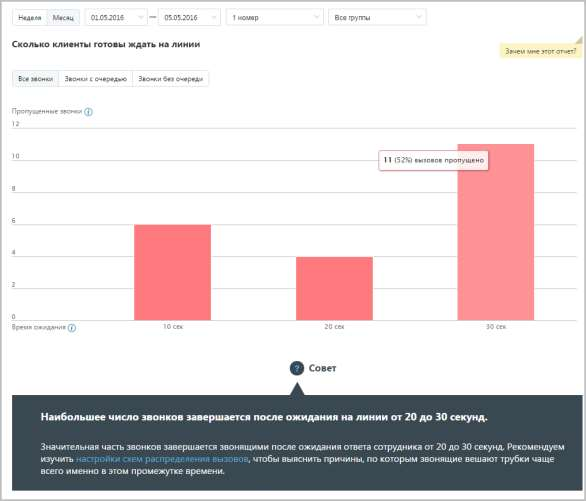

Для более детального формирования отчета предусмотрены следующие переключатели: • Все звонки – отчет содержит информацию обо всех внешних пропущенных звонках; • Звонки с очередью – отчет учитывает только звонки, которые находились в очереди вызовов одной или более групп; • Звонки без очереди – отчет учитывает только звонки, которые в процессе прохождения не попали в очередь вызовов ни одной группы.

