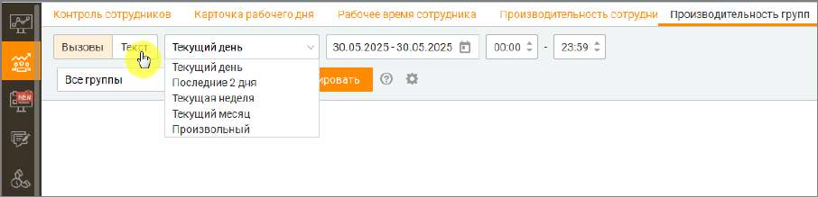
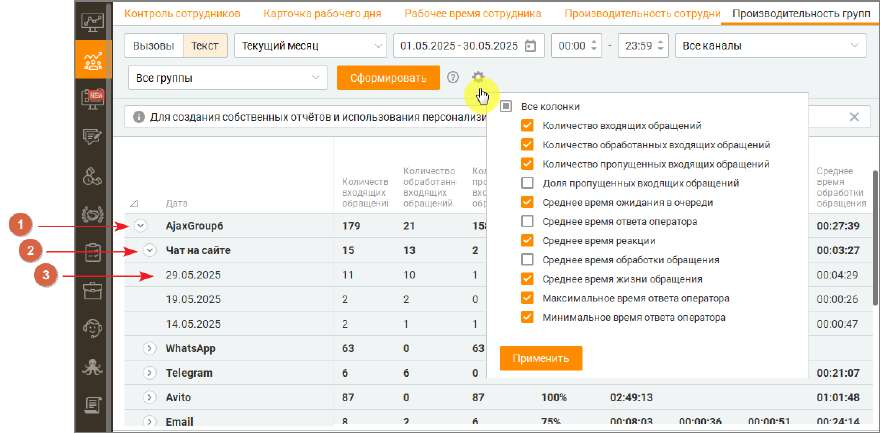

# 7.5.2. Текст

Отчёт «Текст» предназначен для анализа входящих и исходящих текстовых сообщений. Он позволяет получать наглядную аналитику по текстовым каналам в отчёте ППГ с разбивкой по группам сотрудников. Это дает возможность отслеживать выполнение SLA, выявлять пропущенные диалоги и оценивать эффективность работы команд. Агрегированные табличные данные помогут быстро понять ситуацию и использовать полученную информацию для принятия решений и улучшения рабочих процессов.

Возможности фильтрации: 1. Выбор периода — задайте интересующий период для анализа, включая точные временные рамки в пределах одного дня. 2. Фильтрация по каналам связи — анализ охватывает такие каналы, как Telegram, WhatsApp, онлайн-чат, Авито, Авито Работа, Email, , Max, VK и Клиентское приложение. 3. Фильтрация по группам сотрудников — позволяет ограничить данные анализом внутри конкретной команды или отдела. 4. Фильтрация по сотрудникам — можно отобразить данные как по отдельным сотрудникам, так и по всему коллективу. 5. Выбор отображаемых показателей — через меню фильтров можно указать, какие метрики будут представлены в таблице.

Общая структура и логика формирования отчетов На вкладке Производительность групп ➔ Текст реализована иерархическая структура отчетов, которая позволяет пользователям глубоко анализировать данные. В системе предусмотрены три уровня детализации: 1. Первый уровень — Группы. o На этом уровне пользователь видит ключевые метрики по каждой группе: общее количество обращений, среднее время реакции и другие показатели, отражающие эффективность работы группы в целом. 2. Второй уровень — Каналы. o Информация детализируется по каналам связи (Telegram, WhatsApp, чат на сайте и др.), что позволяет сравнивать, как группа справляется с обращениями в разных средах коммуникации. 3. Третий уровень — Дни. o Данные разбиваются по дням, что даёт возможность отслеживать динамику показателей, выявлять пики, падения и тренды в производительности. Важные особенности • Все показатели рассчитываются на основе актуальных данных системы с учётом специфики каждого канала коммуникации. • При расчётах игнорируются нулевые значения, что повышает точность и достоверность результатов. • Средние значения формируются на основе всех обращений, а не отдельных выборок. Практические рекомендации • Для анализа за длительные периоды рекомендуется использовать фильтры по каналам связи и группам, чтобы сократить объём выводимых данных и повысить наглядность. • Для получения корректных средних значений желательно исключать периоды низкой активности или ограничивать расчёты только рабочими часами. Эти показатели помогают глубже понять процессы обслуживания в Контакт-центре, способствуя эффективному контролю качества работы операторов и оптимизации внутренних процессов.

Список доступных показателей и формулы расчета 1. Количество входящих обращений — общее количество входящих обращений, поступивших на группу. Как считается: Количество обращений с типом "Входящее", направленных на группу. 2. Количество обработанных входящих обращений — число входящих обращений, которые были обработаны и закрыты операторами группы. Как считается: Количество входящих обращений, закрытых при выполнении одного из условий: • оператор ответил и нажал «Закрыть» или «Перевести и закрыть»; • оператор перевёл обращение без ответа; • обращение закрыто по тайм-ауту после ответа оператора. Также учитываются обращения, помеченные как СПАМ. 3. Количество пропущенных входящих обращений — входящие обращения, на которые не был дан ответ в установленное время. Как считается: Обращение считается пропущенным, если: • закрыто по тайм-ауту без ответа; • оператор взял обращение, но не ответил и закрыл его; • оператор не ответил вовремя, и обращение ушло в общую очередь (автораспределение). 4. Доля пропущенных входящих обращений — процент входящих обращений, на которые не был дан ответ. Как считается: (Количество пропущенных входящих обращений / Количество входящих обращений) × 100 % 5. Количество успешных исходящих обращений — число исходящих сообщений, успешно доставленных клиенту. Как считается: Количество обращений с типом «Исходящее» и статусом «Обработано». 6. Количество неуспешных исходящих обращений — число исходящих сообщений, по которым отправка была заблокирована или не разрешена. Как считается: Количество обращений с типом «Исходящее» и статусом «Отправка запрещена» или аналогичным. 7. Среднее время ожидания в очереди — среднее время, которое обращение провело в очереди до назначения оператору. Как считается: Среднее значение по всем входящим обращениям (Время назначения минус Время поступления). Измеряется в мм:сс. 8. Среднее время ответа оператора — среднее время от момента взятия обращения в работу до отправки первого ответа оператором. Как считается: Среднее значение (Время первого ответа минус Время взятия в работу). Измеряется в мм:сс. 9. Среднее время реакции — среднее время от поступления обращения до первого ответа оператора. Как считается: Среднее время ожидания в очереди плюс Среднее время ответа оператора. Измеряется в мм:сс. 10. Среднее время обработки обращения — среднее время от взятия обращения в работу до его закрытия. Как считается: Среднее значение (Время закрытия минус Время взятия в работу). Измеряется в мм:сс. 11. Среднее время жизни обращения — общее среднее время обращения от поступления до закрытия. Как считается: Среднее время ожидания в очереди плюс Среднее время обработки обращения (для входящих). Измеряется в мм:сс. 12. Максимальное время ответа оператора — наибольшее время, затраченное оператором на первый ответ после взятия обращения.

Как считается: Максимум из (Время первого ответа минус Время взятия в работу). Измеряется в мм:сс. 13. Минимальное время ответа оператора — наименьшее время, затраченное оператором на первый ответ после взятия обращения. Как считается: Минимум из (Время первого ответа минус Время взятия в работу). Измеряется в мм:сс. 14. Уровень сервиса (SL) по времени ожидания в очереди (%) — процент групповых обращений, распределённых или переведённых на конкретную группу, которые были взяты в работу в пределах установленного в личном кабинете значения SL по времени ожидания в очереди. Как считается: Количество групповых обращений, взятых в работу в пределах SL по времени ожидания / общее количество групповых обращений, взятых в работу × 100%. 15. Уровень сервиса (SL) по времени первого ответа (%) — процент групповых обращений, распределённых или переведённых на конкретную группу, на которые оператор дал первый ответ в пределах установленного в личном кабинете значения SL по времени ответа. Как считается: Количество групповых обращений с первым ответом оператора в пределах SL / общее количество групповых обращений, получивших ответ × 100%. 16. Уровень сервиса (SL) по времени реакции оператора (%) — процент групповых обращений, распределённых или переведённых на конкретную группу, на которые оператор дал первый ответ в пределах установленного в личном кабинете значения SL, отсчитываемого с момента поступления обращения. Как считается: Количество групповых обращений с реакцией оператора в пределах SL (от момента поступления) / общее количество групповых обращений, получивших ответ × 100%. Расчет количественных и временных показателей аналогичен примерам на вкладке Производительность сотрудников ➔ Текст
