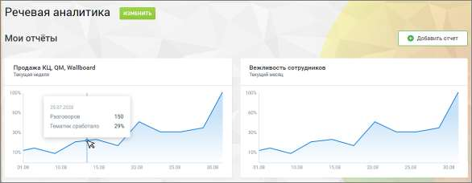
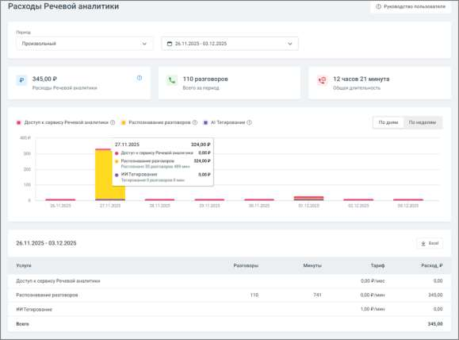
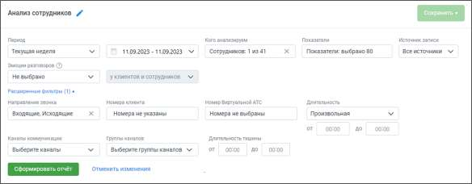
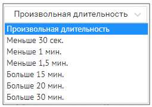
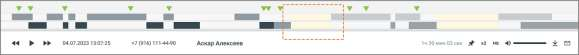
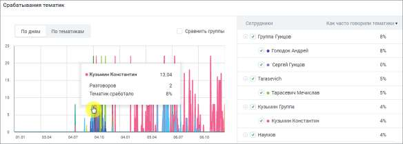
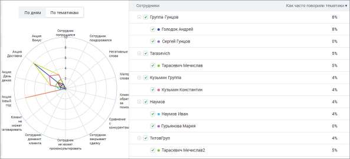

# 16.1. Отчеты речевой аналитики

> Трассировка: PDF §16.1 · сквозные стр. 452-457 · источники: ч.1 `kb/sources/mango-cc-manual/CC_manual_1.26.28.1.pdf` с.452-457.

Вкладка Отчеты содержит детальную аналитическую информацию о распознанных вызовах в соответствии с заданными параметрами фильтрации. В подразделе Мои отчеты размещаются виджеты отчетов (не более 10-ти) с настроенными параметрами фильтрации, для быстрого перехода. Чтобы добавить новый виджет, нажмите кнопку «Добавить отчет», установите фильтры отчета.

При клике на кнопку сохранения отображается список доступных вариантов сохранения – таблица, график, таблица и график. Сохранение виджета выполняется только после выбора одного из вариантов. Содержание таблицы, сохраняемой на дашборде отчетов, зависит от положения чекбокса "Показать группы" в блоке таблицы Разговоры, детализация. Также доступны отчеты: • Расходы Речевой аналитики • Анализ сотрудников • Анализ разговоров • Анализ по чек-листам • Ловец инсайтов

16.1.1. Расходы Речевой аналитики Страница расходов помогает быстро понять, сколько стоит использование сервиса за выбранный период и какие услуги вносят основной вклад в затраты.

| Доступ к отчету регулируется в настройках ролей ЛК ВАТС. Доступ к отчету открыт, если |
| --- |
| у пользователя есть доступ к разделам Финансы и Баланс Лицевого счета: "Просматривать |
| информацию о расходах за текущий и предыдущий месяцы". |

Период и выбор дат В верхней части страницы можно выбрать период, за который будут отображены расходы. Чаще всего пользователи выбирают: • текущий день или вчера — чтобы быстро оценить недавнюю активность; • текущую неделю или месяц — для регулярного мониторинга; • произвольный период — когда нужно посмотреть данные за конкретные даты. После выбора периода информация на странице сразу обновляется — ничего дополнительно подтверждать не нужно. Основные показатели за период Под блоком выбора дат отображаются три ключевых значения, которые дают быстрый обзор ситуации: • сумма расходов за выбранный период; • количество обработанных разговоров; • общая длительность разговоров.

Эти показатели помогают сразу оценить нагрузку и стоимость работы сервиса. График расходов График визуально показывает динамику затрат по дням или неделям. Это полезно, если вы хотите: • увидеть, когда были пики активности, • понять, какие услуги формируют ключевые расходы, • быстро сравнить дни между собой. Цветовая маркировка помогает сразу отличать: • расход на доступ к сервису, • распознавание разговоров, • ИИ-тегирование. При наведении курсора на столбец появляется всплывающая подсказка с деталями по конкретному дню: сумма расходов по каждой услуге, количество разговоров и длительность. Таблица расходов Внизу страницы расположена таблица с подробной разбивкой по услугам. Для каждой услуги указано: • сколько разговоров было обработано, • сколько минут распознано, • какой тариф использовался, • какая сумма начислена. В конце таблицы отображается итоговый расход за период. Если данные нужно передать коллегам или приложить к отчёту — таблица легко выгружается в формате Excel. 16.1.2. Отчет "Анализ сотрудников" Отчет Анализ сотрудников состоит из трех блоков: 1. Блок фильтров 2. Блок визуализации «Срабатывание тематик» 3. Блок таблицы «Разговоры, детализация» Блок фильтров

При формировании отчета пользователям доступна фильтрация: Период – произвольный, текущий день, текущая неделя, текущий месяц, с прошлого месяца, с позапрошлого месяца, текущий год, весь период; Кого анализируем – список всех сотрудников, сгруппированный по группам. Если ни один сотрудник не выбран, отчет формируется по всем сотрудникам; Показатели – все тематики (в том числе неактивные), а также характеристики разговора. Подробнее здесь; Источник записи – выбор типа записи разговора: телефонные разговоры/ офлайн-записи /текстовые коммуникации. Направление звонка – входящий, исходящий, внутренний; Эмоции разговоров (по клиентам, по сотрудникам, по клиентам и сотрудникам) – дополнительная настройка для фильтрации разговоров в зависимости от выбранной эмоции: негативно, позитивно, нейтрально. В таблице отчета отображаются соответствующими пиктограммами-смайликами. Эмоции определяются на основании звуков (тембра, громкости). Номер ВАТС – выбор номеров линии ВАТС (максимальное количество – 100); Номер клиента – выбор произвольного номера клиента; Длительность звонка – по умолчанию установлена произвольная длительность звонка.

Каналы коммуникации – выбор из выпадающего списка доступных в разделе «Текстовые коммуникации» ЛК ВАТС каналов коммуникации. Варианты: Чат на сайте, ВКонтакте, Telegram, Max, WhatsApp, Авито. При выборе типа записи разговора «офлайн-записи» или «телефонные разговоры» фильтр недоступен. Группы каналов – выбор из выпадающего списка созданных в разделе «Текстовые коммуникации» ЛК ВАТС групп каналов коммуникации. При выборе типа записи разговора «офлайн-записи» или «телефонные разговоры» фильтр недоступен.

| Внутри фильтра действует принцип фильтрации – ИЛИ (когда одно из условий истинно). |
| --- |
| Между фильтрами действует принцип фильтрации – И (когда все условия истинны). |

Длительность тишины – используя этот фильтр руководитель может контролировать сотрудников на предмет тишины в разговорах, для выявления слабых мест в работе операторов. Фильтр применим только к новым записям. • Если не выбрана величина "от" – отфильтруются все разговоры, где длительность тишины была до указанного времени. • Если не выбрала величина "до" – отфильтруются разговоры, где длительность тишины была более указанного времени. Длительность тишины также отображается на плеере расшифровки разговора.

Изменение какого-либо из дополнительных фильтров не приводит к автоматическому обновлению данных в отчете. Для обновления данных нажмите кнопку «Сформировать отчет». Блок визуализации срабатывания тематик Отчет предоставляет данные по количеству сработавших тематик в разговорах сотрудника/группы, которым были присвоены выбранные тематики. Отчет доступен в срезах По дням и По тематикам. Каждый цвет кривой на графике соответствует определенному сотруднику.

Рис.1. Срез «По дням» • По оси У графика «По дням» отображается сколько тематик сработало, то есть процентное значение срабатывания выбранных в "Показателях" тематик. Если чекбокс «Сравнить группы» проставлен, то график отображает данные по группам сотрудников. Иначе – по отдельным сотрудникам. • По оси Х отображается временной период в разбивке по дням относительно выбранного периода в фильтре "Период".

| ПРИМЕР 1: |
| --- |
| • В поле "Показатели" выбрано 3 тематики. |
| • За указанную дату по сотруднику "Игорь Петров" было распознано 50 разговоров. |
| • На 40 распознанных разговоров была проставлена каждая из выбранных тематик, а на |
| оставшиеся 10 не проставилась ни одна тематика. Таким образом количество тематик, |
| которые проставились на указанные разговоры = 120 (из возможных 150). |
| Значение параметра "Тематик сработало" будет равняться: 120 / 150 * 100% = 80% |

По клику на графике отображается всплывающее окно с информацией по сотруднику на выбранную дату. Если чекбокс «Сравнить группы» проставлен, то всплывающее окно содержит данные по группе сотрудников на выбранную дату. Столбец «Как часто говорили тематики» рассчитывается как среднее значение по всем значениям параметра «Тематик сработало» за установленный период.

Рис.1. Срез «По тематикам» Внутри окружности графика «По тематикам» располагается графическое отображение вхождения сработавших тематик в разговоры выбранных сотрудников (сколько тематик сработало, столько цветных фигур отображается на графике). Столбец «Как часто говорили тематики» рассчитывается как среднее значение по всем значениям параметра «Тематик сработало» для конкретного сотрудника.

| ПРИМЕР 2: |
| --- |
| • Значение "Тематик сработало" по сотруднику "Игорь Петров" за 01.01 = 50%, а за 02.01 = |
| 70% |
| Соответственно, значение "Как часто говорили тематики" по сотруднику "Игорь Петров" за |
| выбранные 2 дня равняется [(50% + 70%) / 2)] = 60% |

Блок таблицы Разговоры, детализация Табличная часть отчета состоит из трех разделов: • Разговоры • Тематики • Показатели разговора

| Для типа записи разговора «Текстовые коммуникации» в качестве показателей |
| --- |
| отображаются только данные разговоров по тематикам. |

<!-- kb-verify:start -->

> ❓ **ТРЕБУЕТСЯ ПРОВЕРКА**: значения `02.01` не подтверждены независимым движком извлечения (PyMuPDF 1.28.2) на тех же страницах. Значение НЕ достраивалось — сверьте с источником. (Источник: `CC_manual_1.26.28.1.pdf`, стр. 452-457)

<!-- kb-verify:end -->
