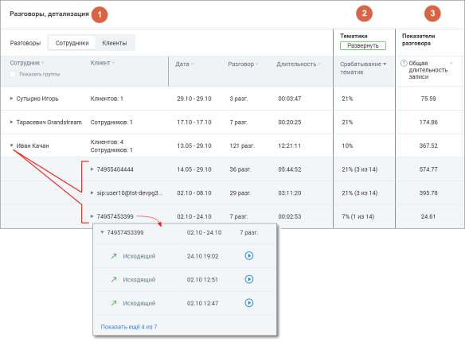

# 1. Раздел «Разговоры, детализация»

> Трассировка: PDF §1 · сквозные стр. 457-458 · источники: ч.1 `kb/sources/mango-cc-manual/CC_manual_1.26.28.1.pdf` с.457-458.

Детализация разговоров предоставляется в срезах Сотрудники/Клиенты. В таблице отчета данные выводятся с возможностью группировки согласно установленных фильтров.

Таблица содержит следующие столбцы (рассмотрим пример для среза «Сотрудники»): • Сотрудник – имя сотрудника ВАТС. • Клиент - количество уникальных внешних номеров (не привязанных ни к одному из сотрудников ВАТС) с которыми у выбранного сотрудника за выбранный период состоялся успешный звонок. По каждому номеру доступна детализация звонков с записями разговоров (если на ВАТС подключена услуга записи разговоров). • Дата – диапазон дат в которые у выбранного сотрудника имеются распознанные разговоры. • Разговор – суммарное количество распознанных разговоров выбранного сотрудника за выбранный период. • Длительность – суммарная длительность всех распознанных разговоров выбранного сотрудника за выбранный период в формате ЧЧ:ММ:СС.

По клику на пиктограмму аудиозаписи или пиктограмму текстового канала

коммуникации (например ) открывается окно записи разговора.

| Если чекбокс «Показать группы» проставлен, столбец Сотрудник содержит двухуровневый |
| --- |
| иерархический список (группа/ сотрудник): т.е. сотрудники сгруппированы по группам. |
| Данные в отчете в этом случае формируются и для группы в целом. |
