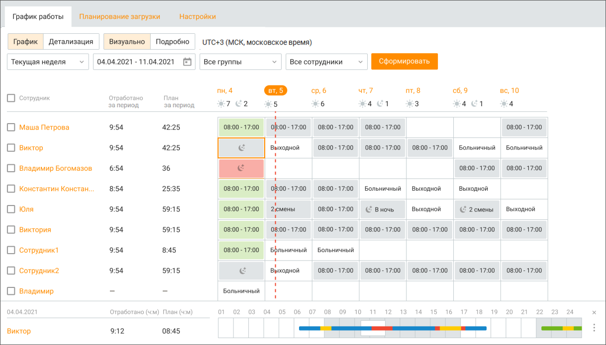
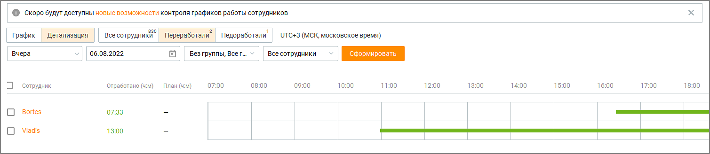
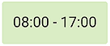
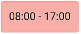
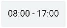
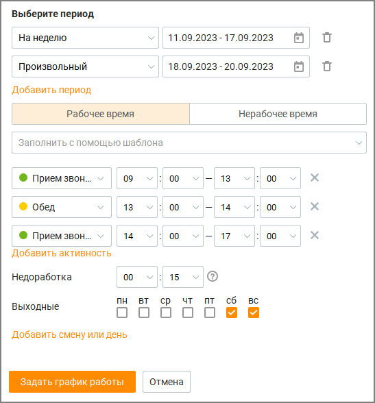
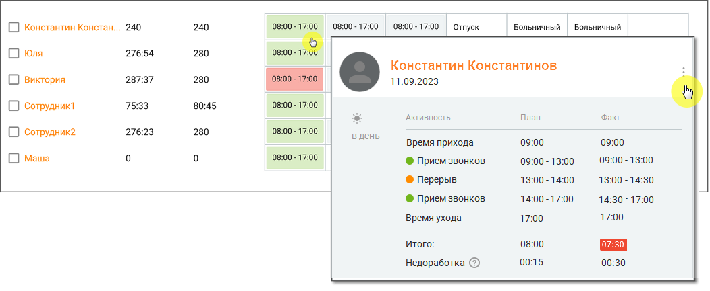

# 8.1. График работы

> Трассировка: PDF §8.1 · сквозные стр. 246-251 · источники: ч.3 `kb/sources/mango-cc-manual/CC_manual_1.26.23-part-3.pdf` с.44-49.

| Раздел отображается только для пользовательских ролей Администратор и Руководитель |
| --- |
| компании при подключенной в ЛК ВАТС услуге "Планирование работы (WFM)". |

Графики рабочего времени могут быть индивидуальны для сотрудников по количеству рабочих дней и времени начала/окончания. На вкладке "График работы" руководитель может: • задавать время начала и окончания работы; • планировать рабочий день сотрудника по статусам: На линии, Обзвон, Не беспокоить и т.д.; • запланировать отпуска, дни обучения и административной работы сотрудников; • отмечать дни, проведенные сотрудником на больничном;

• задать количество, продолжительность и периодичность перерывов в виде интервалов времени таким образом, чтобы перерывы сотрудников пересекались как можно реже. Система помогает составить для этого оптимальное расписание; • устанавливать выходные дни сотрудника;

| формировать отчет по форме T-13; |
| --- |
| отслеживать текущую обстановку по сотрудникам; |
| оставить отзыв о сервисе. |

| Руководитель может просматривать отчеты по работе сотрудников в двух вариантах: (1) |
| --- |
| график и (2) детализация. |

При просмотре в варианте "детализация" дополнительно отображаются данные по

| всем сотрудникам |
| --- |
| переработавшим сотрудникам |
| недоработавшим сотрудникам. |

Рисунок 1 – Пример окна Контакт-центра с вариантом отображения "график"

Рисунок 2 – Пример окна Контакт-центра с вариантом отображения "детализация", по переработавшим сотрудникам Рассмотрим получение отчета для варианта отображения "График". Для получения отчета об истории работы операторов отфильтруйте данные по: • периоду – • если вариант просмотра "график" – сегодня, вчера, последние 2 дня, текущая неделя, текущий месяц, произвольный; • если вариант просмотра "детализация" – вчера, сегодня, завтра, произвольный; • группе – все группы, без группы, конкретная группа; • сотруднику – все сотрудники, конкретный сотрудник; Клик по кнопке Сформировать формирует таблицу отчета с учетом заданных элементов фильтрации. Цветовая градация ячеек помогает руководителю быстро оценить общую картину работы сотрудников.

– сотрудник отработал времени больше или равно запланированному по плану;

- сотрудник отработал времени меньше, чем было запланировано по плану;

– нет данных для расчёта. Данное время еще не наступило. В ячейках нерабочего времени отображается запись о типе нерабочего времени. При выборе сотрудника или группы сотрудников кнопка Задать график работы становится доступной для нажатия. Клик по кнопке открывает окно формирования графика:

Задайте график, заполнив следующие поля: Период – период, на который задается график: на день, на неделю, на месяц, на квартал, на год, произвольный; Задать график на прошедший период невозможно. Допускается задать до 10-ти периодов. Рабочее время: • Применить шаблон – выбор из ранее настроенных шаблонов графиков; • Перечень активностей – настройка активностей на период рабочего дня сотрудника; • Недоработка – разница по времени между плановым и фактическим показателем, на которую можно уменьшить плановое время работы. Например, здесь можно указывать время, на которое сотрудник может опоздать. • Выходные - чекбоксы для выбора выходных дней; • Добавить смену или день – добавление рабочей смены или рабочего дня сотруднику. Нерабочее время: • Выбор планового типа нерабочего времени.

Сохраните внесенные изменения кликом по кнопке Задать график работы. Если для некоторых сотрудников график работы уже был задан ранее, откроется окно запроса.

Выберите – изменить или оставить существующий график у сотрудников – одной из двух кнопок. Чтобы просмотреть график работы сотрудника, следует кликнуть по любому из дней на

вкладке в строке детализации выбранного сотрудника, либо на пиктограмму . В открывшемся окне приведены плановые и фактические данные о времени работы сотрудника.

| На этапе сохранения изменений возможны системные уведомления о графике работы |
| --- |
| сотрудника/сотрудников. Они помогают корректно сформировать график работы. |

Менеджеру по учету рабочего времени доступен показатель соблюдения графика — он отображает, насколько фактическое рабочее время сотрудников и групп соответствует запланированному, в процентном выражении. Показатель «Отработано за период, %» выводится в отдельном столбце таблицы с вариантом отображения "график". • Расчёт показателя выполняется по формуле: (Суммарное фактическое время в рабочих активностях) / (Суммарное запланированное время в рабочих активностях) × 100%. • Для групп отображается агрегированное значение — взвешенное среднее по всем сотрудникам, входящим в группу.

| В графике работы учитываются данные региона местонахождения сотрудника (указан в |
| --- |
| профиле сотрудника). Если все сотрудники компании работают в одном регионе, данные по |
| смещению времени работы не отображаются. |

Администратор может сохранить график работы сотрудника за произвольный период времени для предоставления его сотруднику, чтобы сотрудник знал свои рабочие дни. В отчете видно ежедневное время работы сотрудника и его выходные дни. Для этого необходимо отметить

чекбокс сотрудника, нажать кнопку "Сохранить в Exel" в левом нижнем углу экрана и выбрать место сохранения графика.
