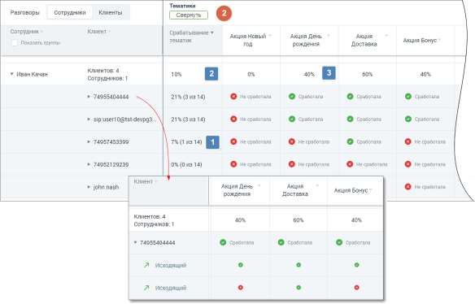

# 2. Раздел «Тематики»

> Трассировка: PDF §2 · сквозные стр. 458-459 · источники: ч.1 `kb/sources/mango-cc-manual/CC_manual_1.26.28.1.pdf` с.458-459.

В развернутом виде раздел таблицы содержит следующие столбцы: • Соответствие тематикам – показатель вида (N из M), где N – количество проставленных на данный разговор тематик, а M – общее количество тематик, выбранных в блоке фильтрации; • Столбцы с наименованиями тематик – все тематики, выбранные в блоке фильтрации, с пометкой о срабатывании. В детализации звонков пометка о срабатывании отображается по каждому звонку. При расчете данных в столбцах используются следующие величины: N – количество проставленных на данный разговор тематик M – общее количество тематик, выбранных в блоке фильтрации

– параметр, равный N/M*100%;

- параметр, равный среднему арифметическому данных в строке по всем выбранным тематикам;

- параметр, равный отношению количества меток "Сработала" (по вертикали) к общему количеству меток ("Сработала " + "Не сработала ").
