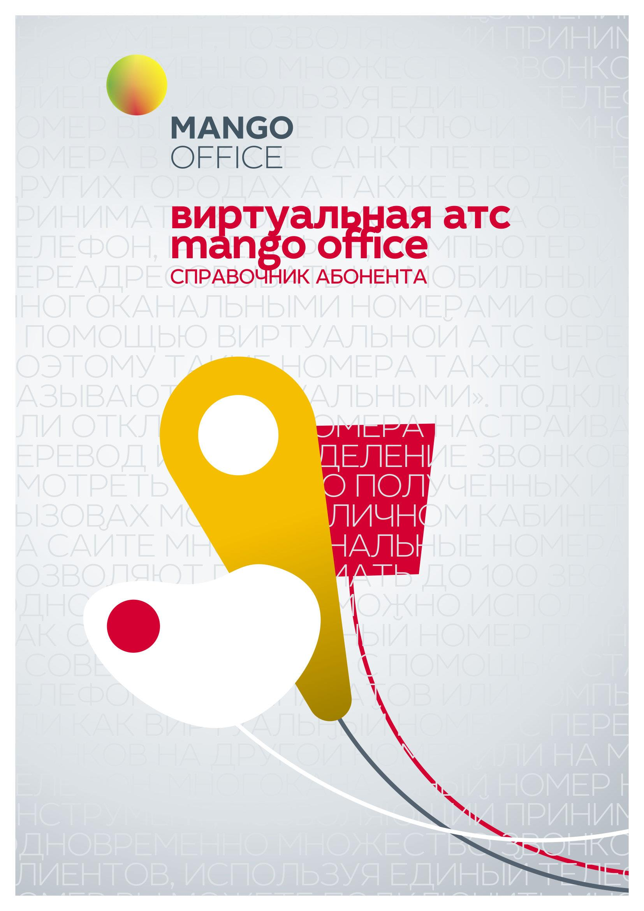

# Титульная часть

> Трассировка: PDF §— · сквозные стр. 1-6 · источники: ч.1 `kb/sources/mango-lk-manual/LK_manual_v-121часть-1.pdf` с.1-6.

Оглавление v 26.23 | 03.06.2026 Раздел 1. Добро пожаловать в Личный кабинет! .............................................................. 6 1.1 Вход в Личный кабинет ............................................................................................... 6 1.2 Восстановление пароля .............................................................................................. 8 1.3 Договор оферты ........................................................................................................ 10 1.4 Общие сведения........................................................................................................ 11 1.5 Панель Лицевого счета ............................................................................................. 11 1.6 Панель навигации ..................................................................................................... 12 1.7 Панель продуктов ...................................................................................................... 12 1.8 Обучение работе с ВАТС .......................................................................................... 13 1.8.1 Сценарий МИКРО ............................................................................................. 14 1.8.2 Сценарий МАЛЫЙ + СРЕДНИЙ ....................................................................... 21 Раздел 2. Финансы ........................................................................................................... 27 2.1 Документы ................................................................................................................. 27 2.1.1 Просмотреть/загрузить бухгалтерские документы ......................................... 27 2.1.2 Сформировать счет на предоплату телекоммуникационных услуг .............. 28 2.1.3 Создать акт сверки взаимных расчетов .......................................................... 28 2.1.4 Получить детализацию совершенных звонков ............................................... 29 2.2 Договоры .................................................................................................................... 29 2.3 Расходы на связь ...................................................................................................... 30 2.4 История Платежей .................................................................................................... 32 2.5 Пополнить счет .......................................................................................................... 34 2.5.1 Банковский перевод ......................................................................................... 34 2.5.2 Банковские карты .............................................................................................. 36 2.5.3 Электронные платежи ...................................................................................... 37 2.5.4 Оплата наличными ........................................................................................... 38 2.5.5 Оплата через QR-код ....................................................................................... 40 2.6 Автоматический платеж ............................................................................................ 40 2.7 Реквизиты .................................................................................................................. 42 2.8 Настройка уведомлений ........................................................................................... 43 2.9 Расходы на продукт .................................................................................................. 45 Раздел 3. Поддержка ........................................................................................................ 49 3.1 Вкладка «Поддержка» ............................................................................................... 49 3.1.1 Контакты персонального менеджера............................................................... 49

3.1.2 Быстрые каналы связи ..................................................................................... 50 3.1.3 Написать в техподдержку ................................................................................. 50 3.1.4 Инструкции и вспомогательные материалы ................................................... 52 3.2 Вкладка «Обращения» .............................................................................................. 52 3.2.1 Общий обзор ..................................................................................................... 52 3.2.2 Работа со статусами ......................................................................................... 53 3.2.3 Карточка обращения......................................................................................... 53 3.3 Вкладка «Наши офисы» ....................................................................................... 54 Раздел 4. Продукт «Виртуальная АТС» .......................................................................... 55 Демо-версия ВАТС .......................................................................................................... 57 Главная страница пользователя .................................................................................... 58 Персональная карточка сотрудника ......................................................................... 59 Виджет «Лента звонков» ........................................................................................... 60 Виджет «Сотрудники» ............................................................................................... 61 Виджет «Блок кнопок быстрых коммуникаций» ....................................................... 62 Виджет «Настройки личной защиты» ....................................................................... 63 Виджет «Аналитика» ................................................................................................. 64 Виджет «Коллтрекинг» .............................................................................................. 67 Виджеты Бухгалтера ................................................................................................. 69 Приложение «Личный кабинет» ................................................................................ 69 Начало работы ................................................................................................................ 70 Блокировка ВАТС ...................................................................................................... 70 4.1 Навигационная панель.............................................................................................. 70 4.1.1 Смена версии и тарифа продукта ................................................................... 71 4.2 Блок «Ваши номера» ................................................................................................ 75 4.2.1 Номера MANGO OFFICE .................................................................................. 75 4.2.2 Номера других операторов .............................................................................. 76 4.2.3 Виджеты для сайта ........................................................................................... 79 4.3 Блок «Персонал» ....................................................................................................... 97 4.4 Обработка звонков .................................................................................................... 98 4.4.1 Номера, подключенные к АТС ......................................................................... 98 4.4.2 Голосовое меню и распределение звонков .................................................. 105 4.4.3 Настройки дозвона и сообщений по умолчанию .......................................... 125 4.4.4 Переадресация по номеру клиента ............................................................... 131 4.4.5 Черный/белый список ..................................................................................... 134

4.4.6 Сотрудники и группы ...................................................................................... 135 4.5 Инструменты............................................................................................................ 175 4.5.1 Статистика и мониторинг ............................................................................... 176 4.5.2 История вызовов ............................................................................................. 184 4.5.3 Запись разговоров .......................................................................................... 193 4.5.4 Контакт-центр .................................................................................................. 215 4.5.6 Голосовые сообщения .................................................................................... 222 4.5.7 Заказ звонка .................................................................................................... 223 4.5.8 Статический коллтрекинг ............................................................................... 224 4.5.9 Аналитика ........................................................................................................ 229 4.5.10 Адресная книга контрагентов ....................................................................... 275 4.5.11 Текстовые коммуникации ............................................................................. 277 4.5.12 Речевая аналитика ....................................................................................... 375 4.5.13 Wallboard ....................................................................................................... 376 4.5.14 Сделки ........................................................................................................... 389 4.5.15 Контроль качества ........................................................................................ 391 4.5.16 Аналитика «Calltouch» .................................................................................. 392 4.5.17 Анализ конкурентов ...................................................................................... 393 4.5.18 Управление дозвоном и маркировка ........................................................... 408 4.6 Настройка АТС ........................................................................................................ 440 4.6.1 Настройка SIP ................................................................................................. 440 4.6.2 Аудиофайлы.................................................................................................... 452 4.6.3 Безопасность и ограничения .......................................................................... 454 4.6.4 Конференц-связь ............................................................................................ 476 4.6.5 Дополнительные настройки ........................................................................... 481 4.6.6 Управление услугами ..................................................................................... 491 4.6.7 Интеграции ...................................................................................................... 493 Раздел 5. SIP Trunk ........................................................................................................ 523 5.1 Термины и определения ......................................................................................... 523 5.2 Что такое SIP Trunk ................................................................................................. 523 5.3 Создание и редактирование SIP Trunk .................................................................. 524 5.3.1 Внешний SIP Trunk ......................................................................................... 525 5.3.2 Внутренний SIP Trunk ..................................................................................... 534 5.3.3 Активация SIP Trunk в карточке сотрудника ................................................. 538 5.3.4 Редактирование SIP Trunk ............................................................................. 539

5.3.5 Удаление SIP Trunk ........................................................................................ 539 5.4 Рабочая панель SIP Trunk ...................................................................................... 539 5.4.1 Список транков................................................................................................ 540 5.4.2 Список правил маршрутизации ..................................................................... 541 5.5 Настройка схемы распределения звонков в Личном кабинете ............................ 541 5.6 Примеры настройки звонков через SIP Trunk........................................................ 544 5.7 Конфигурация популярных PBX ............................................................................. 552 5.7.1 Создание SIP trunk для FreePBX (Asterisk) ................................................... 552 5.7.2 Создание SIP trunk для FusionPBX (Freeswitch) ........................................... 562 5.8 Роли и права доступа SIP Trunk ............................................................................. 567 Раздел 6. Роли и права доступа ЛК ВАТС .................................................................... 568

