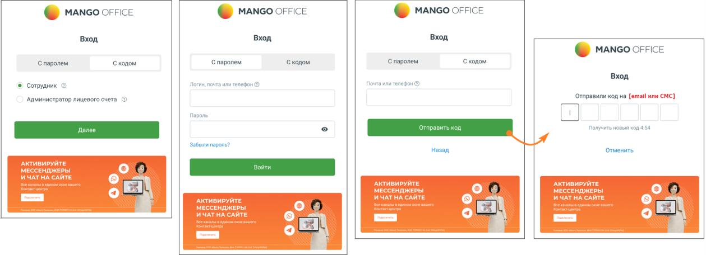
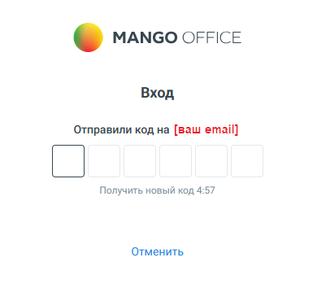
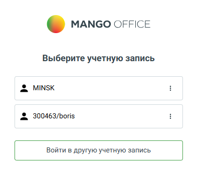

# 1.1. Вход в Личный кабинет

> Трассировка: PDF §1.1 · сквозные стр. 6-8 · источники: ч.1 `kb/sources/mango-lk-manual/LK_manual_v-121часть-1.pdf` с.6-8.

1.1 ВХОД В ЛИЧНЫЙ КАБИНЕТ На странице входа в систему предусмотрено два способа авторизации для сотрудников и Администраторов: • С паролем — классический вариант входа по логину (e-mail или номер телефона) и постоянному паролю. • С кодом — упрощённый способ входа без пароля, при котором используется одноразовый код подтверждения. Код отправляется на указанный email или номер телефона, заданные в Личном кабинете. Для переключения между способами используется вкладка в верхней части формы авторизации.

В качестве логина используются: • Номер лицевого счета — для доступа к учетной записи администратора Лицевого счета. Номер лицевого счета указывается в договоре об оказании услуг связи; • Логин сотрудника, e-mail, номер телефона — для доступа к учетной записи сотрудника. Данные указываются в карточке сотрудника. Если для учетной записи активирована двухфакторная аутентификация, дополнительно также отобразится окно для ввода кода верификации:

При наличии нескольких учетных записей имеется возможность выбора между ними.

