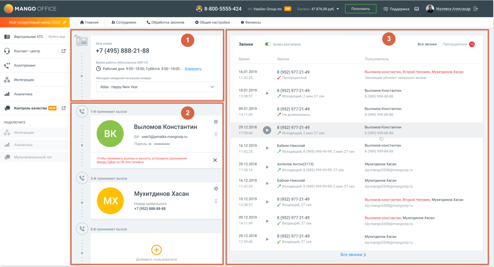

# 1.8.1. Сценарий МИКРО

> Трассировка: PDF §1.8.1 · сквозные стр. 14-15 · источники: ч.1 `kb/sources/mango-lk-manual/LK_manual_v-121часть-1.pdf` с.14-15.

Сценарий МИКРО по умолчанию предназначен для пользователей тарифного плана ВАТС «Виртуальный номер». Следуя сценарию, пользователь настроит отображение данных на главной панели ВАТС.

Главная страница ЛК ВАТС включает в себя следующие блоки: 1. Расписание и схема распределения звонков; 2. Сотрудники; 3. Звонки.

