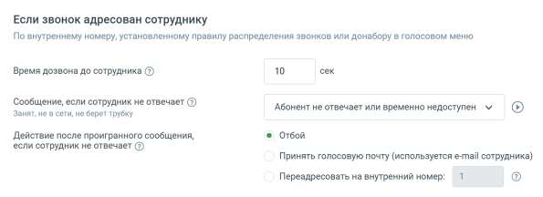
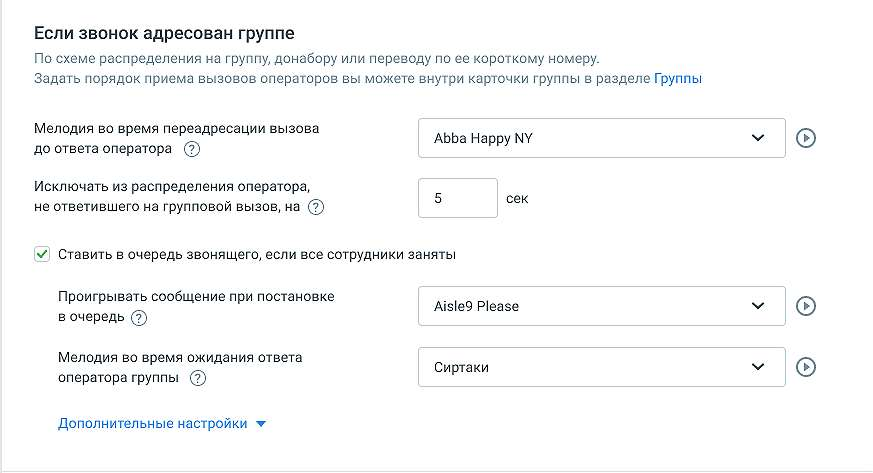
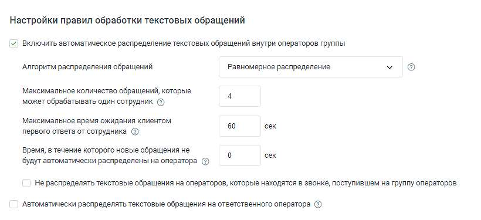

# 4.4.3. Настройки дозвона и сообщений по умолчанию

> Трассировка: PDF §4.4.3 · сквозные стр. 125-131 · источники: ч.1 `kb/sources/mango-lk-manual/LK_manual_v-123.pdf` с.125-131.

Данный раздел предназначен для настройки параметров обработки звонка по умолчанию. Если звонок адресован сотруднику

Время дозвона до сотрудника, сек В поле вводится интервал времени (по умолчанию 25 сек, максимум 120 сек), в течение которого Виртуальная АТС ожидает ответа сотрудника, номер которого включен, доступен и не занят другим вызовом. По истечении установленного периода дозвон на этого специалиста прекратится, и дальнейшая обработка будет происходить в соответствии с настройками Виртуальной АТС.

совет Если вы используете переадресацию на сотовые телефоны, то рекомендуем установить время ожидания не более 30 секунд, или отключить голосовую почту оператора мобильной связи. Данный параметр используется, если для номера (способа связи) не заданы индивидуальные правила обработки. Например, если время ожидания переопределено на схеме переадресации, то будет действовать параметр, заданный на схеме переадресации (подробнее в подразделе). Сообщение, если сотрудник не отвечает Здесь можно задать звуковой фрагмент, который воспроизводится при недоступности сотрудника (при значении «Нет» сообщение не воспроизводится). Действие после проигранного сообщения, если сотрудник не отвечает В этом блоке задается действие Виртуальной АТС, которое выполняется, если сотрудник не отвечает на звонок (занят другим вызовом и т. п.) и дальнейшие правила не определены (например, нет следующего действия в активной схеме переадресации). Действие выполняется как при внешних входящих вызовах, так и при звонках по внутренним номерам внутри ВАТС. • Отбой — звонок завершается со стороны Виртуальной АТС (абонент услышит сигнал «Занято»). • Принять голосовую почту (используется e-mail сотрудника) — воспроизводятся звуковое сообщение, заданное параметром «Предупреждение о начале записи голосовой почты», затем сигнал начала записи. Установлено по умолчанию. • Переадресовать на внутренний номер — переводит звонок на указанный номер (по умолчанию — 1).

Если звонок адресован группе

Мелодия во время переадресации вызова до ответа оператора В этом списке можно выбрать звуковой фрагмент, который воспроизводится абоненту во время перевода из голосового меню (по умолчанию — «нет»). Используется, если не задан параметр «Мелодия при дозвоне в группу» для группы сотрудников. Исключать из распределения оператора, не ответившего на групповой вызов, на Если незанятый сотрудник не ответил на звонок (не снял трубку) или текстовое сообщение в течение заданного интервала ожидания ответа, то его можно на определенное время исключить из распределения звонков и текстовых сообщений в группе. Для этого в соответствующем поле необходимо установить нужное значение. При значении параметра по умолчанию — 0 сек — сотрудник не будет исключен из распределения звонков и текстовых сообщений, даже если он не отвечает на них. При переключении статуса сотрудника на статус «На линии», сотрудник возвращается в распределение взвонков и текстовых обращений, даже если период исключения не завершен.

внимание Специалист, не ответивший на звонок или текстовое сообщение, временно исключается из распределения звонков и сообщений во всех группах сотрудников. совет Звонок перенаправляется на номера других сотрудников группы в соответствии с выбранным для нее алгоритмом распределения. Если при попытке переадресовать вызов на мобильный этот номер занят (другим звонком), то сотрудник исключается из распределения как минимум на 10 секунд вне зависимости от этого параметра. Ставить в очередь звонящего, если все сотрудники заняты Если в этом пункте установлена галочка, то Виртуальная АТС будет удерживать внешнего абонента на линии, даже если все сотрудники заняты. Он будет оставаться в очереди в течение времени, заданного значением параметра «Максимальное время ожидания ответа». При постановке абонента в очередь воспроизводится выбранное в пункте ниже голосовое сообщение, а при нахождении в очереди — установленная мелодия (см. ниже). Проигрывать сообщение при постановке в очередь В этом списке можно выбрать звуковой фрагмент для ситуации, когда все операторы заняты и звонок ставится в очередь. Если выбрано значение «Нет», то при постановке в очередь сообщение не воспроизводится. По умолчанию используется «К сожалению, все операторы заняты». Мелодия во время ожидания ответа оператора группы В этом списке можно установить звуковой фрагмент (мелодию), который циклически воспроизводится при ожидании в очереди (по умолчанию — «Сиртаки»). Максимальное время удержания вызова В этом поле можно задать время ожидания в очереди (по умолчанию — 600 сек). Если указать 0, то звонки будут находиться в очереди неограниченное время. Максимальная длина очереди В этом поле можно указать максимальное количество звонков, одновременно ожидающих распределения на группу сотрудников. Если вызов выходит за указанную границу, то помечается как пропущенный и далее обрабатывается в соответствии с настройками активной схемы переадресации. Значение параметра по умолчанию — 0 (длина очереди не ограничена).

Проигрывать сообщение при превышении ограничений очереди Если хотя бы один из двух параметров: «Максимальное время удержания вызова» или «Максимальная длина очереди» превышен, то звонок помечается как пропущенный. Можно установить для такой ситуации звуковой фрагмент (по умолчанию используется значение параметра «Нет»). Настройки правил обработки текстовых обращений

Включить автоматическое распределение текстовых обращений внутри операторов группы • чекбокс включен - автоматическое распределение поступивших текстовых обращений активируется; • чекбокс выключен - поступившие текстовые обращения попадают в очередь обращений. Алгоритм распределения обращений Для выбора доступны варианты: на наименее загруженного оператора, равномерное распределение. Максимальное количество текстовых обращений, которые может обрабатывать один сотрудник Установите максимальное количество единовременных текстовых сообщений, которые будут автоматически распределяться на сотрудника. При достижении данного показателя, обращения не будут распределять на сотрудника до тех пор, пока он не закроет одно из текущих обращений. Если у всех сотрудников будет достигнут данный показатель, все последующие текстовые обращения будут попадать в очередь обращений. Если указан 0, то обращения всегда будут распределяться на сотрудника.

Максимальное время ожидания клиентом первого ответа от сотрудника Укажите максимальное время в секундах, за которое сотрудник должен дать ответ на первое сообщение в чате от вашего клиента, если сотрудник не ответит за указанное время, то обращение будет переведено на другого сотрудника. По умолчанию 0, то есть сотрудник не ограничен во времени для дачи первого ответа.

| Время, в течение которого новые обращения не будут автоматически распределены |
| --- |
| на оператора |

| В течение заданного времени оператору не будут назначаться новые запросы на |
| --- |
| обработку. Это дает оператору возможность завершить обработку уже полученных |
| запросов без прерывания новыми. Чтобы отключить эту функцию, установите значение |
| на 0 секунд. Доступно только при выбранном алгоритме "Равномерное распределение". |

Не распределять текстовые обращения на операторов, которые находятся в звонке, поступившем на группу операторов • чекбокс включен - текстовые обращения не будут автоматически распределяться на оператора, если он уже находится в звонке, который поступил на ту же группу операторов и был назначен на этого сотрудника. Это означает, что оператор, который уже обрабатывает звонок, не будет получать новые текстовые обращения до завершения текущего звонка. Это помогает избежать перегрузки операторов и обеспечить более эффективное распределение обращений. • чекбокс выключен - текстовые обращения будут назначаться на оператора независимо от его текущего статуса звонка. Даже если оператор уже находится в звонке, который поступил на ту же группу операторов и был назначен на этого сотрудника, он все равно будет получать новые текстовые обращения. Это может привести к перегрузке оператора, особенно в случае одновременного обработки звонков и текстовых обращений. Автоматическое распределять текстовые обращения на ответственного оператора • чекбокс включен - поступившие текстовые обращения передаются оператору, закрепленному за клиентом, при отсутствии оператора - распределяются в соответствии с настроенной схемой распределения обращений; • чекбокс выключен - текстовые обращения распределяются в соответствии с настроенной схемой распределения обращений.

