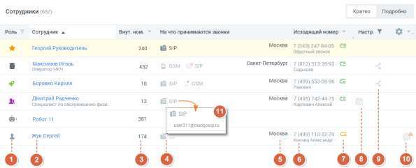
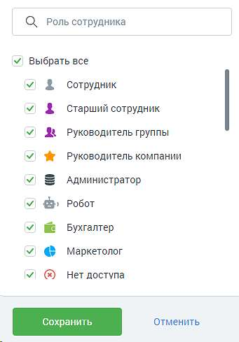
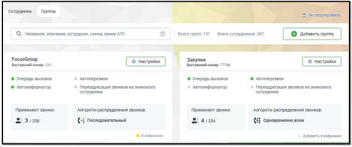
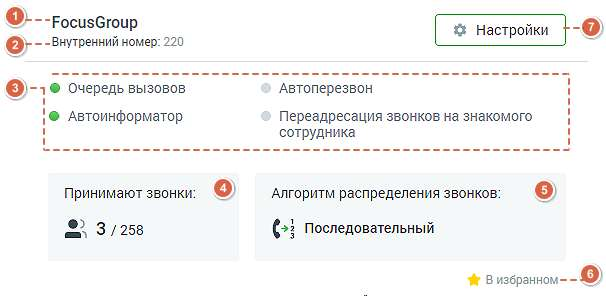

# 4.4.6. Сотрудники и группы

> Трассировка: PDF §4.4.6 · сквозные стр. 135-141 · источники: ч.1 `kb/sources/mango-lk-manual/LK_manual_v-123.pdf` с.135-141.

Вкладка «Сотрудники» На данной вкладке содержится список пользователей текущей Виртуальной АТС. Видимость списка зависит от настроек прав доступа роли текущег пользователя.

Пользователям с ролью «Администратор ВАТС» и «Администратор» доступен список всех пользователей текущей ВАТС вне зависимости от вхождения в группы.

Нажатие на кнопку «Экспортировать» позволяет произвести экспорт сотрудников в файл csv. Нажатие на кнопку «Импортировать» позволяет произвести импорт сотрудников из шаблона csv. В файле импорта для каждого сотрудника необходимо указать уникальный email. Функция импорта доступна пользователям, у которых есть права на создание сотрудников и доступ к разделу "Сотрудники". В поле поиска при вводе каждого символа выполняется интеллектуальный поиск по всем полям, содержащим текст: Ф.И.О., должность, способ приема звонков, название группы, настройки группы и т.д.

Для каждого пользователя в таблицу вынесена основная информация: 1. Пиктограмма, указывающая на роль пользователя в Личном кабинете. Роль указывается при редактировании карточки сотрудника на вкладке «Карточка». С полным списком ролей можно ознакомиться на вкладке «Настройка доступа» раздела «Безопасность и ограничения». Для фильтрации списка сотрудников по ролям следует щелкнуть по наименованию столбца. Список содержит все роли, присвоенные хотя бы одному из сотрудников ВАТС на момент просмотра отчета, включая как стандартные роли, так и дополнительные. При установке флага напротив наименования роли в результате применения фильтра список сотрудников будет включать только сотрудников с указанными ролями. Для быстрого выбора всех ролей предусмотрен общий флаг.

При наличии большого количества ролей рекомендуется воспользоваться строкой поиска. По мере ввода символов срабатывает автоподбор. После выбора нужных ролей необходимо нажать кнопку Сохранить. Для того, чтобы скрыть окно фильтра без применения изменений следует щелкнуть по кнопке Отменить либо в любое место вне фильтра.

2. Ф.И.О. — фамилия, имя, отчество, должность (если указана) сотрудника; 3. Внутренний номер для связи с сотрудником; 4. Первые три способа приема вызова и алгоритм дозвона до сотрудника. 5. Зона тарификации; 6. Номер для исходящих звонков (номер 8-800 недоступен для выбора в качестве исходящего номера); 7. Наличие автоматической подстановки номера для входящих звонков:

• автоподстановка включена и настроена

• автоподстановка включена, но не настроена

• автоподстановка отключена При наведении курсора мышки на пиктограмму отображаются подсказки.

8. Пиктограмма говорит о наличии настроенного расписания приема звонков;

9. Для сотрудника, отмеченного пиктограммой настроены правила Автосекретаря; 10. Рекомендации по заполнению карточки сотрудника. Клик по пиктограмме откроет всплывающее окно с текстом рекомендации; 11. Режим просмотра «Подробно» отображаются все телефонные номера и имена учетных записей каждого сотрудника, используемые в качестве средств связи. Для внесения изменений в карточку сотрудника щелкните в любом месте нужной строки таблицы. Для добавления профиля нового сотрудника нажмите кнопку «Добавить сотрудника», и откроется форма «Новый абонент». Процесс заполнения формы, а также подробное описание карточки сотрудника приведены в разделе. Вкладка «Группы обзвона» (режим просмотра списка групп обзвона) На данной вкладке содержатся блоки всех групп обзвона.

Нажатие на кнопку «Экспортировать» позволяет произвести экспорт сотрудников групп в файл csv. Функция доступна пользователям, у которых есть право «Просматривать список групп - для всех». Для изменения настроек группы нажмите кнопку «Настройки». Для создания новой группы щелкните по кнопке «Добавить группу», и откроется форма создания группы.

Блок каждой группы содержит следующую информацию:

1. Название группы и пиктограммы рекомендаций по настройке (если есть). Клик по пиктограмме откроет всплывающее окно с текстом рекомендации; 2. Внутренний короткий номер группы (если задан) и описание группы (если задано); 3. Блок услуг с пиктограммой подключения:

услуга подключена;

услуга отключена; 4. Блок «Сотрудники» - отображается количество сотрудников, в формате "N/M", где N - количество принимающих звонки операторов, а M - общее количество добавленных в группу сотрудников. Для просмотра или редактирования состава группы наведите курсор на любую часть блока и кликните по кнопке «Настроить»; 5. Блок «Алгоритм распределения звонков». Варианты алгоритмов:

Последовательный

Случайный

Параллельный по приоритету

Одновременно всем

Равномерный

Кто меньше звонил

Наименьшее время разговора Для просмотра или редактирования алгоритма наведите курсор на любую часть блока и кликните по кнопке «Настроить». Если в настройках группы указан алгоритм распределения звонков «Последовательный» или «Параллельный по приоритету», то чем выше находится специалист в списке группы, тем раньше будет производиться дозвон на его номер. 6. Показатель нахождения группы в списке «Избранное» пользователя.

- группа находится в Избранном;

- группа не находится в Избранном; Группы из списка «Избранное» отображаются в начале списка групп; 7. Настройки – клик на кнопку открывает карточку группы для просмотра или редактирования.

