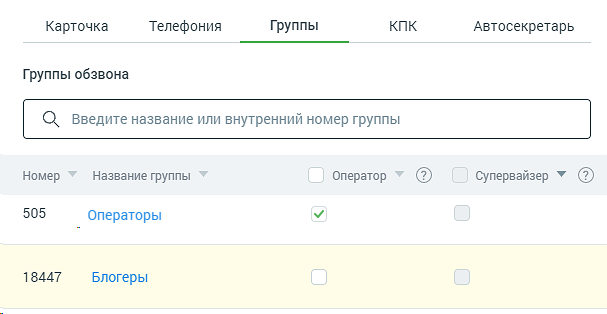

# 4.4.6.1.3. Вкладка «Группы»

> Трассировка: PDF §4.4.6.1.3 · сквозные стр. 156-157 · источники: ч.2 `kb/sources/mango-lk-manual/LK_manual_v-121часть-2.pdf` с.55-56.

Вид вкладки представлен на рисунке ниже.

Права в группах При необходимости добавьте пользователю права оператора и/или супервайзера для групп в Контакт-центре. Операторы могут обрабатывать звонки, распределенные на группу, в которой они состоят, а супервайзеры помимо этого — контролировать деятельность операторов. Для добавления нажмите соответствующую ссылку и отметьте нужные группы. Сохраните внесенные изменения. Оператор/Супервайзер – Установленный флаг означает, что сотрудник, карточка которого открыта, является оператором/супервайзером соответствующей группы. Сотрудник в зависимости от наличия прав может менять данную настройку себе либо другим сотрудникам.
