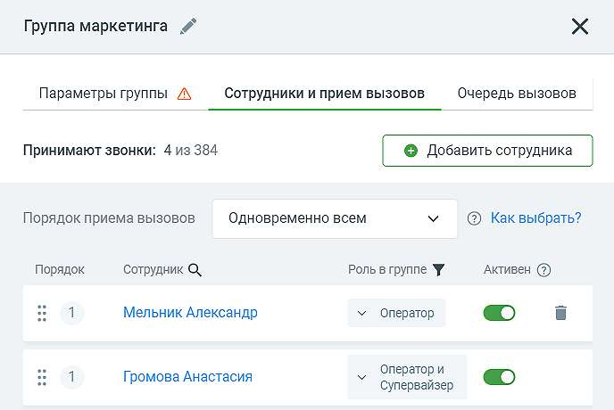

# 4.4.6.2.2. Вкладка «Сотрудники и прием вызовов»

> Трассировка: PDF §4.4.6.2.2 · сквозные стр. 170-172 · источники: ч.1 `kb/sources/mango-lk-manual/LK_manual_v-123.pdf` с.170-172.

Вид вкладки представлен на рисунке ниже.

Кнопка «Добавить сотрудника». Нажатие на кнопку открывает окно выбора сотрудников для добавления их в группу. В случаях, когда права доступа пользователя не предусматривают просмотр карточек некоторых членов группы, их карточки в карточке группы недоступны для активации. Если права доступа пользователя позволяют исключение сотрудников из группы, рядом с именем сотрудника размещается пиктограмма «корзина». Клик по пиктограмме открывает окно согласия на исключение сотрудника. После получения согласия сотрудник будет исключен из группы. Пиктограмма «воронка» рядом с наименованием столбца «Роль в группе» открывает выпадающий список фильтров по ролям сотрудников группы. Отметка на фильтре оставляет в списке сотрудников группы только тех сотрудников, чью роли соответствуют выбранному фильтру.

Алгоритмы распределения звонков в группе Алгоритмы распределения звонков в группе помогают подстроить телефонию под текущие бизнес-задачи компании. • Последовательный — набор номеров сотрудников в заданном порядке. Порядок обзвона устанавливается при просмотре списка сотрудников, входящих в группу. • Случайный — вызов направляется на одного сотрудника группы, выбранного случайным образом. • Параллельный по приоритету — вызов направляется одновременно всем сотрудникам с наивысшим приоритетом обзвона. Приоритет обзвона устанавливается при просмотре списка сотрудников, входящих в группу. • Одновременно всем — вызов направляется одновременно на всех свободных сотрудников. • Равномерный — вызов направляется на сотрудника, предыдущий разговор которого закончился раньше, чем у других. Затем вызов направляется на второго по списку, и т. д. • Наименьшее время разговора – вызов направляется на сотрудника с наименьким временем разговоров среди свободных на момент вызова сотрудников группы. • Кто меньше ответил – вызов направляется на сотрудника с наименьшим количеством ответов на входящие звонки среди свободных на момент вызова сотрудников группы. • Равномерный внутри приоритетного – вызов направляется на наименее загруженного сотрудника в группе согласно приоритету группы. Для выбора оптимального алгоритма прочитайте советы по использованию каждого из них, наводя курсор на значок «?» или ссылку «Как выбрать?». В зависимости от тарифного плана ВАТС алгоритмы распределения звонков могут быть: • недоступны • подключены за отдельную ежемесячную плату. В этом случае при выборе алгоритма стоимость алгоритма будет приведена в нижней части формы. Для использования алгоритма необходимо установить галочку «Я принимаю условия подключения»; • подключены по умолчанию. совет Если ранее вы не подключали сервис переадресации по номеру клиента, то в процессе настройки вам будет предложено согласиться с условиями его использования. Установите галочку «Я принимаю условия подключения». Для настройки сервиса перейдите на главную страницу Виртуальной АТС и в блоке «Инструменты» выберите «Переадресация по номеру клиента».

