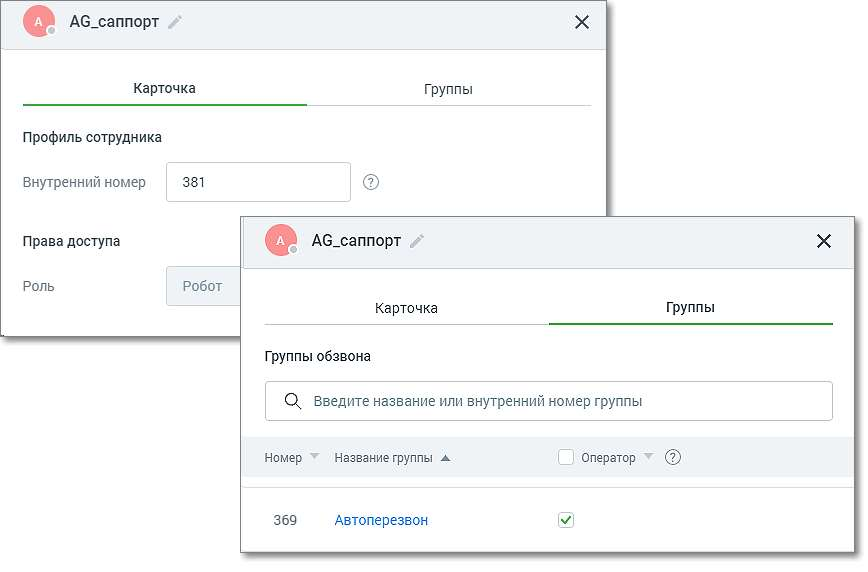
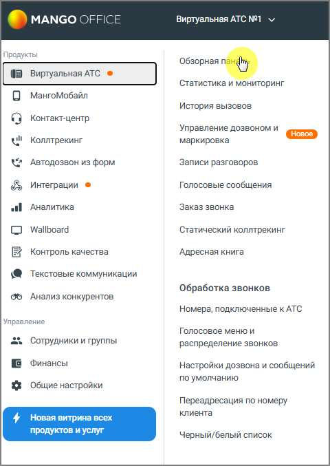

# 4.5. Инструменты

> Трассировка: PDF §4.5 · сквозные стр. 175-176 · источники: ч.1 `kb/sources/mango-lk-manual/LK_manual_v-123.pdf` с.175-176.

Карточка робота содержит следующую информацию: • Имя робота – может быть изменено по клику на пиктограмме «карандаш»; • Профиль сотрудника – внутренний номер робота для перевода вызовов; • Роль - значение поля «Робот». Поле недоступно для редактирования; • Добавление исключение робота из групп обзвона – в группе обзвона робот может быть только оператором. Сотрудник-робот отображается в статистике аналогично другим сотрудникам, может быть добавлен в группы и участвовать в схеме переадресации. 4.5 ИНСТРУМЕНТЫ Раздел Инструменты доступен пользователю из: 1. Обзорной панели Личного кабинета 2. Вертикальной навигационной панели Рабочего стола

