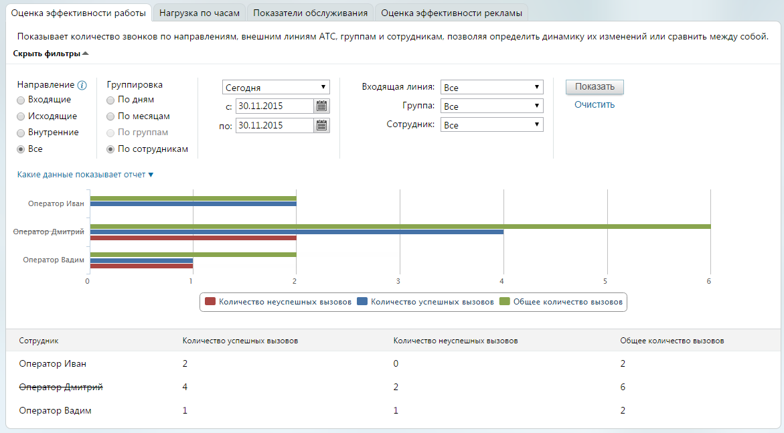

# 4.5.1.1. Оценка эффективности работы

> Трассировка: PDF §4.5.1.1 · сквозные стр. 177-179 · источники: ч.2 `kb/sources/mango-lk-manual/LK_manual_v-121часть-2.pdf` с.76-78.

Для построения отчета воспользуйтесь следующими фильтрами: 1. Выберите направление вызовов, используя одноименный переключатель: • Входящие – звонки, пришедшие на любой номер, подключенный к АТС в качестве внешней линии (номера MANGO OFFICE, номера сторонних операторов, номера 8-800); • Исходящие – звонки, совершенные сотрудниками на номера, не указанные в карточках сотрудников; • Внутренние – звонки, совершенные и полученные сотрудниками (группами), по номерам, указанным в карточках сотрудников; • Все — сумма входящих, исходящих и внутренних звонков. совет При выборе вариантов «Исходящие» и «Все» недоступен способ группировки «По группам». Также при указании варианта «Исходящие» нельзя использовать фильтры «Входящая линия» и «Группа». 2. Выберите способ группировки данных с помощью одноименного переключателя. • По дням — разбивка по календарным дням. Максимальная длина отчетного периода — месяц.

• По месяцам — группировка по календарным месяцам. Максимальная длина — 1 год. • По группам — разбивка по группам сотрудников. Максимальная длина — три месяца. • По сотрудникам – разбивка по сотрудникам. Максимальная длина — три месяца. 3. Укажите период, охватываемый отчетом. При необходимости можно указать даты самостоятельно. 4. Выберите входящую линию: • Номер или sip-линию; • группу; • конкретного сотрудника; • линию, указанную для виджета «Звонок с сайта» или «обратный звонок». совет Если выбрана группа сотрудников, то в списке «Сотрудник» будут доступны только те из них, которые входят в данную группу, и вариант «Все». Если указан конкретный работник, то в списке «Группа» будут доступны только те из них, в которых он состоит, и вариант «Все». Под блоком фильтров располагается блок подсказок "Какие данные показывает отчет". Его содержимое меняется в реальном времени в соответствии с выбранным набором фильтров отчета. Для формирования отчета в соответствии с указанными критериями фильтрации нажмите кнопку Показать.

В случае, если сотрудник, группа либо виджет «Звонок с сайта» или «Обратный звонок» были удалены из ВАТС, то в отчете такой объект отображается «перечеркнутым» шрифтом. Для получения более подробной информации наведите курсор на нужный столбец или строку гистограммы. Нажмите на элемент легенды («Количество успешных вызовов», «Количество неуспешных вызовов», «Общее количество вызовов») для отображения или скрытия соответствующих данных на гистограмме. В число неуспешных включены также вызовы, завершенные в соответствии с настройками сервиса «Черный/Белый список».
