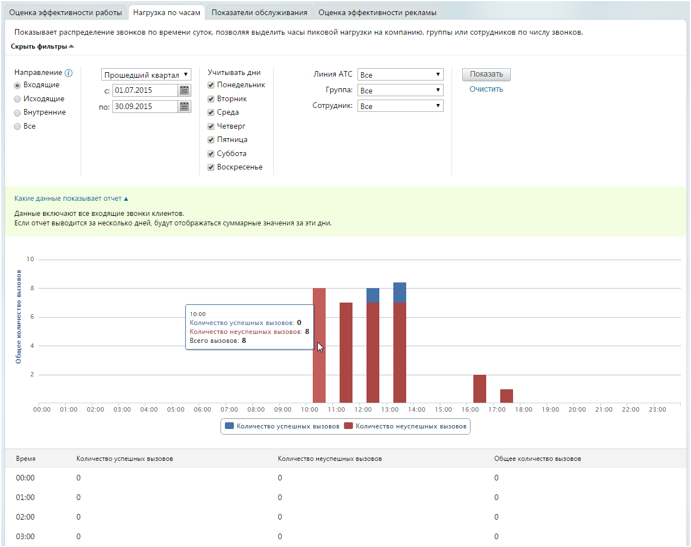

# 4.5.1.2. Нагрузка по часам

> Трассировка: PDF §4.5.1.2 · сквозные стр. 179-181 · источники: ч.2 `kb/sources/mango-lk-manual/LK_manual_v-121часть-2.pdf` с.78-80.

Для построения отчета воспользуйтесь следующими фильтрами: 1. Выберите направление вызовов, используя одноименный переключатель: • Входящие – звонки, пришедшие на любой номер, подключенный к АТС в качестве внешней линии (номера MANGO OFFICE, номера сторонних операторов, номера 8-800); • Исходящие – звонки, совершенные сотрудниками на номера, не указанные в карточках сотрудников; • Внутренние – звонки, совершенные и полученные сотрудниками (группами), по номерам, указанным в карточках сотрудников; • Все — сумма входящих, исходящих и внутренних звонков.

совет При указании варианта «Исходящие» нельзя использовать фильтры «Линия АТС» и «Группа», а варианта «Внутренние» — фильтр «Линия АТС». 2. Укажите период, охватываемый отчетом. При необходимости можно указать даты самостоятельно. Максимальная длина периода формирования отчета составляет один год. 3. В блоке «Учитывать дни» установите флаги для тех дней недели, которые будут учтены в отчете. Если флаг не установлен, то звонки соответствующих дней недели в отчет не попадут. 4. Выберите входящую линию: • Номер или sip-линию; • группу; • конкретного сотрудника; • линию, указанную для виджета «Звонок с сайта» или «обратный звонок». Для формирования отчета в соответствии с указанными критериями фильтрации нажмите Показать.

Если выбрана конкретная группа сотрудников, то в списке «Сотрудник» будут доступны только вариант «Все», а также входящие в нее работники. При указании определенного специалиста в списке «Группа» окажутся доступны только группы, в которые он включен, а также вариант «Все». Во время работы с фильтрами рекомендуем развернуть текстовую подсказку «Какие данные показывает отчет». Её содержимое меняется в реальном времени в соответствии с выбранным набором фильтров отчета. совет При наведении курсора на элементы графика отображается всплывающая подсказка (см. пример на рисунке выше).
