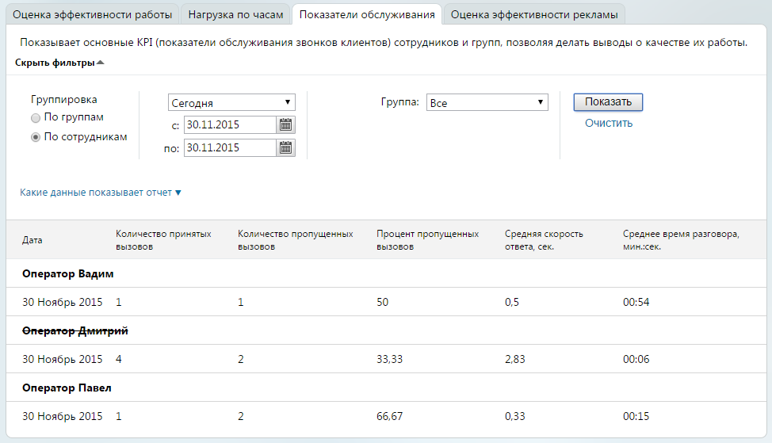

# 4.5.1.3. Показатели обслуживания

> Трассировка: PDF §4.5.1.3 · сквозные стр. 181-182 · источники: ч.2 `kb/sources/mango-lk-manual/LK_manual_v-121часть-2.pdf` с.80-81.

Выберите тип группировки, используя одноименный переключатель. При необходимости можно указать даты (по умолчанию предлагается период «Произвольный»), нажав значок календаря, или ввести их в формате дд.мм.гггг в соответствующие поля. Максимальная длина периода формирования отчета составляет три месяца. Есть возможность указать группу сотрудников, используя одноименный список. Нажмите кнопку «Показать», и Виртуальная АТС создаст и отобразит отчет, сформированный в соответствии с указанными критериями фильтрации. Он будет представлен на странице в табличном виде со столбцами: • Дата — содержит информацию о дате, а также названиях групп или Ф.И.О. сотрудников. • Количество принятых вызовов — общее число успешных вызовов в соответствии с указанными критериями выборки. • Количество пропущенных вызовов — общее число неуспешных вызовов в соответствии с указанными критериями выборки. • Средняя скорость ответа, сек. — величина рассчитывается только по принятым вызовам с момента его поступления (когда начался дозвон до номера в результате переадресации) до момента поднятия трубки. • Среднее время разговора, мин:сек. — рассчитывается в соответствии с указанными критериями выборки, как суммарное время разговора, деленное на суммарное количество успешных вызовов. • Процент пропущенных вызовов — выраженное в процентах отношение числа неуспешных вызовов к общему числу вызовов в соответствии с указанными критериями выборки. Рассчитывается по формуле (неуспешные вызовы/все переадресованные вызовы) * 100%.

Как определяется успешность вызова? Если вызов не принят одним из сотрудников в группе — для него он будет считаться пропущенным; если его принял другой сотрудник этой же группы — звонок будет считаться принятым при включении в выборку этого работника или группы специалистов. Если вызов не был принят одной группой сотрудников, после чего был переадресован на другую и принят входящим в нее работником, то при выборке, включающей только первую группу, звонок будет считаться пропущенным, а при выборке, включающей и вторую, — принятым, и т. п. В число пропущенных вызовов также включаются вызовы, завершенные в соответствии с настройками услуги «Черный/Белый список».

В случае, если сотрудник, группа или кнопка «Звонок с сайта» были удалены из ВАТС, то в отчете такой объект отображается «перечеркнутым» шрифтом.
