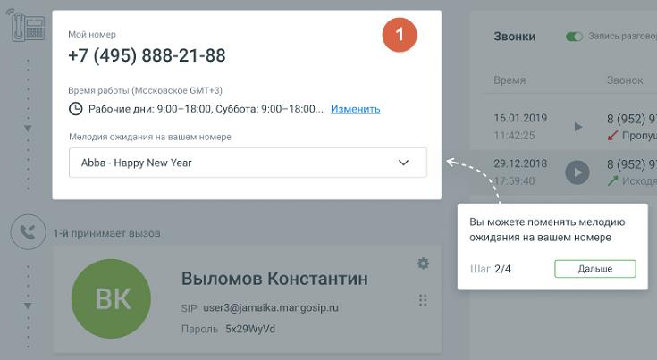

# 1.8.1.3. Главная страница (сценарий МИКРО)

> Трассировка: PDF §1.8.1.3 · сквозные стр. 17-18 · источники: ч.1 `kb/sources/mango-lk-manual/LK_manual_v-121часть-1.pdf` с.17-18.

Настройте интерфейс главной страницы, следуя информационным подсказкам.

Вид Блока главной страницы зависит от сложности схем распределения звонков пользователя ВАТС, установленных в разделе «Голосовое меню и распределение звонков». Варианты интерфейса Блока 1 приведены на рис.1 и рис.2 ниже.

