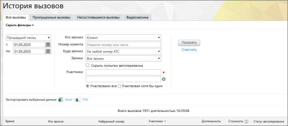
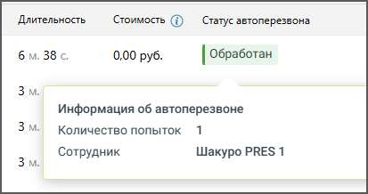
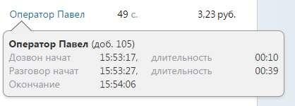
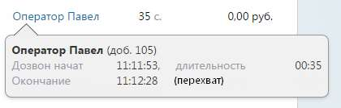
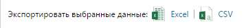

# 4.5.2.1. Все вызовы

> Трассировка: PDF §4.5.2.1 · сквозные стр. 184-188 · источники: ч.1 `kb/sources/mango-lk-manual/LK_manual_v-123.pdf` с.184-188.

Данный отчет объединяет информацию обо всех вызовах любого типа: принятых и несостоявшихся по той или иной причине. Отчет формируется по указанному периоду. При выборе значения «Произвольный» в полях «с» и «по» следует указать точные даты начала и завершения периода.

Клиент: • Номер клиента – номер, с которого звонил клиент; • Куда звонил – входящая линия ВАТС (номер или SIP-линия), а также линия, указанная для виджетов «Звонок с сайта» и «Обратный звонок». При выборе линии, указанной для виджета «Обратный звонок», в поле «Набранный номер» отчета будет указано название соответствующего виджета.

• Статус звонка – фильтр по статусу звонка: o Все звонки; o Только успешные звонки; o Только неуспешные звонки. Сотрудник: • Сотрудник – выбор сотрудника, совершившего исходящий вызов; • С номера – выбор номера исходящего звонка; • Статус звонка – фильтр по статусу звонка: o Все звонки; o Только успешные звонки; o Только неуспешные звонки. Клиент или сотрудник: • Статус звонка – фильтр по статусу звонка: o Все звонки; o Только успешные звонки; o Только неуспешные звонки. Участники - сотрудники или группы, принимавшие участие в вызове. Отношение между заданными участниками вызова – фильтр доступен только при двух и более участников вызова. При выборе варианта «Участвовали все» фильтр срабатывает как логическое условие «И»: запись будет отображена только в том случае, если в вызове принимали участие все указанные абоненты. В противном случае фильтр срабатывает как логическое «ИЛИ»: запись отображается, если в вызове принимал участие хотя бы один из абонентов. Скрыть попытки автоперезвона – при отметке чекбокса в отчёте будут скрыты автоматические повторы вызовов, выполняемые системой в случае недозвона. Это позволяет исключить из анализа технические вызовы и сосредоточиться только на реальных попытках соединения с клиентом. Пример. Для того, чтобы посмотреть все звонки по определенному клиенту, выберите следующие значения фильтров: • Кто звонил – клиент или сотрудник; • Участники – номер телефона клиента В результате отчет будет содержать список вызовов, в которых участвовал клиент. Вы сможете увидеть, был ли последний разговор с клиентом успешным или нет. В том числе вы увидите, оставлял ли клиент заказ на обратный звонка через виджет «Обратный звонок».

совет Чтобы отчет содержал номера с определенной последовательностью цифр, при фильтрации по клиенту введите эту последовательность в поле "Номер клиента". При фильтрации по сотруднику отчет отображает вызовы, совершенные сотрудником: исходящие и внутренние. Отчет может быть сформирован как по конкретному сотруднику, так и по всем сотрудникам определенной группы, а также по всем сотрудникам ВАТС. Отчет формируется после нажатия кнопки Показать. Сформированный отчет состоит из столбцов: • Время – время начала дозвона; • Тип вызова – тип вызова по направлению; • Кто звонил – номер или SIP-адрес абонента, с которого был совершен вызов. Если звонил сотрудник ВАТС, то отображается его ФИО; • С номера – содержит номер (DID) или название (SIP UAC) исходящей линии ВАТС или название транка, через которые был совершен вызов; • Набранный номер с номер, на который был совершен вызов; • Участники – сотрудники или группы, принимавшие участие в вызове; • Длительность – длительность вызова; • Стоимость – стоимость вызова. Стоимость включает общую стоимость звонков всем участникам и поминутную запись разговоров. • Статус автоперезвона – отображает, участвовал ли вызов в процессе автоматического перезвона (АПП) и как он завершился. Это позволяет отслеживать эффективность автоперезвона и понимать, каким образом и кем был закрыт контакт с клиентом. Тег статуса может иметь следующие значения: o Обработан — задача на перезвон выполнена: оператор успешно дозвонился и поговорил с клиентом; o В работе — задача активна: система выполняет попытки дозвона, но разговора с клиентом ещё не было; o Не дозвонились — все автоматические попытки завершены, клиент не ответил; o Клиент сам перезвонил — входящий вызов от клиента поступил до успешного дозвона со стороны оператора; o Сотрудник сам перезвонил — оператор инициировал исходящий вызов до завершения автоматической задачи. При клике на тег открывается всплывающее окно, содержащее подробную информацию:

В столбце «Участники» прочерком обозначается вызов, пропущенный не по вине сотрудника. Например, это вызов, отмененный клиентом при работе с голосовым меню. Если же вызов был пропущен сотрудником, то в отчете его ФИО выделяется красным. При щелчке по ФИО сотрудника или названию группы в столбце «Участники» отображается подсказка, содержащая дополнительную информацию по вызову.

Подсказка для группы также содержит список сотрудников, которым были попытки совершены дозвона, но дозвониться не удалось (т.е. не ответивших на вызов), с указанием числа попыток, и имя оператора, ответившего на вызов. В случае, если вызов был перехвачен с помощью кнопок BLF, то в подсказке будет присутствовать пометка «Перехват», которая означает, что вызов на данного сотрудника был перехвачен. В таком случае следующей записью в истории вызовов будет являться разговор сотрудника, перехватившего вызов.

Экспорт (сохранение) файла отчета выполняется в формате CSV в двух вариантах: с адаптацией для Excel и без адаптации. Выберите нужный вариант и нажмите на соответствующую пиктограмму. В результате будет открыто стандартное диалоговое окно браузера, позволяющее открыть или сохранить файл.

