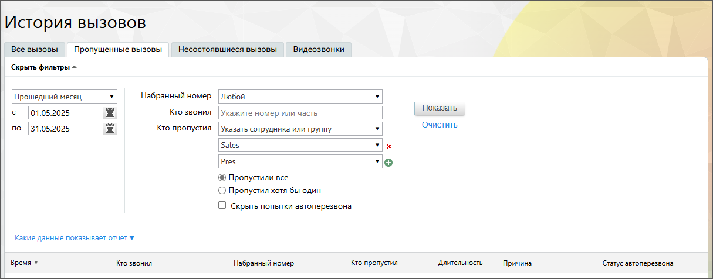
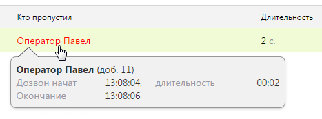
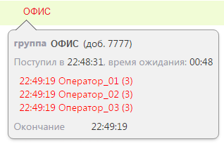
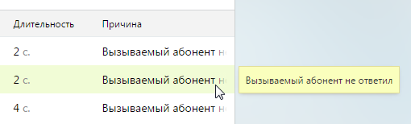

# 4.5.2.2. Пропущенные вызовы

> Трассировка: PDF §4.5.2.2 · сквозные стр. 188-190 · источники: ч.2 `kb/sources/mango-lk-manual/LK_manual_v-121часть-2.pdf` с.87-89.

Данный отчет содержит информацию обо всех пропущенных входящих вызовах. Порядок действий для создания и сохранения отчета аналогичен процедуре при работе с отчетом «Все вызовы».

Для построения отчета воспользуйтесь следующими фильтрами: 1. Период. Отчет формируется по указанному периоду. При выборе значения «Произвольный» в полях «с» и «по» следует указать точные даты начала и завершения периода. 2. Набранный номер - номер ВАТС, номера сторонних операторов, номера 8-800 и линии виджетов «Звонок с сайта» и «Обратный звонок». Предусмотрена возможность выбора всех номеров; 3. Кто звонил - Номер или SIP-адрес абонента. Если поле оставлено незаполненным, то отчет формируется по всем внешним номерам; 4. Кто пропустил - имя сотрудника или название группы, пропустивших вызов. Кроме того, предусмотрен пункт «Никто (звонки закончились в голосовом меню)» для отображения вызовов, пропущенных на стадии работы абонента с голосовым меню. 5. Отношение между пропустившими вызов - фильтр доступен только в случае, если указано два и более сотрудника (группы), пропустивших вызов. При выборе варианта «Пропустили все» фильтр срабатывает как логическое условие «И»: запись будет отображена только в том случае, если вызов был пропущен всеми указанными сотрудниками (группами). В противном случае фильтр срабатывает как логическое «ИЛИ»: запись отображается, если в вызове принимал участие хотя бы один из абонентов. 6. Скрыть попытки автоперезвона – при отметке чекбокса в отчёте будут скрыты автоматические повторы вызовов, выполняемые системой в случае недозвона. Это позволяет исключить из анализа технические вызовы и сосредоточиться только на реальных попытках соединения с клиентом.

Отчет формируется после нажатия Показать. Сформированный отчет состоит из столбцов: • Время – время начала дозвона; • Кто звонил – номер абонента, с которого был совершен вызов. Если звонил сотрудник ВАТС, то отображается его ФИО. Если звонок был совершен посредством кнопки с сайта, то в поле будет отображаться название соответствующей кнопки; • Набранный номер – номер, на который был совершен вызов, либо линия, указанная для виджета «Обратный звонок», если клиентом был сделан заказ на звонок при помощи соответствующего виджета; • Кто пропустил – имя сотрудника или название группы, пропустивших вызов • Длительность – длительность вызова; • Причина – уточняющая причина завершения вызова. • Статус автоперезвона – функциональность аналогична статусу автоперезвона на вкладке «Все вызовы». При щелчке по ФИО сотрудника или названию группы в столбце «Кто пропустил» отображается подсказка, содержащая дополнительную информацию по вызову.

При пропущенном звонке на группу подсказка содержит список сотрудников, пропустивших вызов. Для каждого сотрудника указывается количество дозвонов

При наведении курсора на столбец «Причина» отображается всплывающая подсказка, содержащая полный текст причины завершения вызова.

Как и на закладке «Все вызовы», здесь предусмотрен экспорт файла отчета форматов Excel и CSV. Выберите нужный вариант и нажмите на соответствующую пиктограмму. В результате будет открыто стандартное диалоговое окно браузера, позволяющее открыть или сохранить файл.
