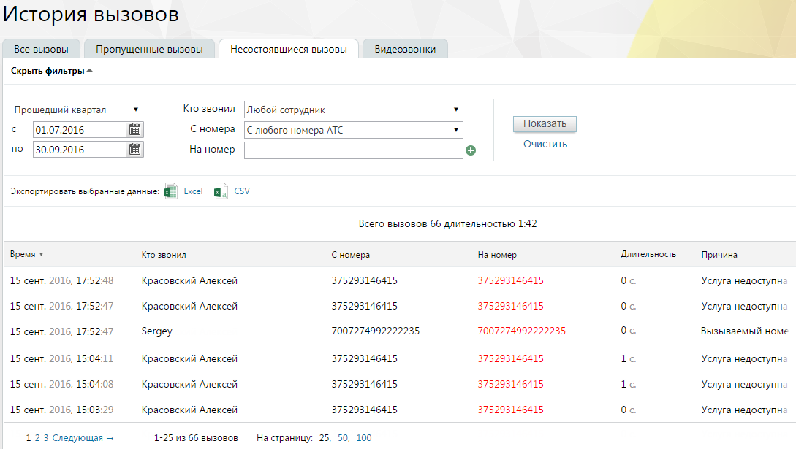

# 4.5.2.3. Несостоявшиеся вызовы

> Трассировка: PDF §4.5.2.3 · сквозные стр. 190-191 · источники: ч.2 `kb/sources/mango-lk-manual/LK_manual_v-121часть-2.pdf` с.89-90.

Данный отчет содержит информацию обо всех несостоявшихся исходящих вызовах, совершенных на внешний номер (номера) клиента. Отчет позволяет отследить несостоявшиеся вызовы, совершенные: • любым сотрудником определенной группы; • определенным сотрудником; • с определенной линии; • на определенный внешний номер или номера клиента. Порядок действий для создания и сохранения отчета аналогичен процедуре при работе с предыдущими отчетами.

Сформированный отчет состоит из столбцов: • Время – время начала дозвона; • Кто звонил – имя сотрудника ВАТС; • С номера – номер или название SIP-линии сотрудника ВАТС; • На номер – номер либо SIP-линия, на который был совершен вызов; • Длительность – длительность вызова; • Причина – причина завершения вызова. Пример Необходимо просмотреть все неуспешные исходящие звонки, совершенные на определенный номер клиента любым сотрудником определенной группы. Для этого следует: • Указать требуемый период; • В фильтре «Кто звонил» указать выбрать значение «Любой сотрудник группы [Название группы]»; • Значение фильтра «С номера» оставить без изменений или указать номер или SIP-линию выбранной группы; • В фильтре «На номер» указать номер клиента; • Нажать Показать. В результате отчет отобразит список неуспешных вызовов, совершенных любым сотрудником указанной группы на определенный номер клиента за выбранный период.
