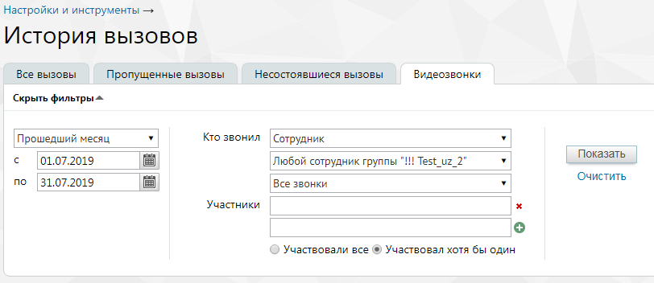

# 4.5.2.4. Видеозвонки

> Трассировка: PDF §4.5.2.4 · сквозные стр. 191-193 · источники: ч.1 `kb/sources/mango-lk-manual/LK_manual_v-123.pdf` с.191-193.

Данный отчет содержит информацию обо всех видеозвонках. Отчет позволяет отследить видеозвонки, совершенные: • любым сотрудником определенной группы; • определенным сотрудником; • успешные или неуспешные видеозвонки; • с участием определенного сотрудника или любого сотрудника группы. Порядок действий для создания и сохранения отчета аналогичен процедуре при работе с предыдущими отчетами.

Сформированный отчет состоит из столбцов: • Время – время начала дозвона; • Кто звонил – имя сотрудника ВАТС; • С номера – номер или название SIP-линии сотрудника ВАТС; • На номер – номер либо SIP-линия, на который был совершен вызов; • Длительность – длительность вызова; • Причина – причина завершения вызова. Через 4 часа после завершения видеозвонка становится доступна для скачивания запись видеоконференции. Формат записи mp4, разрешение не ниже 1024х768. Для скачивания кликните по иконке «скачать» напротив выбранной записи. Видеоконференция длительностью менее 6 секунд считается несостоявшейся. Ее запись недоступна для скачивания.

