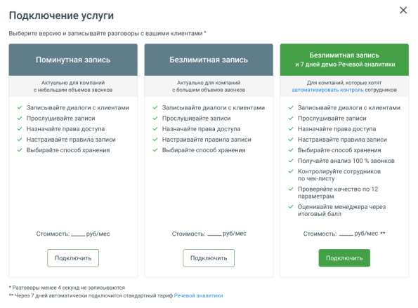

# 4.5.3. Запись разговоров

> Трассировка: PDF §4.5.3 · сквозные стр. 193-194 · источники: ч.1 `kb/sources/mango-lk-manual/LK_manual_v-123.pdf` с.193-194.

Виртуальная АТС может записывать — вручную или автоматически — нужный разговор (разговоры) для дальнейшего использования этих записей в интересах вашего бизнеса. Созданные аудиофайлы можно прослушать, распознать и проанализировать с помощью «Речевой аналитики», загрузить из облачного хранилища, переслать на нужные адреса электронной почты. Для подключения инструмента нажмите одноименную кнопку и выберите (см. рисунок ниже) режим использования сервиса: • Безлимитная запись — безлимитная запись всех разговоров по определенному тарифу за месяц использования услуги; • Поминутная запись — поминутная тарификация использования услуги. Стоимость подключения услуги зависит от текущего тарифного плана ВАТС. • Безлимитная запись и 7 дней демо Речевой аналитики — безлимитная запись всех разговоров, с подключенной на семь дней демоверсией Речевой аналитики. "

Правила записи разговоров указываются во вкладке «Настройки». Допускается запись как всех разговоров, так и выборочно путем создания правил записи: по группе, сотруднику, способу связи или определенному внешнему номеру.

