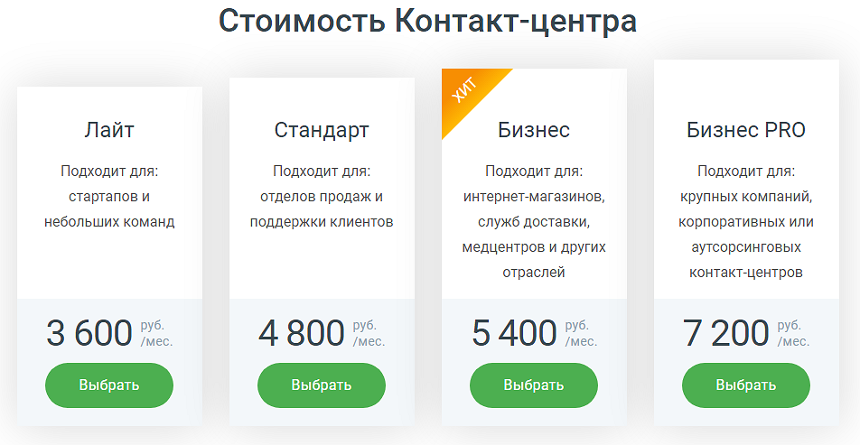
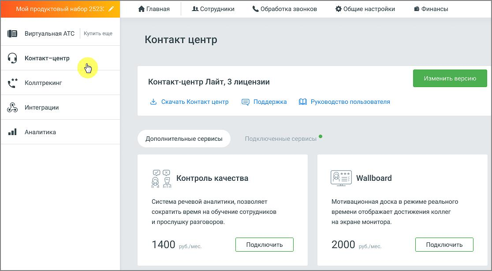

# 4.5.4. Контакт-центр

> Трассировка: PDF §4.5.4 · сквозные стр. 215-217 · источники: ч.3 `kb/sources/mango-lk-manual/LK_manual_v-121часть-3.pdf` с.13-15.

Контакт-центр предназначен для управления потоком обращений в реальном времени. Для подключения услуги воспользуйтесь одним из вариантов: 1) Откройте в браузере страницу Контакт-центр MANGO OFFICE, ознакомьтесь с информацией о возможностях модуля и нажмите кнопку Подключить в одной из версий. При подключении потребуется авторизация в Личном кабинете пользователя ВАТС.

2) Щелкните по иконке модуля в вертикальном меню Личного кабинета пользователя ВАТ и нажмите кнопку Подключить в одной из версий.

После подключения услуги иконка модуля перемещается выше, в раздел подключенных продуктов. По клику на иконку открывается страница «Контакт-центр Mango Office», с описанием текущей версии услуги, количеством приобретенных лицензий и ссылкой на скачивание приложения Контакт-центра. внимание Если временно заблокировать Виртуальную АТС, с которой связан Контакт- центр MANGO OFFICE, то он будет заблокирован на тот же период. При этом лицензионные платежи за его использование будут списываться с Лицевого счета в течение периода добровольной блокировки. Также на странице размещается информация о подключенных сервисах и сервисах с возможностью подключения.

Чтобы изменить текущую версию услуги, нажмите на кнопку Изменить версию. Отключение услуги возможно только через личного менеджера. Дальнейшие настройки и работа с инструментом - через приложение Контакт-центр MANGO OFFICE. внимание

| Пункт главного меню "Контакт центр" доступен только в том случае, когда на ВАТС |
| --- |
| не подключен продукт «Сделки». В противном случае ссылка на |

приложения Контакт-центра располагается в разделе "Сделки". Для использования продукта ваше оборудование должно удовлетворять следующим системным требованиям Требования для Контакт-центр MANGO OFFICE. Взаимодействие с Контакт-центром MANGO OFFICE можно осуществлять через API. API Контакт-центра позволяет управлять статусами пользователей, получать уведомления о смене статусов, а также работать со сделками, кампаниями исходящего обзвона, обращениями и задачами. Для использования API Контакт- центра MANGO OFFICE в данном разделе необходимо подключить услугу "Открытое API". Для получения дополнительной информации ознакомьтесь с Руководством по API Контакт-центра MANGO OFFICE.
