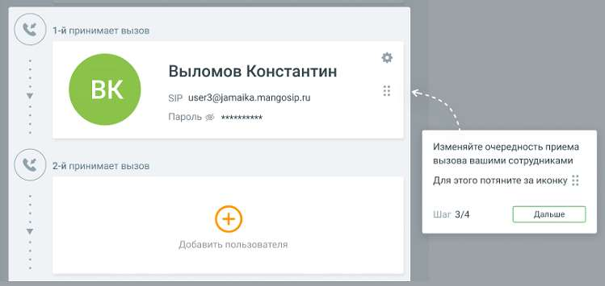

# 1.8.1.3.2. Блок 2. Сотрудники

> Трассировка: PDF §1.8.1.3.2 · сквозные стр. 19-20 · источники: ч.1 `kb/sources/mango-lk-manual/LK_manual_v-123.pdf` с.19-20.

Блок «Сотрудники» содержит список пользователей ВАТС, принимающих звонки.

Клик по пиктограмме открывает карточку добавления нового пользователя. • Для сценария МИКРО (тариф «Виртуальный номер») можно добавить не более трех сотрудников.

Сотрудники принимают звонки в порядке очередности, сверху вниз. Для изменения порядка очередности переместите карточку сотрудника вверх или вниз

по списку, удерживая левую кнопку мыши на пиктограмме .

ВНИМАНИЕ Для схемы распределения «сложная настройка» возможность перетаскивать карточки сотрудника отсутствует. Очередность приема звонков указана в заданной в Блоке 1 схеме распределения.
