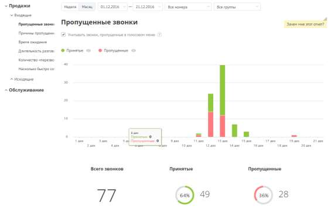
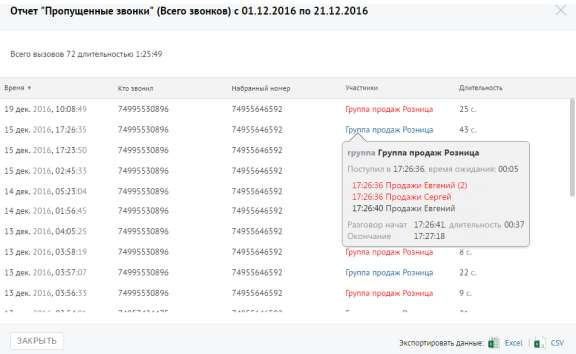

# Отчет «Пропущенные звонки»

> Трассировка: PDF §4.5.9.1.1 · сквозные стр. 233-234 · источники: ч.1 `kb/sources/mango-lk-manual/LK_manual_v-123.pdf` с.233-234.

Отчет «Пропущенные звонки» в графическом виде отображает информацию о входящих звонках по датам выбранного диапазона через выбранные линии с участием выбранных групп. Пример сформированного отчета приведен на рисунке ниже.

Если флаг «Учитывать звонки, пропущенные в голосовом меню» не установлен, то из подсчета общего числа пропущенных звонков исключаются вызовы, пропущенные в IVR меню. Для того, чтобы скрыть/отобразить принятые или пропущенные вызовы на графике, щелкните по кнопкам Принятые и Пропущенные соответственно. Данные о количестве звонков приведены в нижней части окна в виде инфографики, включающей три диаграммы. Для получения детальной информации о пропущенных вызовах предусмотрена дополнительная форма «Кто звонил», содержащая данные из отчета «Истории вызовов» согласно установленным значениям фильтра. Чтобы открыть форму, следует щелкнуть по определенному элементу отчета. Содержание данных зависит от того, по какому элементу было совершено нажатие:

• Столбец диаграммы отчета (принятые вызовы) – количество принятых вызовов за указанный день; • Столбец диаграммы отчета (пропущенные вызовы) – количество пропущенных вызовов за указанный день; • Диаграмма «Всего звонков» - общее количество вызовов за установленный период; • Диаграмма «Принятые» - общее количество принятых вызовов за установленный период; • Диаграмма «Пропущенные» - общее количество пропущенных вызовов за установленный период. При щелчке по названию группы в столбце «Участники» или «Кто пропустил» отображается подсказка, содержащая подробную информацию по вызову.

