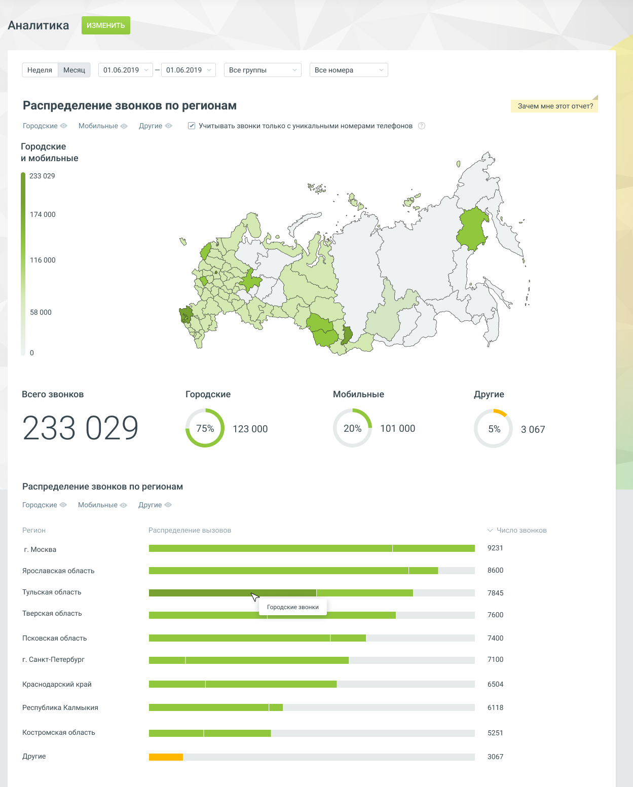

# Отчет «Распределение звонков по регионам»

> Трассировка: PDF §4.5.9.1.1 · сквозные стр. 244-246 · источники: ч.3 `kb/sources/mango-lk-manual/LK_manual_v-121часть-3.pdf` с.42-44.

Отчет предоставляет (на карте и в таблице) информацию о регионе звонящего на номера продукта ВАТС. Мобильные - если номер звонящего соответствует мобильному номеру (префикс +79) в пределах некоторого региона РФ , то звонок относится к категории "Мобильные" данного региона; Городские - если номер звонящего не соответствует категории "Мобильный" в пределах некоторого региона РФ, то такой звонок относится к категории "Городские" данного региона; Другие – все остальные внешние входящие звонки. Чекбокс "Учитывать звонки только с уникальными номерами телефонов" - если чекбокс проставлен, то в отчвете отображаются только уникальные вызовы за выбранный период и условия фильтрации. Повторные звонки с одного и того же номера в течении суток считаются уникальными. совет Если на продукте ВАТС нет номера 8-800 и ни на один регион не приходится больше 70% звонков, рекомендуется подключить номер 8-800 для расширения клиентской базы и увеличения числа звонков. Клиентам не придется оплачивать звонок по межгороду, что повысит число звонков. Если на продукте ВАТС нет номера 8-800, на один регион приходится больше 70% звонков, из которых не менее 70% мобильные, также рекомендуется подключить номер 8-800. Клиенты не будут стараться завершить разговор пораньше и с большей вероятностью выслушают дополнительные предложения продавца. Если число звонков из какого-то региона превышает 10%, но на продукте ВАТС не подключен номер MANGO OFFICE в этом регионе, рекомендуется подключить местные номера, чтобы клиенты больше доверяли "местной" компании и могли снизить затраты на связь в этих регионах. Международные звонки на карте России не отображаются, но в отчете учитываются.

