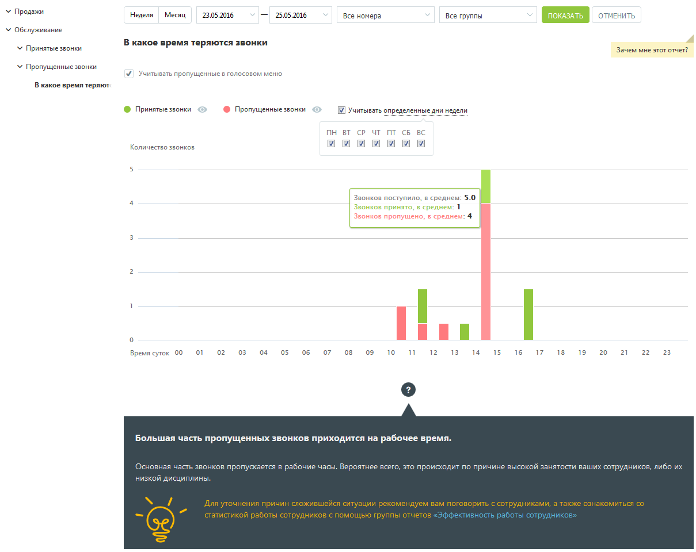
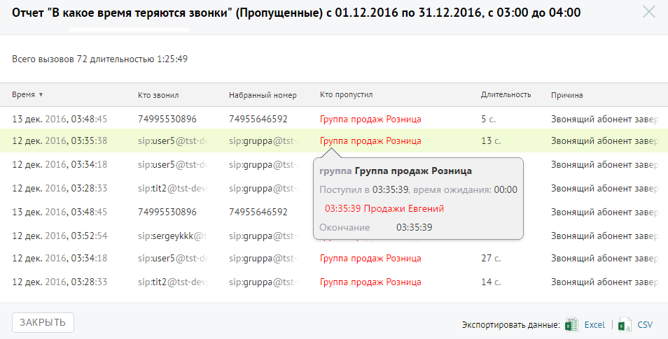

# Отчет «В какое время теряются звонки»

> Трассировка: PDF §4.5.9.2.1 · сквозные стр. 259-261 · источники: ч.3 `kb/sources/mango-lk-manual/LK_manual_v-121часть-3.pdf` с.57-59.

Отчет «В какое время теряются звонки» в графическом виде отображает информацию о процентном соотношении количества принятых и пропущенных звонков в зависимости

от времени суток. Таким образом, отчет поможет выявить часы, в течение которых пропускается больше всего вызовов, и принять меры по снижению количества пропущенных звонков в эти часы. Пример сформированного отчета приведен на рисунке ниже. Для получения более детальной информации о количестве вызовов в течение дня наведите курсор на любой столбец графика.

Если флаг «Учитывать пропущенные в голосовом меню» не установлен, то из подсчета общего числа звонков исключаются вызовы, пропущенные в IVR меню. Для того, чтобы скрыть/отобразить принятые или пропущенные вызовы на графике, щелкните по кнопкам Принятые звонки и Пропущенные звонки соответственно. Для того, чтобы исключить из указанного периода определенные дни недели, данные по которым не должны фигурировать в отчете, щелкните по ссылке «Учитывать определенные дни недели» и снимите нужные флаги. Для получения детальной информации о пропущенных вызовах предусмотрена дополнительная форма, содержащая данные из отчета «Истории вызовов» согласно установленным значениям фильтра. Чтобы открыть форму, следует щелкнуть по столбцу диаграммы отчета, содержащего пропущенные вызовы за определенное время суток.

При щелчке по названию группы в столбце «Кто пропустил» отображается подсказка, содержащая подробную информацию по вызову.
