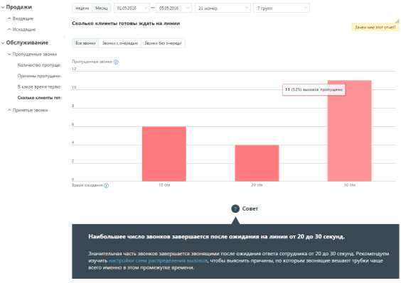

# Отчет «Сколько клиенты готовы ждать на линии»

> Трассировка: PDF §4.5.9.2.1 · сквозные стр. 261-262 · источники: ч.1 `kb/sources/mango-lk-manual/LK_manual_v-123.pdf` с.261-262.

Отчет «Сколько клиенты готовы ждать на линии» отображает информацию о количестве входящих пропущенных звонков на группу, которые в соответствии с заданными параметрами фильтрации распределены в зависимости от времени ожидания на линии. Пример сформированного отчета приведен на рисунке ниже. Отчет представляет собой диаграмму, отображающую количество внешних пропущенных звонков, прекращенных по инициативе звонящего, распределенное по промежуткам времени ожидания на линии.

Для более детального формирования отчета предусмотрены следующие переключатели: • Все звонки – отчет содержит информацию обо всех внешних пропущенных звонках; • Звонки с очередью – отчет учитывает только звонки, которые находились в очереди вызовов одной или более групп; • Звонки без очереди – отчет учитывает только звонки, которые в процессе прохождения не попали в очередь вызовов ни одной группы.
