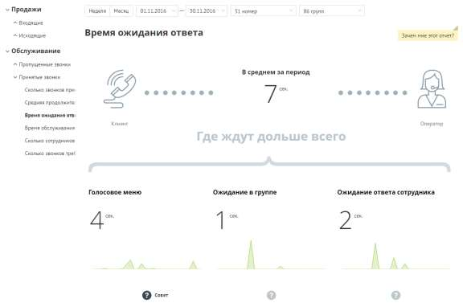
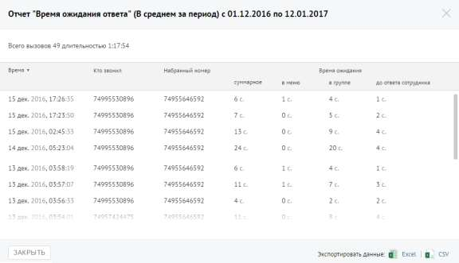

# Отчет «Время ожидания ответа»

> Трассировка: PDF §4.5.9.2.2 · сквозные стр. 265-267 · источники: ч.1 `kb/sources/mango-lk-manual/LK_manual_v-123.pdf` с.265-267.

Отчет «Время ожидания ответа» отображает информацию о времени ожидания обслуживания вызова на разных стадиях: голосовое меню, дозвон на группу и дозвон на оператора.

По умолчанию оптимальным временем ожидания в голосовом меню считается время не более 25 секунд, ожидание в очереди на группу — от 0 до 60 секунд, ожидание ответа оператора не должно превышать 5 секунд.

Щелкните по пиктограмме , чтобы посмотреть совет для каждой стадии обработки вызова. Для получения детальной информации о вызовах предусмотрена дополнительная форма, содержащая данные из отчета «Истории вызовов» согласно установленным значениям фильтра. Чтобы открыть форму, следует щелкнуть по определенному элементу отчета. Содержание данных зависит от того, по какому элементу было совершено нажатие: • Диаграмма «В среднем за период» - звонки, которые учитываются при подсчете числового показателя «В среднем за период», отражающего среднюю длительность ожидания ответа по принятым внешним входящим звонкам за установленный календарный период; В данном случае дополнительный отчет формируется при щелчке по диаграмме «В среднем за период».

