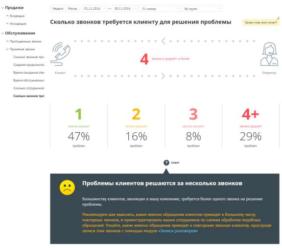
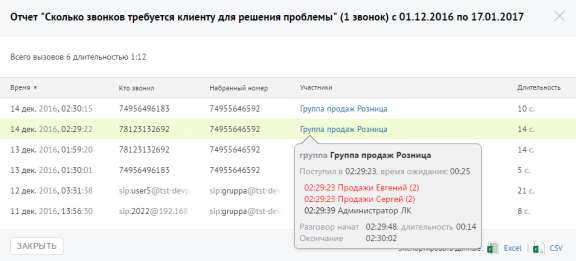

# Отчет «Сколько звонков требуется клиенту для решения проблемы»

> Трассировка: PDF §4.5.9.2.2 · сквозные стр. 270-272 · источники: ч.1 `kb/sources/mango-lk-manual/LK_manual_v-123.pdf` с.270-272.

Отчет «Сколько звонков требуется клиенту для решения проблемы» количество повторных звонков, сделанных клиентом для решения его вопроса. Пример сформированного отчета приведен на следующей странице.

Эталонное количество звонков, за которое должна быть решена проблема клиента - один звонок. Если звонков больше, то рекомендуем прослушать записи разговоров с помощью модуля «Записи разговоров». Для получения детальной информации о вызовах предусмотрена дополнительная форма «Кто звонил», содержащая данные из отчета «Истории вызовов» согласно установленным значениям фильтра. Чтобы открыть форму, следует щелкнуть по определенному элементу отчета. Содержание данных зависит от того, по какому элементу было совершено нажатие. В данном случае дополнительный отчет формируется при щелчке по диаграмме с определенным количеством звонков, необходимых для решения вопроса клиента. При щелчке по названию группы в столбце «Кто пропустил» отображается подсказка, содержащая подробную информацию по вызову.

