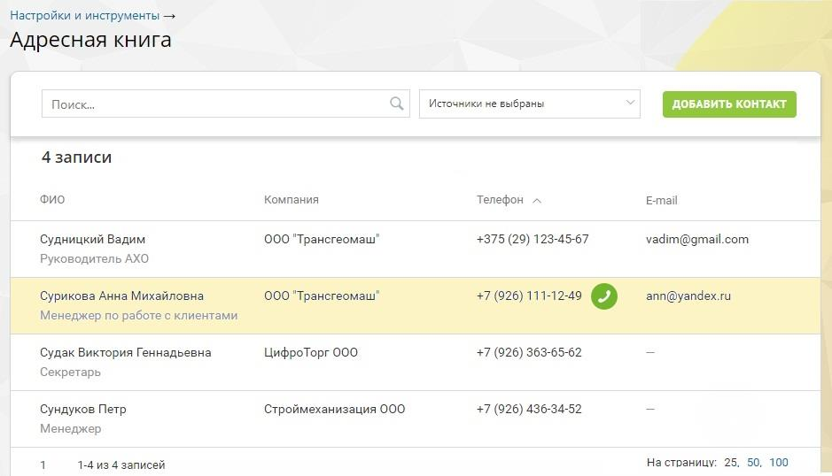
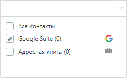

# 4.5.10. Адресная книга контрагентов

> Трассировка: PDF §4.5.10 · сквозные стр. 275-276 · источники: ч.3 `kb/sources/mango-lk-manual/LK_manual_v-121часть-3.pdf` с.73-74.

Инструмент «Адресная книга» предназначен для хранения основной информации о контрагентах. Список является единым для всех пользователей текущей ВАТС.

Адресная книга может содержать контакты, полученные посредством интеграции с внешними системами – amoCRM, Bitrix24 и т.д. Такие контакты помечены пиктограммой соответствующей системы. Для фильтрации записей в зависимости от источника следует открыть выпадающий список и установить флаги напротив названия нужного источника.

Предусмотрен быстрый поиск интересующего контрагента (по ФИО, должности, названию компании, телефонному номеру или E-mail). Для этого следует ввести необходимые данные в поле поиска. При вводе искомого текста работает автоматическая фильтрация записей адресной книги с учетом указанной комбинации символов. Название компании контрагента (при его наличии) является кликабельной ссылкой. При щелчке по ссылке выполняется фильтрация списка контрагентов, в результате которой в отфильтрованном списке должны отображаться все контрагенты, относящиеся к данной компании. В случае, если для контрагента указан контактный телефонный номер, то при наведении курсора на строку отображается кнопка Позвонить. Обязательным условием отображения кнопки также является наличие хотя бы одного активного средства приема звонков в карточке пользователя личного кабинета. При щелчке по кнопке выполняется дозвон соответствующему контрагенту. Для редактирования карточки контрагента следует навести курсор на нужную строку и щелкнуть по ней в любом свободном месте (за исключением названия компании и кнопки дозвона).
