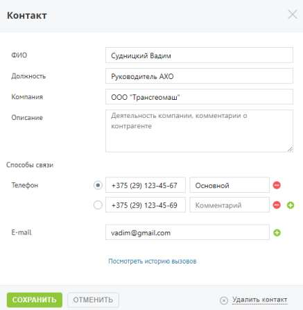

# 4.5.10.1. Добавление контакта

> Трассировка: PDF §4.5.10.1 · сквозные стр. 276-277 · источники: ч.1 `kb/sources/mango-lk-manual/LK_manual_v-123.pdf` с.276-277.

Для того, чтобы добавить нового контрагента, следует щелкнуть по кнопке Добавить контакт.

Обязательным для заполнения является только поле ФИО. Для того, чтобы добавить дополнительное поле для ввода телефона и/или E-mail,

следует щелкнуть по кнопке напротив последнего поля. При наличии нескольких телефонных номеров следует указать основной номер, который будет отображаться в списке контрагентов и подставляться при звонке. При наличии хотя бы одного телефонного номера у текущего контрагента на карточке отобразится ссылка «Посмотреть историю вызовов». При щелчке по ссылке выполняется переход на отчет «Все вызовы» страницы «История вызовов». Для сохранения внесенных изменений необходимо нажать кнопку Сохранить. Для удаления контрагента следует открыть его карточку и щелкнуть по ссылке «Удалить контакт». После подтверждения контакт будет удален со всеми данными.
