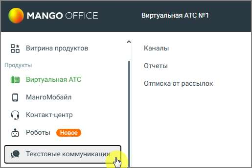

# 4.5.11.1. Подключение «Текстовые коммуникации» в Личном кабинете

> Трассировка: PDF §4.5.11.1 · сквозные стр. 278-279 · источники: ч.1 `kb/sources/mango-lk-manual/LK_manual_v-123.pdf` с.278-279.

Для подключения «Текстовые коммуникации» зайдите в Личный кабинет пользователя ВАТС и далее в боковой навигационной панели выберите пункт Текстовые коммуникации. Ознакомьтесь с возможностями модуля и нажмите кнопку Подключить.. После подлючения вам будут доступны три вкладки меню: Каналы, Отчеты и Отписка от рассылок.

Технические требования к оборудованию, необходимые для корректной работы модуля (десктоп):

|  |  |  |  |  |  |  |  |  |  |  |  |
| --- | --- | --- | --- | --- | --- | --- | --- | --- | --- | --- | --- |
|  | Платформа |  |  | Разрешение экрана |  |  | Браузер |  |  | Версия |  |
|  |  |  |  |  |  |  |  |  |  |  |  |
|  |  |  |  |  |  |  |  |  |  |  |  |
|  | Windows 10 и выше |  |  | 1 920x1080, 1366x768 |  |  | Google Chrome |  |  | 82 и выше |  |
|  |  |  |  |  |  |  |  |  |  |  |  |

|  |  |  |  |  |  |  |  |  |  |  |  |
| --- | --- | --- | --- | --- | --- | --- | --- | --- | --- | --- | --- |
|  |  |  |  |  |  |  | Яндекс.Браузер |  |  | 20,5 и выше |  |
|  |  |  |  |  |  |  |  |  |  |  |  |
|  |  |  |  |  |  |  |  |  |  |  |  |
|  |  |  |  |  |  |  | Firefox |  |  | 77 и выше |  |
|  |  |  |  |  |  |  |  |  |  |  |  |
|  |  |  |  |  |  |  |  |  |  |  |  |
|  | MacOS > Mojave и выше |  |  | 1920x1080 |  |  | Safari |  |  | 13,1 и выше |  |
|  |  |  |  |  |  |  |  |  |  |  |  |
