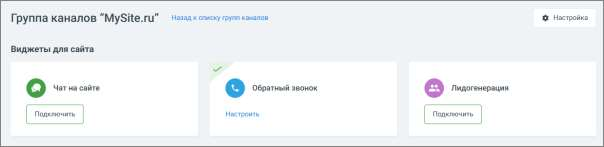

# 4.5.11.2.1. Настройки группы каналов

> Трассировка: PDF §4.5.11.2.1 · сквозные стр. 280-281 · источники: ч.1 `kb/sources/mango-lk-manual/LK_manual_v-123.pdf` с.280-281.

Главное окно группы каналов содержит следующие каналы коммуникации с клиентами: • Виджеты для сайта • Соцсети и мессенджеры • Другие каналы

Кликните по кнопке Настройка в правом верхнем углу окна и перейдите к настройкам группы каналов. Эти настройки буду действовать для всех подключенных каналов.

После внесения необходимых изменений в настройки, сохраните их кнопкой Сохранить.
