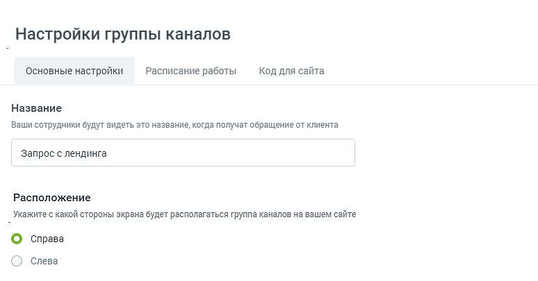
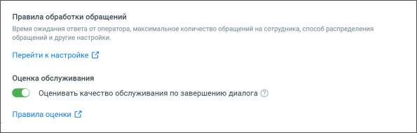
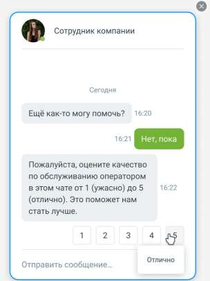
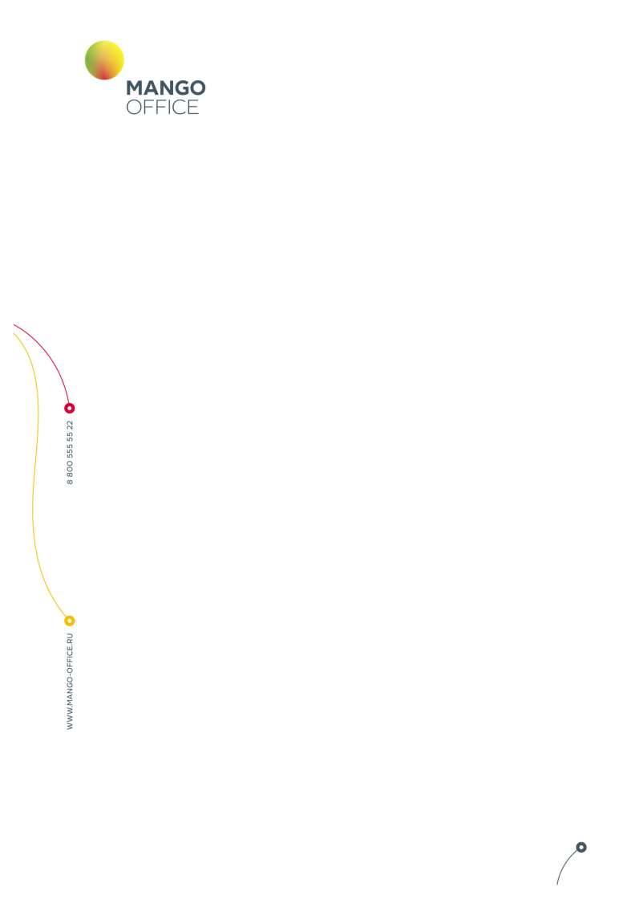
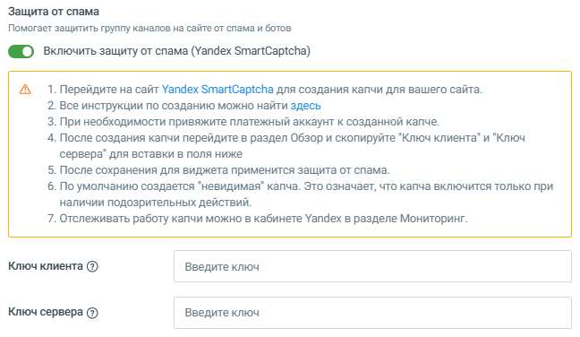
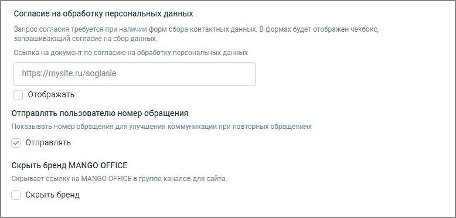

# 4.5.11.2.1.1. Основные настройки

> Трассировка: PDF §4.5.11.2.1.1 · сквозные стр. 281-284 · источники: ч.1 `kb/sources/mango-lk-manual/LK_manual_v-123.pdf` с.281-284.

В настройках группы каналов следует указать: Название – здесь можно сменить заданное по умолчанию имя группы; Расположение – отметьте подходящий вариант расположения на экране всплывающих уведомлений;

Правила обработки обращений – ссылка «Перейти к настройке» ведет на страницу «Обработка звонков → Настройки дозвона по умолчанию → Настройки правил обработки текстовых обращений» в Личном кабинете;

Оценка обслуживания – если чекбокс включен, клиенты могут оставлять оценки в чатах после завершения диалога с сотрудником. Это дает возможность можно было собрать сквозную аналитику оценки работы конкретного сотрудника для всех каналов. Выставление оценки доступно клиенту в течение пяти минут после завершения диалога

с оператором. При выставлении оценки в чате она будет отображаться в формате [Выставленная оценка] / [Пояснение оценки].

Ссылка «Правила оценки» ведет на страницу «Оценка качества в чатах» модуля Контроль качества, для настройки вопросов клиенту. Для работы оценок необходимо подключить услугу «Омниканальной оценки диалогов» на странице модуля Контроль качества. Для того чтобы иметь возможность настраивать более одного вопроса необходимо включить услугу «Несколько вопросов». Защита от спама – Настройка защиты от спама подразумевает интеграцию модуля «Текстовые коммуникации» с Yandex SmartCAPTCHA. Для подключения пользователь должен настроить интеграцию модуля «Текстовые коммуникации» с сервисом Yandex SmartCAPTCHA. Для этого необходимо получить ключи доступа в Yandex SmartCAPTCHA и указать их в настройках модуля. После сохранения настроек система использует SmartCAPTCHA для проверки пользователей и защиты от автоматических спам-запросов. При отключении «Защиты от спама» ранее введённые ключи сохраняются, при повторном подключении вносить их не требуется.

Согласие на обработку персональных данных – при включённой настройке внутри окна виджета отображается чекбокс и текст согласия со сбором персональных данных. Также можно разместить прямую ссылку на документ, при этом текст согласия кликабелен и ведет клиента на указанную ссылку. Клиент не сможет инициировать чат или заказать звонок, если не установит флажок согласия. Отправлять пользователю номер обращения – при включенной настройке сотрудник может просмотреть и скопировать номер обращения внутри диалога Мои обращения. Также номер сообщения отображается в окне виджета; Скрыть бренд MANGO OFFICE – при включенной настройке упоминания бренда в виджете отсутствует;

Кнопка Удалить группу каналов – перед удалением группы необходимо еще раз подтвердить согласие на удаление.
